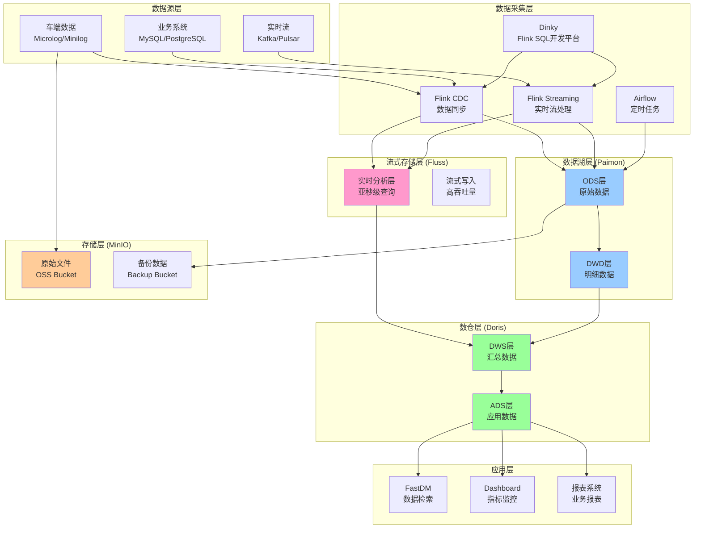
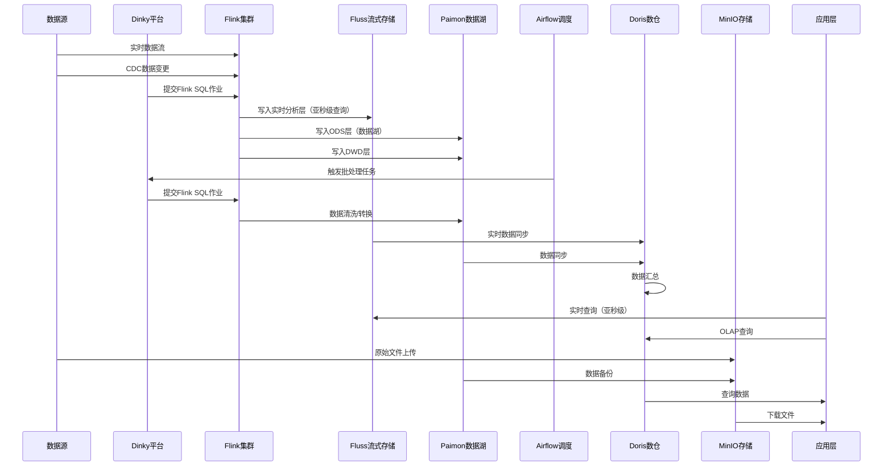
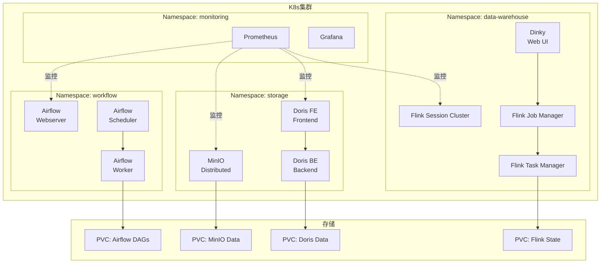

# L4 自动驾驶数据闭环数仓方案（K8s + Flink + Fluss + Paimon + Doris + MinIO + Airflow）

> **基于K8s集群的现代化数仓架构设计**
> 
> 本文档提供基于K8s集群，使用Flink、Fluss、Paimon、Doris、MinIO、Airflow构建L4自动驾驶数据闭环数仓的完整方案。
> 
> **技术栈说明**：
> - **Flink**：流批一体计算引擎
> - **Fluss**：流式存储，专为实时分析优化（[Apache Fluss](https://github.com/apache/fluss)）
> - **Paimon**：流式数据湖存储
> - **Doris**：OLAP查询引擎
> - **MinIO**：对象存储
> - **Airflow**：工作流调度

---

## 目录

1. [方案概述](#一方案概述)
2. [技术栈选型](#二技术栈选型)
3. [架构设计](#三架构设计)
4. [数据分层设计](#四数据分层设计)
5. [K8s部署方案](#五k8s部署方案)
6. [数据流转设计](#六数据流转设计)
7. [实施步骤](#七实施步骤)

---

## 一、方案概述

### 1.1 方案目标

基于现有K8s集群，构建一套**流批一体、湖仓一体**的现代化数仓系统，支持L4自动驾驶数据闭环的完整需求。

### 1.2 技术栈组合

| 组件 | 技术选型 | 职责 |
|------|---------|------|
| **流式计算** | Apache Flink | 实时数据处理、流批一体 |
| **Flink开发平台** | Dinky | Flink SQL开发、作业管理、监控 |
| **流式存储** | Apache Fluss | 实时分析流式存储、低延迟读写 |
| **数据湖存储** | Apache Paimon | 流式数据湖、CDC支持 |
| **OLAP引擎** | Apache Doris | 实时OLAP查询、秒级响应 |
| **对象存储** | MinIO | S3兼容的对象存储 |
| **工作流调度** | Apache Airflow | 离线任务调度、数据质量监控 |

### 1.3 核心优势

1. **流批一体**：Flink统一处理实时和离线数据
2. **流式存储**：Fluss提供亚秒级延迟的实时分析能力
3. **湖仓一体**：Paimon作为数据湖，Doris作为数仓，统一数据管理
4. **云原生**：完全基于K8s，弹性伸缩，高可用
5. **成本优化**：MinIO替代商业对象存储，降低成本
6. **统一调度**：Airflow统一管理所有数据任务

### 1.4 Fluss vs Paimon 选型说明

**Apache Fluss**（[GitHub](https://github.com/apache/fluss)）：
- **定位**：流式存储，专为实时分析优化
- **核心特性**：
  - 亚秒级延迟：低延迟流式读写
  - 列式流：流式读取性能提升10倍
  - 实时更新：高效的部分更新
  - 查找查询：主键查找超高QPS
- **适用场景**：实时分析、实时查询、低延迟场景

**Apache Paimon**：
- **定位**：流式数据湖，支持时间旅行
- **核心特性**：
  - CDC支持：原生支持CDC数据同步
  - 时间旅行：支持历史数据查询
  - 流式更新：支持流式写入和查询
- **适用场景**：数据湖存储、历史数据查询、CDC同步

**组合使用建议**：
- **Fluss**：用于实时分析层，需要亚秒级查询的场景
- **Paimon**：用于数据湖层，需要历史数据查询和CDC的场景

---

## 二、技术栈选型

### 2.1 Apache Flink

**选型理由**：
- 流批一体：同一套代码处理实时和离线数据
- 状态管理：支持复杂的状态计算
- 容错机制：Checkpoint保证数据一致性
- K8s原生支持：Flink on K8s成熟稳定

**版本建议**：Flink 1.18+

**核心能力**：
- 实时流处理：处理SLS心跳、Pose数据流
- 批处理：离线标签生成、数据清洗
- CDC支持：支持MySQL、PostgreSQL等数据源CDC

### 2.2 Dinky（Flink SQL开发平台）

**选型理由**：
- **Web UI开发**：提供可视化的Flink SQL开发界面，降低开发门槛
- **作业管理**：统一管理Flink作业，支持作业提交、停止、重启
- **实时监控**：实时查看作业运行状态、指标、日志
- **SQL开发**：支持Flink SQL语法高亮、自动补全、语法检查
- **版本管理**：支持SQL版本管理和回滚
- **任务调度**：支持定时任务和依赖任务
- **多集群管理**：支持管理多个Flink集群

**版本建议**：Dinky 0.7+

**核心能力**：
- Flink SQL在线开发：Web IDE编写和调试Flink SQL
- 作业生命周期管理：提交、停止、重启、Savepoint管理
- 实时监控：作业状态、Checkpoint、Backpressure监控
- 告警通知：作业失败、异常告警
- 数据源管理：统一管理Kafka、Paimon、Doris等数据源连接
- 作业模板：常用作业模板，快速创建

### 2.3 Apache Paimon

**选型理由**：
- 流式数据湖：支持流式写入和查询
- CDC支持：原生支持CDC数据同步
- 时间旅行：支持历史数据查询
- 与Flink深度集成：无缝对接Flink

**版本建议**：Paimon 0.5+

**核心能力**：
- ODS层存储：存储原始数据
- DWD层存储：存储清洗后的明细数据
- 支持流式更新：实时更新数据

### 2.4 Apache Doris

**选型理由**：
- 高性能OLAP：列存引擎，查询速度快
- 实时导入：支持Stream Load实时导入
- MySQL协议：兼容MySQL协议，易用性好
- 向量化执行：充分利用CPU SIMD指令

**版本建议**：Doris 2.0+

**核心能力**：
- DWS层存储：存储汇总数据
- ADS层存储：存储应用层数据
- 秒级查询：支持秒级OLAP查询

### 2.5 MinIO

**选型理由**：
- S3兼容：完全兼容AWS S3 API
- 高可用：支持分布式部署
- 成本低：开源免费，无License成本
- K8s友好：支持K8s部署

**版本建议**：MinIO RELEASE.2024-01-16T16-07-38Z+

**核心能力**：
- 原始文件存储：存储Microlog/Minilog/Raw数据
- 备份存储：数据备份和归档
- 冷数据存储：长期存储冷数据

### 2.6 Apache Airflow

**选型理由**：
- 工作流调度：强大的DAG调度能力
- 任务依赖：支持复杂的任务依赖关系
- 监控告警：完善的监控和告警机制
- 可扩展性：支持自定义Operator

**版本建议**：Airflow 2.7+

**核心能力**：
- 离线任务调度：调度标签生成、数据清洗等任务
- 数据质量监控：监控数据质量，及时告警
- 任务重试：支持任务失败自动重试

### 2.7 技术栈组合优势

**Dinky + Flink的优势**：
- **降低开发门槛**：Web UI开发，无需本地环境
- **提升开发效率**：SQL语法检查、自动补全、模板复用
- **统一作业管理**：集中管理所有Flink作业
- **实时监控告警**：及时发现和处理问题
- **团队协作**：SQL版本管理，便于团队协作

**Fluss + Paimon的优势**：
- **分层存储**：Fluss负责实时分析层，Paimon负责数据湖层
- **性能优化**：Fluss提供亚秒级查询，Paimon提供历史数据查询
- **场景互补**：Fluss适合实时查询，Paimon适合历史分析

---

## 三、架构设计

### 3.1 整体架构图



### 3.2 数据流转架构



---

## 四、数据分层设计

### 4.1 数仓分层架构

```
数据源
  ↓
ODS层 (Paimon) - 原始数据层
  ↓
DWD层 (Paimon) - 明细数据层
  ↓
DWS层 (Doris) - 汇总数据层
  ↓
ADS层 (Doris) - 应用数据层
  ↓
应用层
```

### 4.2 实时分析层设计（Fluss）

**存储位置**：Fluss流式存储

**数据内容**：
- 实时心跳数据（1Hz心跳，用于实时Dashboard）
- 实时Pose数据（用于实时指标计算）
- 实时MPS/MPD指标（需要亚秒级查询）
- 实时Case统计（实时问题监控）

**表结构设计**：

```sql
-- Fluss表：实时心跳数据（用于实时Dashboard）
CREATE TABLE fluss_realtime_heartbeat (
    car_id STRING,
    ts_second BIGINT,
    driving_mode STRING,
    speed DOUBLE,
    road_type STRING,
    task_id STRING,
    task_status STRING,
    city_code STRING,
    area_code STRING,
    route_code STRING,
    PRIMARY KEY (car_id, ts_second) NOT ENFORCED
) WITH (
    'connector' = 'fluss',
    'table-path' = 's3://minio-bucket/fluss/realtime_heartbeat',
    'format' = 'columnar'
);

-- Fluss表：实时MPS/MPD指标
CREATE TABLE fluss_realtime_metrics (
    date_key DATE,
    city_code STRING,
    trigger_type STRING,
    case_count BIGINT,
    total_miles DOUBLE,
    mps DOUBLE,
    mpd DOUBLE,
    update_time TIMESTAMP(3),
    PRIMARY KEY (date_key, city_code, trigger_type) NOT ENFORCED
) WITH (
    'connector' = 'fluss',
    'table-path' = 's3://minio-bucket/fluss/realtime_metrics',
    'format' = 'columnar',
    'lookup.cache.ttl' = '60s'  -- 查找缓存TTL
);
```

**数据特点**：
- 亚秒级查询：支持实时Dashboard查询
- 列式存储：优化的列式格式，查询性能高
- 实时更新：支持部分更新，无需全量重写
- 查找优化：主键查找性能高

### 4.3 ODS层设计（Paimon）

**存储位置**：Paimon数据湖

**数据内容**：
- SLS心跳日志（1Hz心跳，历史数据）
- Pose专线数据（100-200ms采样，历史数据）
- Microlog/Minilog元数据
- 业务系统数据（订单、车辆信息等）

**表结构设计**：

```sql
-- ODS层：心跳数据表
CREATE TABLE ods_heartbeat (
    car_id STRING,
    ts_second BIGINT,
    driving_mode STRING,
    speed DOUBLE,
    road_type STRING,
    task_id STRING,
    task_status STRING,
    city STRING,
    area STRING,
    route_id STRING,
    proc_time AS PROCTIME(),
    PRIMARY KEY (car_id, ts_second) NOT ENFORCED
) WITH (
    'connector' = 'paimon',
    'path' = 's3://minio-bucket/ods/heartbeat',
    'bucket' = '4',
    'changelog-producer' = 'input'
);

-- ODS层：Pose数据表
CREATE TABLE ods_pose (
    car_id STRING,
    timestamp_ms BIGINT,
    latitude DOUBLE,
    longitude DOUBLE,
    speed DOUBLE,
    acceleration_longitudinal DOUBLE,
    acceleration_lateral DOUBLE,
    heading DOUBLE,
    angular_velocity DOUBLE,
    steering_angle DOUBLE,
    throttle DOUBLE,
    brake DOUBLE,
    PRIMARY KEY (car_id, timestamp_ms) NOT ENFORCED
) WITH (
    'connector' = 'paimon',
    'path' = 's3://minio-bucket/ods/pose',
    'bucket' = '4'
);

-- ODS层：Case映射表
CREATE TABLE ods_case_mapping (
    case_id STRING,
    chunk_id STRING,
    car_id STRING,
    start_ts BIGINT,
    end_ts BIGINT,
    file_path STRING,
    file_size BIGINT,
    trigger_type STRING,
    data_type STRING,
    upload_time TIMESTAMP,
    PRIMARY KEY (case_id, chunk_id) NOT ENFORCED
) WITH (
    'connector' = 'paimon',
    'path' = 's3://minio-bucket/ods/case_mapping',
    'bucket' = '4'
);
```

**数据特点**：
- 保留原始数据，不做清洗
- 支持时间旅行查询
- 支持CDC更新

### 4.4 DWD层设计（Paimon）

**存储位置**：Paimon数据湖

**数据内容**：
- 清洗后的心跳数据（加上标准化维度）
- 清洗后的Pose数据
- 关联后的Case数据（关联车辆信息、业务信息）

**表结构设计**：

```sql
-- DWD层：清洗后的心跳数据
CREATE TABLE dwd_heartbeat_clean (
    car_id STRING,
    ts_second BIGINT,
    driving_mode STRING,
    speed DOUBLE,
    road_type STRING,
    task_id STRING,
    task_status STRING,
    -- 标准化维度
    city_code STRING,
    city_name STRING,
    area_code STRING,
    area_name STRING,
    route_code STRING,
    route_name STRING,
    car_type STRING,
    car_model STRING,
    PRIMARY KEY (car_id, ts_second) NOT ENFORCED
) WITH (
    'connector' = 'paimon',
    'path' = 's3://minio-bucket/dwd/heartbeat_clean',
    'bucket' = '4'
);

-- DWD层：Case明细表（关联业务信息）
CREATE TABLE dwd_case_detail (
    case_id STRING,
    car_id STRING,
    start_ts BIGINT,
    end_ts BIGINT,
    trigger_type STRING,
    -- 关联的业务信息
    city_code STRING,
    area_code STRING,
    route_code STRING,
    task_id STRING,
    order_id STRING,
    customer_id STRING,
    -- 文件信息
    file_path STRING,
    file_size BIGINT,
    data_type STRING,
    PRIMARY KEY (case_id) NOT ENFORCED
) WITH (
    'connector' = 'paimon',
    'path' = 's3://minio-bucket/dwd/case_detail',
    'bucket' = '4'
);
```

**数据特点**：
- 数据清洗和标准化
- 关联业务维度
- 支持流式更新

### 4.5 DWS层设计（Doris）

**存储位置**：Doris数仓

**数据内容**：
- 按天/周/月的自动驾驶率
- 按线路/场地的行驶里程和平均速度
- 按业务线的MPS/MPD分布
- 按客户的履约准时率

**表结构设计**：

```sql
-- DWS层：日度自动驾驶率
CREATE TABLE dws_daily_auto_rate (
    date_key DATE,
    city_code STRING,
    area_code STRING,
    route_code STRING,
    car_id STRING,
    total_duration_seconds BIGINT,
    auto_duration_seconds BIGINT,
    auto_rate DOUBLE,
    total_miles DOUBLE,
    auto_miles DOUBLE
) ENGINE=OLAP
DUPLICATE KEY(date_key, city_code, area_code, route_code, car_id)
PARTITION BY RANGE(date_key) (
    PARTITION p202501 VALUES [("2025-01-01"), ("2025-02-01")),
    PARTITION p202502 VALUES [("2025-02-01"), ("2025-03-01"))
)
DISTRIBUTED BY HASH(car_id) BUCKETS 10
PROPERTIES (
    "replication_num" = "3",
    "storage_format" = "V2"
);

-- DWS层：日度MPS/MPD统计
CREATE TABLE dws_daily_mps_mpd (
    date_key DATE,
    city_code STRING,
    trigger_type STRING,
    case_count BIGINT,
    total_miles DOUBLE,
    mps DOUBLE,
    mpd DOUBLE
) ENGINE=OLAP
DUPLICATE KEY(date_key, city_code, trigger_type)
PARTITION BY RANGE(date_key) (
    PARTITION p202501 VALUES [("2025-01-01"), ("2025-02-01"))
)
DISTRIBUTED BY HASH(city_code) BUCKETS 10
PROPERTIES (
    "replication_num" = "3"
);
```

**数据特点**：
- 预聚合数据，查询快
- 按时间分区，便于管理
- 支持实时更新

### 4.6 ADS层设计（Doris）

**存储位置**：Doris数仓

**数据内容**：
- CEO看的一页纸业务总览
- 运营负责人看的线路/场地健康度
- 算法团队看的版本对比报表

**表结构设计**：

```sql
-- ADS层：CEO业务总览
CREATE TABLE ads_ceo_overview (
    date_key DATE,
    total_cars INT,
    total_miles DOUBLE,
    auto_rate DOUBLE,
    total_cases BIGINT,
    mps DOUBLE,
    mpd DOUBLE,
    revenue DOUBLE,
    cost DOUBLE
) ENGINE=OLAP
UNIQUE KEY(date_key)
DISTRIBUTED BY HASH(date_key) BUCKETS 1
PROPERTIES (
    "replication_num" = "3"
);

-- ADS层：线路健康度
CREATE TABLE ads_route_health (
    date_key DATE,
    route_code STRING,
    route_name STRING,
    total_trips INT,
    avg_speed DOUBLE,
    mps DOUBLE,
    mpd DOUBLE,
    health_score DOUBLE
) ENGINE=OLAP
DUPLICATE KEY(date_key, route_code)
PARTITION BY RANGE(date_key) (
    PARTITION p202501 VALUES [("2025-01-01"), ("2025-02-01"))
)
DISTRIBUTED BY HASH(route_code) BUCKETS 10;
```

---

## 五、K8s部署方案

### 5.1 整体部署架构



### 5.2 Flink部署方案

#### 5.2.1 Flink Session Cluster部署

**部署方式**：使用Flink Native K8s部署

**配置文件**：`flink-session-cluster.yaml`

```yaml
apiVersion: v1
kind: Namespace
metadata:
  name: data-warehouse
---
apiVersion: v1
kind: ServiceAccount
metadata:
  name: flink
  namespace: data-warehouse
---
apiVersion: rbac.authorization.k8s.io/v1
kind: Role
metadata:
  name: flink-role
  namespace: data-warehouse
rules:
- apiGroups: [""]
  resources: ["pods", "services", "configmaps"]
  verbs: ["get", "list", "watch", "create", "update", "patch", "delete"]
---
apiVersion: rbac.authorization.k8s.io/v1
kind: RoleBinding
metadata:
  name: flink-role-binding
  namespace: data-warehouse
subjects:
- kind: ServiceAccount
  name: flink
  namespace: data-warehouse
roleRef:
  kind: Role
  name: flink-role
  apiGroup: rbac.authorization.k8s.io
---
apiVersion: flink.apache.org/v1beta1
kind: FlinkDeployment
metadata:
  name: flink-session-cluster
  namespace: data-warehouse
spec:
  image: flink:1.18.1-scala_2.12
  flinkVersion: v1_18
  flinkConfiguration:
    # 基础配置
    taskmanager.numberOfTaskSlots: "4"
    parallelism.default: "2"
    
    # 状态后端配置
    state.backend: rocksdb
    state.backend.incremental: "true"
    state.checkpoints.dir: s3://minio-bucket/flink/checkpoints
    state.savepoints.dir: s3://minio-bucket/flink/savepoints
    
    # Checkpoint配置
    execution.checkpointing.interval: "60000"  # 1分钟
    execution.checkpointing.mode: "EXACTLY_ONCE"
    execution.checkpointing.timeout: "600000"  # 10分钟
    execution.checkpointing.max-concurrent-checkpoints: "1"
    execution.checkpointing.min-pause: "500"
    execution.checkpointing.externalized-checkpoint-retention: "RETAIN_ON_CANCELLATION"
    
    # S3配置（MinIO）
    s3.endpoint: http://minio-service:9000
    s3.path-style-access: "true"
    s3.ssl.enabled: "false"
    s3.access-key: minioadmin
    s3.secret-key: minioadmin
    
    # 网络配置
    taskmanager.network.memory.fraction: "0.2"
    taskmanager.network.memory.min: "512mb"
    taskmanager.network.memory.max: "1gb"
    
    # 内存配置
    taskmanager.memory.process.size: "4096m"
    taskmanager.memory.flink.size: "3200m"
    taskmanager.memory.managed.fraction: "0.4"
    
    # 高可用配置
    high-availability.type: "kubernetes"
    high-availability.storageDir: "s3://minio-bucket/flink/ha"
    
    # 日志配置
    web.log.path: "/opt/flink/log"
    
    # Paimon配置
    table.dynamic-table-options.enabled: "true"
    
  serviceAccount: flink
  jobManager:
    resource:
      memory: "2048m"
      cpu: 1
    replicas: 1
  taskManager:
    replicas: 3
    resource:
      memory: "4096m"
      cpu: 2
  podTemplate:
    spec:
      containers:
        - name: flink-main-container
          env:
            - name: FLINK_PROPERTIES
              value: |
                state.backend: rocksdb
                state.backend.incremental: true
          volumeMounts:
            - name: flink-libs
              mountPath: /opt/flink/lib
      volumes:
        - name: flink-libs
          emptyDir: {}
---
apiVersion: v1
kind: Service
metadata:
  name: flink-jobmanager-service
  namespace: data-warehouse
spec:
  type: ClusterIP
  ports:
  - port: 8081
    targetPort: 8081
    name: webui
  - port: 6123
    targetPort: 6123
    name: rpc
  selector:
    app: flink-jobmanager
---
apiVersion: v1
kind: Service
metadata:
  name: flink-taskmanager-service
  namespace: data-warehouse
spec:
  type: ClusterIP
  ports:
  - port: 6122
    targetPort: 6122
    name: data
  selector:
    app: flink-taskmanager
```

#### 5.2.2 Flink Connector依赖配置

**Flink需要加载的Connector JAR包**：

```yaml
# flink-connector-configmap.yaml
apiVersion: v1
kind: ConfigMap
metadata:
  name: flink-connectors
  namespace: data-warehouse
data:
  connectors.txt: |
    # Paimon Connector
    paimon-flink-1.18-0.5.0.jar
    
    # Kafka Connector
    flink-sql-connector-kafka-1.18.0.jar
    
    # Doris Connector
    flink-doris-connector-1.18-1.4.0.jar
    
    # MySQL CDC Connector
    flink-sql-connector-mysql-cdc-2.4.0.jar
    
    # S3 Filesystem
    flink-s3-fs-hadoop-1.18.1.jar
```

**初始化脚本**：`init-flink-connectors.sh`

```bash
#!/bin/bash
# 下载Connector JAR包到Flink lib目录

FLINK_LIB_DIR="/opt/flink/lib"
CONNECTOR_BASE_URL="https://repo1.maven.org/maven2"

# Paimon
wget -P $FLINK_LIB_DIR \
  https://repo1.maven.org/maven2/org/apache/paimon/paimon-flink-1.18/0.5.0/paimon-flink-1.18-0.5.0.jar

# Kafka
wget -P $FLINK_LIB_DIR \
  https://repo1.maven.org/maven2/org/apache/flink/flink-sql-connector-kafka/1.18.0/flink-sql-connector-kafka-1.18.0.jar

# Doris
wget -P $FLINK_LIB_DIR \
  https://repo1.maven.org/maven2/org/apache/doris/flink-doris-connector/1.18-1.4.0/flink-doris-connector-1.18-1.4.0.jar

# MySQL CDC
wget -P $FLINK_LIB_DIR \
  https://repo1.maven.org/maven2/com/ververica/flink-sql-connector-mysql-cdc/2.4.0/flink-sql-connector-mysql-cdc-2.4.0.jar

# S3 Filesystem
wget -P $FLINK_LIB_DIR \
  https://repo1.maven.org/maven2/org/apache/flink/flink-s3-fs-hadoop/1.18.1/flink-s3-fs-hadoop-1.18.1.jar
```

**使用Init Container加载Connector**：

```yaml
# 在FlinkDeployment中添加initContainers
podTemplate:
  spec:
    initContainers:
    - name: download-connectors
      image: curlimages/curl:latest
      command:
      - sh
      - -c
      - |
        # 下载Connector JAR包
        curl -o /shared-lib/paimon-flink-1.18-0.5.0.jar \
          https://repo1.maven.org/maven2/org/apache/paimon/paimon-flink-1.18/0.5.0/paimon-flink-1.18-0.5.0.jar
        # ... 其他Connector
      volumeMounts:
      - name: shared-lib
        mountPath: /shared-lib
    containers:
    - name: flink-main-container
      volumeMounts:
      - name: shared-lib
        mountPath: /opt/flink/lib
    volumes:
    - name: shared-lib
      emptyDir: {}
```

#### 5.2.3 Flink高可用配置

**高可用Flink Session Cluster**：

```yaml
apiVersion: flink.apache.org/v1beta1
kind: FlinkDeployment
metadata:
  name: flink-session-cluster-ha
  namespace: data-warehouse
spec:
  image: flink:1.18.1-scala_2.12
  flinkVersion: v1_18
  flinkConfiguration:
    # 高可用配置
    high-availability.type: "kubernetes"
    high-availability.storageDir: "s3://minio-bucket/flink/ha"
    high-availability.cluster-id: "flink-session-cluster-ha"
    
    # JobManager高可用
    jobmanager.rpc.address: "flink-jobmanager-service"
    jobmanager.rpc.port: "6123"
    
    # 其他配置...
  jobManager:
    replicas: 2  # 2个JobManager实现高可用
    resource:
      memory: "2048m"
      cpu: 1
  taskManager:
    replicas: 3
    resource:
      memory: "4096m"
      cpu: 2
```

#### 5.2.4 Flink Job部署（使用Dinky）

**推荐方式**：通过Dinky Web UI提交Flink SQL作业

**传统方式**：使用Flink CLI提交Job

```yaml
apiVersion: flink.apache.org/v1beta1
kind: FlinkDeployment
metadata:
  name: heartbeat-streaming-job
  namespace: data-warehouse
spec:
  image: flink:1.18.1-scala_2.12
  flinkVersion: v1_18
  flinkConfiguration:
    taskmanager.numberOfTaskSlots: "4"
    parallelism.default: "2"
  job:
    jarURI: local:///opt/flink/lib/heartbeat-processor.jar
    entryClass: com.example.HeartbeatProcessor
    args:
      - --source.kafka.bootstrap.servers=kafka:9092
      - --source.kafka.topic=heartbeat
      - --sink.paimon.path=s3://minio-bucket/ods/heartbeat
      - --sink.paimon.bucket=4
    parallelism: 2
    upgradeMode: stateless
```

#### 5.2.3 Flink监控配置

**Prometheus监控集成**：

```yaml
# 在FlinkDeployment中添加监控配置
flinkConfiguration:
  # Metrics配置
  metrics.reporter.prometheus.class: org.apache.flink.metrics.prometheus.PrometheusReporter
  metrics.reporter.prometheus.port: "9249"
  metrics.reporter.prometheus.host: "0.0.0.0"
  
  # 启用系统指标
  metrics.system-resource: "true"
  metrics.system-resource-probing-interval: "5000"
  
  # 启用JVM指标
  metrics.latency.interval: "30000"
  metrics.latency.granularity: "operator"
```

**ServiceMonitor配置**：`flink-monitor.yaml`

```yaml
apiVersion: monitoring.coreos.com/v1
kind: ServiceMonitor
metadata:
  name: flink-monitor
  namespace: data-warehouse
spec:
  selector:
    matchLabels:
      app: flink-jobmanager
  endpoints:
  - port: metrics
    path: /metrics
    interval: 30s
    scrapeTimeout: 10s
---
apiVersion: v1
kind: Service
metadata:
  name: flink-jobmanager-metrics
  namespace: data-warehouse
  labels:
    app: flink-jobmanager
spec:
  type: ClusterIP
  ports:
  - port: 9249
    targetPort: 9249
    name: metrics
  selector:
    app: flink-jobmanager
```

**关键监控指标**：

| 指标名称 | 说明 | 告警阈值 |
|---------|------|---------|
| `flink_taskmanager_job_task_numRunningTasks` | 运行中的任务数 | < 1（无任务运行） |
| `flink_taskmanager_job_task_checkpointDuration` | Checkpoint耗时 | > 5分钟 |
| `flink_taskmanager_job_task_numRecordsInPerSecond` | 每秒输入记录数 | < 1000（数据延迟） |
| `flink_taskmanager_job_task_numRecordsOutPerSecond` | 每秒输出记录数 | < 1000（处理延迟） |
| `flink_taskmanager_job_task_backPressuredTimeMsPerSecond` | 背压时间 | > 500ms/s |
| `flink_jobmanager_numRunningJobs` | 运行中的作业数 | - |
| `flink_taskmanager_Status_JVM_Memory_Heap_Used` | JVM堆内存使用 | > 80% |

#### 5.2.4 Flink性能调优配置

**内存配置优化**：

```yaml
flinkConfiguration:
  # TaskManager内存配置
  taskmanager.memory.process.size: "4096m"  # 总内存
  taskmanager.memory.flink.size: "3200m"    # Flink可用内存
  taskmanager.memory.managed.fraction: "0.4" # Managed Memory比例（用于RocksDB）
  
  # 网络内存配置
  taskmanager.network.memory.fraction: "0.2"  # 网络内存比例
  taskmanager.network.memory.min: "512mb"
  taskmanager.network.memory.max: "1gb"
  
  # JobManager内存配置
  jobmanager.memory.process.size: "2048m"
```

**Checkpoint优化**：

```yaml
flinkConfiguration:
  # Checkpoint间隔（根据数据延迟要求调整）
  execution.checkpointing.interval: "60000"  # 1分钟
  execution.checkpointing.mode: "EXACTLY_ONCE"
  execution.checkpointing.timeout: "600000"  # 10分钟超时
  execution.checkpointing.max-concurrent-checkpoints: "1"
  execution.checkpointing.min-pause: "500"   # 最小间隔500ms
  
  # 增量Checkpoint（RocksDB）
  state.backend.incremental: "true"
  state.backend.rocksdb.checkpoint.transfer.thread.num: "4"
  
  # Checkpoint压缩
  state.backend.checkpoint-storage: "s3"
  state.checkpoints.compression: "snappy"
```

**并行度配置**：

```yaml
flinkConfiguration:
  # 默认并行度（根据数据量调整）
  parallelism.default: "4"
  
  # TaskManager Slot数量
  taskmanager.numberOfTaskSlots: "4"
  
  # 最大并行度（影响状态后端）
  parallelism.max: "128"
```

**RocksDB状态后端优化**：

```yaml
flinkConfiguration:
  # RocksDB配置
  state.backend.rocksdb.block.cache-size: "256mb"  # Block Cache大小
  state.backend.rocksdb.writebuffer.size: "64mb"  # Write Buffer大小
  state.backend.rocksdb.writebuffer.count: "4"     # Write Buffer数量
  state.backend.rocksdb.writebuffer.number-to-merge: "2"
  state.backend.rocksdb.compaction.level.use-dynamic-max-bytes: "true"
```

#### 5.2.5 Flink作业提交方式

**方式一：通过Dinky Web UI提交（推荐）**

1. 登录Dinky Web UI
2. 创建Flink SQL作业
3. 编写SQL代码
4. 点击"提交"按钮
5. 在"作业管理"中查看作业状态

**方式二：通过Flink CLI提交**

```bash
# 提交Flink SQL作业
flink run \
  --target kubernetes-session \
  -Dkubernetes.cluster-id=flink-session-cluster \
  -Dkubernetes.namespace=data-warehouse \
  -c org.apache.flink.table.client.SqlClient \
  /opt/flink/lib/flink-sql-client-1.18.1.jar \
  -f /path/to/sql-file.sql

# 提交JAR作业
flink run \
  --target kubernetes-session \
  -Dkubernetes.cluster-id=flink-session-cluster \
  -Dkubernetes.namespace=data-warehouse \
  /opt/flink/lib/heartbeat-processor.jar \
  --source.kafka.bootstrap.servers=kafka:9092 \
  --source.kafka.topic=heartbeat \
  --sink.paimon.path=s3://minio-bucket/ods/heartbeat
```

**方式三：通过K8s FlinkDeployment提交**

```yaml
apiVersion: flink.apache.org/v1beta1
kind: FlinkDeployment
metadata:
  name: heartbeat-streaming-job
  namespace: data-warehouse
spec:
  image: flink:1.18.1-scala_2.12
  flinkVersion: v1_18
  flinkConfiguration:
    taskmanager.numberOfTaskSlots: "4"
    parallelism.default: "2"
  job:
    jarURI: local:///opt/flink/lib/heartbeat-processor.jar
    entryClass: com.example.HeartbeatProcessor
    args:
      - --source.kafka.bootstrap.servers=kafka:9092
      - --source.kafka.topic=heartbeat
      - --sink.paimon.path=s3://minio-bucket/ods/heartbeat
      - --sink.paimon.bucket=4
    parallelism: 2
    upgradeMode: stateless  # stateless / savepoint / last-state
```

### 5.3 Fluss部署方案

#### 5.3.1 Fluss部署

**参考文档**：[Apache Fluss GitHub](https://github.com/apache/fluss)

**Helm部署**（Fluss提供Helm Chart）：

```bash
# 添加Fluss Helm仓库（如果可用）
# helm repo add fluss https://apache.github.io/fluss-helm
# helm repo update

# 或使用GitHub上的Helm Chart
git clone https://github.com/apache/fluss.git
cd fluss/helm

# 部署Fluss
helm install fluss ./fluss \
  --namespace data-warehouse \
  --create-namespace \
  --set fluss.storage.type=s3 \
  --set fluss.storage.s3.endpoint=http://minio-service:9000 \
  --set fluss.storage.s3.accessKey=minioadmin \
  --set fluss.storage.s3.secretKey=minioadmin \
  --set fluss.storage.s3.bucket=fluss-data
```

**手动部署**：`fluss-deployment.yaml`

```yaml
apiVersion: v1
kind: Namespace
metadata:
  name: data-warehouse
---
apiVersion: apps/v1
kind: StatefulSet
metadata:
  name: fluss-server
  namespace: data-warehouse
spec:
  serviceName: fluss-server
  replicas: 3
  selector:
    matchLabels:
      app: fluss-server
  template:
    metadata:
      labels:
        app: fluss-server
    spec:
      containers:
      - name: fluss-server
        image: apache/fluss:0.8.0
        ports:
        - containerPort: 8080
          name: http
        - containerPort: 9090
          name: rpc
        env:
        - name: FLUSS_STORAGE_TYPE
          value: "s3"
        - name: FLUSS_STORAGE_S3_ENDPOINT
          value: "http://minio-service:9000"
        - name: FLUSS_STORAGE_S3_ACCESS_KEY
          value: "minioadmin"
        - name: FLUSS_STORAGE_S3_SECRET_KEY
          value: "minioadmin"
        - name: FLUSS_STORAGE_S3_BUCKET
          value: "fluss-data"
        resources:
          requests:
            memory: "2Gi"
            cpu: "1"
          limits:
            memory: "4Gi"
            cpu: "2"
        volumeMounts:
        - name: fluss-data
          mountPath: /data
  volumeClaimTemplates:
  - metadata:
      name: fluss-data
    spec:
      accessModes: [ "ReadWriteOnce" ]
      storageClassName: standard
      resources:
        requests:
          storage: 100Gi
---
apiVersion: v1
kind: Service
metadata:
  name: fluss-server
  namespace: data-warehouse
spec:
  type: ClusterIP
  ports:
  - port: 8080
    targetPort: 8080
    name: http
  - port: 9090
    targetPort: 9090
    name: rpc
  selector:
    app: fluss-server
```

#### 5.3.2 Fluss Connector依赖配置

**Flink需要加载Fluss Connector JAR包**：

```bash
# 下载Fluss Flink Connector
# 注意：Fluss Connector需要从Fluss项目构建或下载
# 参考：https://github.com/apache/fluss/tree/main/fluss-flink

# 方式一：从Maven仓库下载（如果已发布）
wget -P /opt/flink/lib \
  https://repo1.maven.org/maven2/org/apache/fluss/fluss-flink-connector/0.8.0/fluss-flink-connector-0.8.0.jar

# 方式二：从源码构建
git clone https://github.com/apache/fluss.git
cd fluss/fluss-flink
mvn clean package -DskipTests
cp target/fluss-flink-connector-0.8.0.jar /opt/flink/lib/
```

**在Flink Connector配置中添加Fluss**：

```yaml
# flink-connector-configmap.yaml（更新）
data:
  connectors.txt: |
    # Fluss Connector
    fluss-flink-connector-0.8.0.jar
    
    # Paimon Connector
    paimon-flink-1.18-0.5.0.jar
    
    # Kafka Connector
    flink-sql-connector-kafka-1.18.0.jar
    
    # Doris Connector
    flink-doris-connector-1.18-1.4.0.jar
    
    # MySQL CDC Connector
    flink-sql-connector-mysql-cdc-2.4.0.jar
    
    # S3 Filesystem
    flink-s3-fs-hadoop-1.18.1.jar
```

#### 5.3.3 Fluss与Flink集成

**在Flink SQL中配置Fluss Catalog**：

```sql
-- 创建Fluss Catalog
CREATE CATALOG fluss_catalog WITH (
    'type' = 'fluss',
    'fluss.metastore' = 's3://minio-bucket/fluss/metastore',
    'fluss.storage.s3.endpoint' = 'http://minio-service:9000',
    'fluss.storage.s3.access-key' = 'minioadmin',
    'fluss.storage.s3.secret-key' = 'minioadmin',
    'fluss.storage.s3.path-style-access' = 'true',
    'fluss.server.address' = 'fluss-server:8080'  -- Fluss Server地址
);

USE CATALOG fluss_catalog;

-- 查看数据库和表
SHOW DATABASES;
SHOW TABLES;

-- 创建Fluss表
CREATE TABLE fluss_realtime_heartbeat (
    car_id STRING,
    ts_second BIGINT,
    driving_mode STRING,
    speed DOUBLE,
    road_type STRING,
    task_id STRING,
    task_status STRING,
    city_code STRING,
    area_code STRING,
    route_code STRING,
    PRIMARY KEY (car_id, ts_second) NOT ENFORCED
) WITH (
    'connector' = 'fluss',
    'table-path' = 's3://minio-bucket/fluss/realtime_heartbeat',
    'format' = 'columnar',
    'write.batch-size' = '10000',
    'write.flush-interval' = '5s'
);
```

#### 5.3.3 Fluss表配置优化

**写入优化**：

```sql
CREATE TABLE fluss_table (
    ...
) WITH (
    'connector' = 'fluss',
    'table-path' = 's3://minio-bucket/fluss/table',
    'format' = 'columnar',
    -- 写入配置
    'write.batch-size' = '10000',      -- 批量写入大小
    'write.flush-interval' = '5s',     -- 刷新间隔
    'write.parallelism' = '4',         -- 写入并行度
    -- 读取配置
    'read.columnar.enabled' = 'true',  -- 启用列式读取
    'read.pushdown.projection' = 'true', -- 投影下推
    -- 查找配置
    'lookup.cache.enabled' = 'true',   -- 启用查找缓存
    'lookup.cache.ttl' = '60s',        -- 缓存TTL
    'lookup.cache.size' = '10000'      -- 缓存大小
);
```

### 5.4 Flink与Paimon集成配置

#### 5.3.1 Paimon Catalog配置

**在Flink SQL中配置Paimon Catalog**：

```sql
-- 在Dinky或Flink SQL Client中执行
CREATE CATALOG paimon_catalog WITH (
    'type' = 'paimon',
    'warehouse' = 's3://minio-bucket/paimon-warehouse',
    's3.endpoint' = 'http://minio-service:9000',
    's3.access-key' = 'minioadmin',
    's3.secret-key' = 'minioadmin',
    's3.path-style-access' = 'true',
    's3.ssl.enabled' = 'false'
);

USE CATALOG paimon_catalog;

-- 查看数据库和表
SHOW DATABASES;
SHOW TABLES;
```

#### 5.3.2 Paimon表配置优化

**Bucket配置**：
- ODS层：bucket = 4（小数据量）
- DWD层：bucket = 8（中等数据量）
- 大表：bucket = 16（大数据量）

**Compaction配置**：
```sql
CREATE TABLE ods_heartbeat (
    car_id STRING,
    ts_second BIGINT,
    ...
    PRIMARY KEY (car_id, ts_second) NOT ENFORCED
) WITH (
    'connector' = 'paimon',
    'path' = 's3://minio-bucket/ods/heartbeat',
    'bucket' = '4',
    'changelog-producer' = 'input',
    -- Compaction配置
    'compaction.strategy' = 'universal',
    'compaction.parallelism' = '2',
    'compaction.max.file-num' = '50',
    'compaction.max.file-size' = '128mb',
    -- 写入配置
    'write-buffer-size' = '256mb',
    'write-buffer-spillable' = 'true',
    'write-buffer-for-append' = 'true',
    -- 读取配置
    'scan.mode' = 'latest',  -- latest / compiled / auto
    'scan.snapshot-id' = 'null',  -- 指定Snapshot ID进行时间旅行查询
    -- 快照配置
    'snapshot.time-retained' = '1h',  -- 快照保留时间
    'snapshot.num-retained.min' = '10',  -- 最少保留快照数
    'snapshot.num-retained.max' = '30'   -- 最多保留快照数
);
```

#### 5.3.3 Paimon时间旅行查询

**查询历史数据**：

```sql
-- 查询指定Snapshot的数据
SELECT * FROM ods_heartbeat 
/*+ OPTIONS('scan.snapshot-id'='123456') */;

-- 查询指定时间点的数据
SELECT * FROM ods_heartbeat 
/*+ OPTIONS('scan.timestamp-millis'='1704067200000') */;

-- 查询指定时间范围的数据
SELECT * FROM ods_heartbeat 
/*+ OPTIONS('scan.timestamp-millis'='1704067200000') */
WHERE ts_second >= 1704067200 AND ts_second < 1704153600;
```

### 5.4 Flink与Doris集成配置

#### 5.4.1 Doris Connector配置

**在Flink SQL中创建Doris表**：

```sql
CREATE TABLE doris_dws_daily_auto_rate (
    date_key DATE,
    city_code VARCHAR(32),
    area_code VARCHAR(32),
    route_code VARCHAR(32),
    car_id VARCHAR(64),
    total_duration_seconds BIGINT,
    auto_duration_seconds BIGINT,
    auto_rate DOUBLE,
    total_miles DOUBLE,
    auto_miles DOUBLE
) WITH (
    'connector' = 'doris',
    'fenodes' = 'doris-fe-service:8030',
    'table.identifier' = 'default_cluster.dws.dws_daily_auto_rate',
    'username' = 'root',
    'password' = 'password',
    -- Stream Load配置
    'sink.label-prefix' = 'doris_sync',
    'sink.properties.format' = 'json',
    'sink.properties.read_json_by_line' = 'true',
    -- 批量导入配置
    'sink.batch.size' = '10000',
    'sink.batch.interval' = '10s',
    'sink.max-retries' = '3',
    -- 并行度配置
    'sink.parallelism' = '4'
);
```

#### 5.4.2 Doris Stream Load优化

**批量写入配置**：

```sql
-- 设置Flink并行度
SET 'parallelism.default' = '4';

-- 写入Doris时使用批量模式
INSERT INTO doris_dws_daily_auto_rate
SELECT ... FROM source_table;
```

**Stream Load参数优化**：

```sql
CREATE TABLE doris_sink_optimized (
    ...
) WITH (
    'connector' = 'doris',
    ...
    -- 优化参数
    'sink.properties.max_filter_ratio' = '0.1',  -- 允许10%的数据过滤
    'sink.properties.timeout' = '600',  -- 超时时间600秒
    'sink.properties.strict_mode' = 'false',  -- 非严格模式
    'sink.properties.timezone' = 'Asia/Shanghai'  -- 时区设置
);
```

### 5.5 Flink CDC配置

#### 5.5.1 MySQL CDC配置

**使用Flink CDC同步MySQL数据到Paimon**：

```sql
-- 创建MySQL CDC Source表
CREATE TABLE mysql_source (
    id BIGINT,
    car_id STRING,
    car_type STRING,
    car_model STRING,
    created_at TIMESTAMP(3),
    updated_at TIMESTAMP(3),
    PRIMARY KEY (id) NOT ENFORCED
) WITH (
    'connector' = 'mysql-cdc',
    'hostname' = 'mysql-service',
    'port' = '3306',
    'username' = 'root',
    'password' = 'password',
    'database-name' = 'auto_driving',
    'table-name' = 'cars',
    -- CDC配置
    'server-id' = '5400-5404',  -- 每个Flink Task需要唯一的server-id
    'server-time-zone' = 'Asia/Shanghai',
    'scan.startup.mode' = 'initial',  -- initial / earliest-offset / latest-offset / specific-offset / timestamp
    -- 连接配置
    'connect.timeout' = '30s',
    'connection.pool.size' = '20',
    'connect.max-retries' = '3',
    -- 读取配置
    'scan.incremental.snapshot.enabled' = 'true',
    'scan.incremental.snapshot.chunk.size' = '8096',
    'chunk-meta.group.size' = '1000'
);

-- 使用Paimon Catalog
USE CATALOG paimon_catalog;

-- 创建Paimon Sink表
CREATE TABLE dim_car (
    id BIGINT,
    car_id STRING,
    car_type STRING,
    car_model STRING,
    created_at TIMESTAMP(3),
    updated_at TIMESTAMP(3),
    PRIMARY KEY (id) NOT ENFORCED
) WITH (
    'connector' = 'paimon',
    'path' = 's3://minio-bucket/dwd/dim_car',
    'bucket' = '4',
    'changelog-producer' = 'input'
);

-- 同步数据
INSERT INTO dim_car
SELECT * FROM mysql_source;
```

#### 5.5.2 PostgreSQL CDC配置

**同步PostgreSQL数据**：

```sql
CREATE TABLE postgres_source (
    ...
) WITH (
    'connector' = 'postgres-cdc',
    'hostname' = 'postgres-service',
    'port' = '5432',
    'username' = 'postgres',
    'password' = 'password',
    'database-name' = 'auto_driving',
    'schema-name' = 'public',
    'table-name' = 'orders',
    'decoding.plugin.name' = 'pgoutput',
    'slot.name' = 'flink_slot'
);
```

### 5.6 Paimon配置（原5.3节内容保留）

#### 5.3.2 Paimon表配置优化

**Bucket配置**：
- ODS层：bucket = 4（小数据量）
- DWD层：bucket = 8（中等数据量）
- 大表：bucket = 16（大数据量）

**Compaction配置**：
```sql
CREATE TABLE ods_heartbeat (
    ...
) WITH (
    'connector' = 'paimon',
    'path' = 's3://minio-bucket/ods/heartbeat',
    'bucket' = '4',
    'changelog-producer' = 'input',
    'compaction.strategy' = 'universal',
    'compaction.parallelism' = '2'
);
```

### 5.4 Doris部署方案

#### 5.4.1 Doris FE部署

**配置文件**：`doris-fe-deployment.yaml`

```yaml
apiVersion: apps/v1
kind: StatefulSet
metadata:
  name: doris-fe
  namespace: storage
spec:
  serviceName: doris-fe
  replicas: 3
  selector:
    matchLabels:
      app: doris-fe
  template:
    metadata:
      labels:
        app: doris-fe
    spec:
      containers:
      - name: fe
        image: apache/doris:fe-2.0.0
        ports:
        - containerPort: 9030
        - containerPort: 8030
        env:
        - name: FE_SERVERS
          value: "doris-fe-0.doris-fe:9010,doris-fe-1.doris-fe:9010,doris-fe-2.doris-fe:9010"
        - name: FE_ID
          valueFrom:
            fieldRef:
              fieldPath: metadata.name
        volumeMounts:
        - name: fe-data
          mountPath: /opt/apache-doris/fe/doris-meta
        resources:
          requests:
            memory: "4Gi"
            cpu: "2"
          limits:
            memory: "8Gi"
            cpu: "4"
  volumeClaimTemplates:
  - metadata:
      name: fe-data
    spec:
      accessModes: [ "ReadWriteOnce" ]
      storageClassName: fast-ssd
      resources:
        requests:
          storage: 100Gi
---
apiVersion: v1
kind: Service
metadata:
  name: doris-fe
  namespace: storage
spec:
  type: ClusterIP
  ports:
  - port: 9030
    name: query-port
  - port: 8030
    name: http-port
  selector:
    app: doris-fe
```

#### 5.4.2 Doris BE部署

**配置文件**：`doris-be-deployment.yaml`

```yaml
apiVersion: apps/v1
kind: StatefulSet
metadata:
  name: doris-be
  namespace: storage
spec:
  serviceName: doris-be
  replicas: 6
  selector:
    matchLabels:
      app: doris-be
  template:
    metadata:
      labels:
        app: doris-be
    spec:
      containers:
      - name: be
        image: apache/doris:be-2.0.0
        ports:
        - containerPort: 9060
        - containerPort: 8040
        env:
        - name: FE_SERVERS
          value: "doris-fe-0.doris-fe:9010"
        volumeMounts:
        - name: be-data
          mountPath: /opt/apache-doris/be/storage
        resources:
          requests:
            memory: "8Gi"
            cpu: "4"
          limits:
            memory: "16Gi"
            cpu: "8"
  volumeClaimTemplates:
  - metadata:
      name: be-data
    spec:
      accessModes: [ "ReadWriteOnce" ]
      storageClassName: fast-ssd
      resources:
        requests:
          storage: 500Gi
---
apiVersion: v1
kind: Service
metadata:
  name: doris-be
  namespace: storage
spec:
  type: ClusterIP
  ports:
  - port: 9060
    name: be-port
  - port: 8040
    name: webserver-port
  selector:
    app: doris-be
```

### 5.5 MinIO部署方案

#### 5.5.1 MinIO分布式部署

**配置文件**：`minio-distributed.yaml`

```yaml
apiVersion: v1
kind: Service
metadata:
  name: minio
  namespace: storage
spec:
  type: ClusterIP
  ports:
  - port: 9000
    name: api
  - port: 9001
    name: console
  selector:
    app: minio
---
apiVersion: apps/v1
kind: StatefulSet
metadata:
  name: minio
  namespace: storage
spec:
  serviceName: minio
  replicas: 4
  selector:
    matchLabels:
      app: minio
  template:
    metadata:
      labels:
        app: minio
    spec:
      containers:
      - name: minio
        image: minio/minio:RELEASE.2024-01-16T16-07-38Z
        args:
        - server
        - /data
        - --console-address
        - ":9001"
        env:
        - name: MINIO_ROOT_USER
          value: "minioadmin"
        - name: MINIO_ROOT_PASSWORD
          valueFrom:
            secretKeyRef:
              name: minio-secret
              key: password
        ports:
        - containerPort: 9000
        - containerPort: 9001
        volumeMounts:
        - name: minio-data
          mountPath: /data
        resources:
          requests:
            memory: "2Gi"
            cpu: "1"
          limits:
            memory: "4Gi"
            cpu: "2"
  volumeClaimTemplates:
  - metadata:
      name: minio-data
    spec:
      accessModes: [ "ReadWriteOnce" ]
      storageClassName: standard
      resources:
        requests:
          storage: 1Ti
```

#### 5.5.2 MinIO Bucket初始化

**创建必要的Bucket**：

```bash
# 使用mc客户端创建Bucket
mc alias set minio http://minio-service:9000 minioadmin minioadmin

# 创建Bucket
mc mb minio/ods-data
mc mb minio/dwd-data
mc mb minio/flink-checkpoints
mc mb minio/flink-savepoints
mc mb minio/backup-data

# 设置Bucket策略
mc anonymous set download minio/ods-data
```

### 5.6 Dinky部署方案

#### 5.6.1 Dinky部署

**配置文件**：`dinky-deployment.yaml`

```yaml
apiVersion: v1
kind: Namespace
metadata:
  name: data-warehouse
---
apiVersion: v1
kind: ConfigMap
metadata:
  name: dinky-config
  namespace: data-warehouse
data:
  application.yml: |
    server:
      port: 8888
    spring:
      datasource:
        url: jdbc:mysql://mysql-service:3306/dinky?useUnicode=true&characterEncoding=UTF-8&autoReconnect=true&useSSL=false&zeroDateTimeBehavior=convertToNull&serverTimezone=Asia/Shanghai&allowPublicKeyRetrieval=true
        driver-class-name: com.mysql.cj.jdbc.Driver
        username: root
        password: password
      servlet:
        multipart:
          max-file-size: 100MB
          max-request-size: 100MB
    flink:
      address:
        - http://flink-jobmanager-service:8081
---
apiVersion: apps/v1
kind: Deployment
metadata:
  name: dinky
  namespace: data-warehouse
spec:
  replicas: 2
  selector:
    matchLabels:
      app: dinky
  template:
    metadata:
      labels:
        app: dinky
    spec:
      containers:
      - name: dinky
        image: dinky/dinky:0.7.0
        ports:
        - containerPort: 8888
        env:
        - name: TZ
          value: Asia/Shanghai
        volumeMounts:
        - name: dinky-config
          mountPath: /opt/dinky/config/application.yml
          subPath: application.yml
        resources:
          requests:
            memory: "2Gi"
            cpu: "1"
          limits:
            memory: "4Gi"
            cpu: "2"
      volumes:
      - name: dinky-config
        configMap:
          name: dinky-config
---
apiVersion: v1
kind: Service
metadata:
  name: dinky
  namespace: data-warehouse
spec:
  type: ClusterIP
  ports:
  - port: 8888
    targetPort: 8888
    name: http
  selector:
    app: dinky
---
apiVersion: networking.k8s.io/v1
kind: Ingress
metadata:
  name: dinky-ingress
  namespace: data-warehouse
spec:
  rules:
  - host: dinky.example.com
    http:
      paths:
      - path: /
        pathType: Prefix
        backend:
          service:
            name: dinky
            port:
              number: 8888
```

#### 5.6.2 Dinky数据库初始化

**创建MySQL数据库**：

```bash
# 创建Dinky数据库
kubectl exec -it mysql-0 -n storage -- mysql -uroot -ppassword \
  -e "CREATE DATABASE IF NOT EXISTS dinky DEFAULT CHARACTER SET utf8mb4 COLLATE utf8mb4_general_ci;"

# 初始化Dinky表结构
kubectl exec -it dinky-0 -n data-warehouse -- \
  /opt/dinky/script/sql/dinky-mysql.sql
```

#### 5.6.3 Dinky配置Flink集群

**在Dinky Web UI中配置Flink集群**：

1. 登录Dinky Web UI：`http://dinky.example.com`
2. 进入"集群管理" → "Flink集群"
3. 添加Flink集群：
   - 集群名称：`flink-session-cluster`
   - 集群地址：`http://flink-jobmanager-service:8081`
   - 集群类型：`Standalone`
   - 启用状态：`启用`

#### 5.6.4 Dinky配置数据源

**在Dinky中配置数据源连接**：

1. **Kafka数据源**：
   - 数据源名称：`kafka-source`
   - 数据源类型：`Kafka`
   - Bootstrap Servers：`kafka:9092`
   - 版本：`universal`

2. **Paimon Catalog**：
   - Catalog名称：`paimon_catalog`
   - Catalog类型：`Paimon`
   - Warehouse路径：`s3://minio-bucket/paimon-warehouse`
   - S3 Endpoint：`http://minio-service:9000`
   - S3 Access Key：`minioadmin`
   - S3 Secret Key：`minioadmin`

3. **Doris数据源**：
   - 数据源名称：`doris-sink`
   - 数据源类型：`Doris`
   - FE地址：`doris-fe-service:8030`
   - 用户名：`root`
   - 密码：`password`

### 5.7 Airflow部署方案

#### 5.6.1 Airflow Helm部署

**使用Airflow官方Helm Chart**：

```bash
# 添加Airflow Helm仓库
helm repo add apache-airflow https://airflow.apache.org
helm repo update

# 创建values文件：airflow-values.yaml
cat > airflow-values.yaml <<EOF
executor: KubernetesExecutor
defaultAirflowTag: "2.7.0"
images:
  airflow:
    repository: apache/airflow
    tag: "2.7.0"
config:
  core:
    executor: KubernetesExecutor
    parallelism: 32
    dag_concurrency: 16
    max_active_runs_per_dag: 16
  kubernetes_executor:
    namespace: workflow
    airflow_configmap: airflow
  logging:
    remote_logging: "True"
    remote_log_conn_id: "s3_logs"
    remote_base_log_folder: "s3://minio-bucket/airflow-logs"
webserver:
  replicas: 2
scheduler:
  replicas: 2
workers:
  replicas: 4
postgresql:
  enabled: true
  persistence:
    enabled: true
    size: 20Gi
redis:
  enabled: true
EOF

# 部署Airflow
helm install airflow apache-airflow/airflow \
  --namespace workflow \
  --create-namespace \
  -f airflow-values.yaml
```

#### 5.6.2 Airflow连接配置

**配置Flink、Doris、MinIO连接**：

```python
# 在Airflow UI中配置Connections
# Flink连接
conn_id: flink_default
conn_type: http
host: flink-jobmanager-service
port: 8081

# Doris连接
conn_id: doris_default
conn_type: mysql
host: doris-fe-service
port: 9030
login: root
password: password
schema: default_cluster

# MinIO连接
conn_id: minio_default
conn_type: s3
host: minio-service
port: 9000
extra: {
    "aws_access_key_id": "minioadmin",
    "aws_secret_access_key": "minioadmin",
    "endpoint_url": "http://minio-service:9000"
}
```

---

## 六、数据流转设计

### 6.1 实时数据流转

#### 6.1.1 使用Dinky开发Flink SQL作业（Fluss + Paimon双写）

**优势**：通过Dinky Web UI开发，无需本地环境，支持SQL语法检查、自动补全

**架构设计**：同时写入Fluss（实时分析）和Paimon（数据湖）

**在Dinky中创建Flink SQL作业**：

1. **登录Dinky Web UI**
2. **创建作业**：
   - 作业名称：`heartbeat_streaming_dual_write`
   - 作业类型：`FlinkSql`
   - 执行模式：`STREAMING`
   - 集群：`flink-session-cluster`

3. **编写Flink SQL**：

```sql
-- 在Dinky SQL编辑器中编写

-- 设置Checkpoint
SET 'execution.checkpointing.interval' = '60000';
SET 'execution.checkpointing.mode' = 'EXACTLY_ONCE';

-- 创建Kafka Source表
CREATE TABLE kafka_heartbeat_source (
    car_id STRING,
    ts_second BIGINT,
    driving_mode STRING,
    speed DOUBLE,
    road_type STRING,
    task_id STRING,
    task_status STRING,
    city STRING,
    area STRING,
    route_id STRING,
    proc_time AS PROCTIME(),
    event_time AS TO_TIMESTAMP_LTZ(ts_second * 1000, 3),
    WATERMARK FOR event_time AS event_time - INTERVAL '5' SECOND
) WITH (
    'connector' = 'kafka',
    'topic' = 'heartbeat',
    'properties.bootstrap.servers' = 'kafka:9092',
    'format' = 'json',
    'scan.startup.mode' = 'latest-offset'
);

-- 使用Fluss Catalog（实时分析层）
CREATE CATALOG fluss_catalog WITH (
    'type' = 'fluss',
    'fluss.metastore' = 's3://minio-bucket/fluss/metastore',
    'fluss.storage.s3.endpoint' = 'http://minio-service:9000',
    'fluss.storage.s3.access-key' = 'minioadmin',
    'fluss.storage.s3.secret-key' = 'minioadmin'
);

USE CATALOG fluss_catalog;

-- 创建Fluss表（用于实时查询）
CREATE TABLE IF NOT EXISTS fluss_realtime_heartbeat (
    car_id STRING,
    ts_second BIGINT,
    driving_mode STRING,
    speed DOUBLE,
    road_type STRING,
    task_id STRING,
    task_status STRING,
    city_code STRING,
    area_code STRING,
    route_code STRING,
    PRIMARY KEY (car_id, ts_second) NOT ENFORCED
) WITH (
    'connector' = 'fluss',
    'table-path' = 's3://minio-bucket/fluss/realtime_heartbeat',
    'format' = 'columnar',
    'write.batch-size' = '10000',
    'write.flush-interval' = '5s'
);

-- 写入Fluss（实时分析）
INSERT INTO fluss_realtime_heartbeat
SELECT 
    car_id,
    ts_second,
    driving_mode,
    speed,
    road_type,
    task_id,
    task_status,
    city as city_code,
    area as area_code,
    route_id as route_code
FROM kafka_heartbeat_source;

-- 使用Paimon Catalog（数据湖层）
CREATE CATALOG paimon_catalog WITH (
    'type' = 'paimon',
    'warehouse' = 's3://minio-bucket/paimon-warehouse',
    's3.endpoint' = 'http://minio-service:9000',
    's3.access-key' = 'minioadmin',
    's3.secret-key' = 'minioadmin',
    's3.path-style-access' = 'true'
);

USE CATALOG paimon_catalog;

-- 创建Paimon Sink表（数据湖存储）
CREATE TABLE IF NOT EXISTS ods_heartbeat (
    car_id STRING,
    ts_second BIGINT,
    driving_mode STRING,
    speed DOUBLE,
    road_type STRING,
    task_id STRING,
    task_status STRING,
    city STRING,
    area STRING,
    route_id STRING,
    proc_time TIMESTAMP(3),
    event_time TIMESTAMP(3),
    PRIMARY KEY (car_id, ts_second) NOT ENFORCED
) WITH (
    'connector' = 'paimon',
    'path' = 's3://minio-bucket/ods/heartbeat',
    'bucket' = '4',
    'changelog-producer' = 'input'
);

-- 写入Paimon（数据湖）
INSERT INTO ods_heartbeat
SELECT 
    car_id,
    ts_second,
    driving_mode,
    speed,
    road_type,
    task_id,
    task_status,
    city,
    area,
    route_id,
    proc_time,
    event_time
FROM kafka_heartbeat_source;
```

**双写策略说明**：
- **Fluss**：用于实时Dashboard查询，需要亚秒级响应
- **Paimon**：用于历史数据查询和数据湖分析
- **优势**：实时查询用Fluss，历史分析用Paimon，各取所长

4. **提交作业**：
   - 点击"提交"按钮
   - Dinky自动提交到Flink集群
   - 在"作业管理"中查看作业状态

#### 6.1.2 心跳数据实时处理（传统方式）

**数据源**：Kafka Topic `heartbeat`

**Flink Job**：实时写入Paimon ODS层

```java
// HeartbeatStreamingJob.java
public class HeartbeatStreamingJob {
    public static void main(String[] args) {
        StreamExecutionEnvironment env = StreamExecutionEnvironment.getExecutionEnvironment();
        env.enableCheckpointing(60000); // 1分钟checkpoint
        
        // 从Kafka读取心跳数据
        FlinkKafkaConsumer<HeartbeatRecord> consumer = new FlinkKafkaConsumer<>(
            "heartbeat",
            new HeartbeatSchema(),
            kafkaProperties
        );
        DataStream<HeartbeatRecord> heartbeatStream = env.addSource(consumer);
        
        // 写入Paimon ODS层
        heartbeatStream.sinkTo(
            PaimonSink.forRowData(
                PaimonOptions.builder()
                    .path("s3://minio-bucket/ods/heartbeat")
                    .bucket(4)
                    .build()
            )
        );
        
        env.execute("Heartbeat Streaming Job");
    }
}
```

**使用Dinky提交Java Job**：

1. 在Dinky中创建作业
2. 作业类型选择：`Jar`
3. 上传JAR文件
4. 配置Main Class和参数
5. 提交作业

**Flink SQL版本（推荐使用Dinky）**：

```sql
-- 在Dinky SQL编辑器中编写和执行

-- 创建Kafka Source表
CREATE TABLE kafka_heartbeat (
    car_id STRING,
    ts_second BIGINT,
    driving_mode STRING,
    speed DOUBLE,
    road_type STRING,
    task_id STRING,
    task_status STRING,
    city STRING,
    area STRING,
    route_id STRING,
    proc_time AS PROCTIME(),
    event_time AS TO_TIMESTAMP_LTZ(ts_second * 1000, 3),
    WATERMARK FOR event_time AS event_time - INTERVAL '5' SECOND
) WITH (
    'connector' = 'kafka',
    'topic' = 'heartbeat',
    'properties.bootstrap.servers' = 'kafka:9092',
    'format' = 'json',
    'scan.startup.mode' = 'latest-offset'
);

-- 使用Paimon Catalog
USE CATALOG paimon_catalog;

-- 写入Paimon ODS层
INSERT INTO ods_heartbeat
SELECT * FROM kafka_heartbeat;
```

**Dinky作业管理功能**：
- ✅ SQL语法检查：实时检查SQL语法错误
- ✅ 作业提交：一键提交到Flink集群
- ✅ 作业监控：实时查看作业状态、指标
- ✅ 作业停止：支持停止、重启作业
- ✅ Savepoint管理：支持创建和管理Savepoint
- ✅ 作业日志：实时查看作业日志

#### 6.1.3 Pose数据实时处理（使用Dinky）

**数据源**：Kafka Topic `pose`

**在Dinky中创建作业**：

**作业名称**：`pose_streaming_with_triggers`

**Flink SQL**：

```sql
-- 设置Checkpoint
SET 'execution.checkpointing.interval' = '60000';

-- 创建Kafka Pose Source表
CREATE TABLE kafka_pose_source (
    car_id STRING,
    timestamp_ms BIGINT,
    latitude DOUBLE,
    longitude DOUBLE,
    speed DOUBLE,
    acceleration_longitudinal DOUBLE,
    acceleration_lateral DOUBLE,
    heading DOUBLE,
    angular_velocity DOUBLE,
    event_time AS TO_TIMESTAMP_LTZ(timestamp_ms, 3),
    WATERMARK FOR event_time AS event_time - INTERVAL '1' SECOND
) WITH (
    'connector' = 'kafka',
    'topic' = 'pose',
    'properties.bootstrap.servers' = 'kafka:9092',
    'format' = 'json'
);

-- 使用Paimon Catalog
USE CATALOG paimon_catalog;

-- 写入Paimon ODS层
INSERT INTO ods_pose
SELECT * FROM kafka_pose_source;

-- 实时检测急刹事件（输出到Kafka）
CREATE TABLE trigger_hard_brake_sink (
    car_id STRING,
    timestamp_ms BIGINT,
    acceleration DOUBLE,
    event_time TIMESTAMP(3)
) WITH (
    'connector' = 'kafka',
    'topic' = 'trigger-hard-brake',
    'properties.bootstrap.servers' = 'kafka:9092',
    'format' = 'json'
);

INSERT INTO trigger_hard_brake_sink
SELECT 
    car_id,
    timestamp_ms,
    acceleration_longitudinal as acceleration,
    event_time
FROM kafka_pose_source
WHERE acceleration_longitudinal < -0.5; -- 急刹阈值
```

**Dinky作业优势**：
- ✅ 多SQL语句支持：可以在一个作业中执行多个SQL语句
- ✅ 作业依赖：支持作业之间的依赖关系
- ✅ 定时调度：支持定时执行作业
- ✅ 告警通知：作业失败自动告警

### 6.2 Fluss实时指标计算

#### 6.2.1 实时MPS/MPD指标计算（使用Fluss）

**在Dinky中创建实时指标计算作业**：

**作业名称**：`realtime_mps_mpd_calculation`

**Flink SQL**：

```sql
SET 'execution.checkpointing.interval' = '60000';

-- 使用Fluss Catalog
USE CATALOG fluss_catalog;

-- 从Fluss读取实时Case数据
CREATE TABLE fluss_realtime_cases (
    case_id STRING,
    car_id STRING,
    start_ts BIGINT,
    end_ts BIGINT,
    trigger_type STRING,
    city_code STRING,
    PRIMARY KEY (case_id) NOT ENFORCED
) WITH (
    'connector' = 'fluss',
    'table-path' = 's3://minio-bucket/fluss/realtime_cases',
    'format' = 'columnar'
);

-- 创建实时指标表
CREATE TABLE fluss_realtime_metrics (
    date_key DATE,
    city_code STRING,
    trigger_type STRING,
    case_count BIGINT,
    total_miles DOUBLE,
    mps DOUBLE,
    mpd DOUBLE,
    update_time TIMESTAMP(3),
    PRIMARY KEY (date_key, city_code, trigger_type) NOT ENFORCED
) WITH (
    'connector' = 'fluss',
    'table-path' = 's3://minio-bucket/fluss/realtime_metrics',
    'format' = 'columnar',
    'lookup.cache.ttl' = '60s'
);

-- 实时计算MPS/MPD指标
INSERT INTO fluss_realtime_metrics
SELECT 
    DATE(FROM_UNIXTIME(start_ts / 1000)) as date_key,
    city_code,
    trigger_type,
    COUNT(*) as case_count,
    SUM((end_ts - start_ts) / 1000.0 * speed / 3600.0) as total_miles,
    CASE 
        WHEN SUM((end_ts - start_ts) / 1000.0 * speed / 3600.0) > 0
        THEN COUNT(*) * 10000.0 / SUM((end_ts - start_ts) / 1000.0 * speed / 3600.0)
        ELSE 0
    END as mps,
    CASE 
        WHEN trigger_type IN ('collision', 'dangerous')
        THEN COUNT(*) * 10000.0 / SUM((end_ts - start_ts) / 1000.0 * speed / 3600.0)
        ELSE 0
    END as mpd,
    CURRENT_TIMESTAMP as update_time
FROM fluss_realtime_cases
GROUP BY 
    DATE(FROM_UNIXTIME(start_ts / 1000)),
    city_code,
    trigger_type;
```

**Fluss实时查询优势**：
- ✅ 亚秒级查询：实时Dashboard可以秒级响应
- ✅ 列式存储：查询性能提升10倍
- ✅ 实时更新：指标实时更新，无需等待批处理

### 6.3 离线数据流转

#### 6.3.1 ODS → DWD数据清洗

**方案一：使用Dinky开发和管理（推荐）**

**在Dinky中创建作业**：

**作业名称**：`ods_to_dwd_clean`

**执行模式**：`BATCH`（批处理）

**Flink SQL**：

```sql
-- 设置批处理模式
SET 'execution.runtime-mode' = 'BATCH';

-- 使用Paimon Catalog
USE CATALOG paimon_catalog;

-- 清洗心跳数据
INSERT INTO dwd_heartbeat_clean
SELECT 
    h.car_id,
    h.ts_second,
    h.driving_mode,
    h.speed,
    h.road_type,
    h.task_id,
    h.task_status,
    -- 关联维度表
    d.city_code,
    d.city_name,
    d.area_code,
    d.area_name,
    d.route_code,
    d.route_name,
    c.car_type,
    c.car_model
FROM ods_heartbeat h
LEFT JOIN dim_city_area d 
    ON h.city = d.city_name AND h.area = d.area_name
LEFT JOIN dim_car c 
    ON h.car_id = c.car_id
WHERE h.ts_second >= UNIX_TIMESTAMP(DATE_SUB(CURRENT_DATE, 1))
  AND h.ts_second < UNIX_TIMESTAMP(CURRENT_DATE);
```

**Dinky定时任务配置**：
- 执行模式：`BATCH`
- 调度类型：`CRON`
- CRON表达式：`0 2 * * *`（每天凌晨2点执行）
- 失败重试：2次

**方案二：Airflow调用Dinky作业**

**Airflow DAG**：`ods_to_dwd_clean.py`

```python
from airflow import DAG
from airflow.operators.http import SimpleHttpOperator
from airflow.utils.dates import days_ago
from datetime import timedelta

default_args = {
    'owner': 'data-team',
    'depends_on_past': False,
    'start_date': days_ago(1),
    'retries': 2,
    'retry_delay': timedelta(minutes=5),
}

dag = DAG(
    'ods_to_dwd_clean',
    default_args=default_args,
    description='ODS层数据清洗到DWD层',
    schedule_interval='0 2 * * *',
    catchup=False,
)

# 调用Dinky API触发作业
trigger_dinky_job = SimpleHttpOperator(
    task_id='trigger_dinky_job',
    http_conn_id='dinky_default',
    endpoint='/api/job/trigger',
    method='POST',
    data={
        'jobId': 1,  # Dinky作业ID
        'savePoint': False
    },
    headers={'Content-Type': 'application/json'},
    dag=dag,
)

trigger_dinky_job
```

**方案三：Airflow直接使用FlinkOperator（传统方式）**

```python
from airflow import DAG
from airflow.providers.apache.flink.operators.flink import FlinkOperator
from airflow.utils.dates import days_ago

default_args = {
    'owner': 'data-team',
    'depends_on_past': False,
    'start_date': days_ago(1),
    'retries': 2,
    'retry_delay': timedelta(minutes=5),
}

dag = DAG(
    'ods_to_dwd_clean',
    default_args=default_args,
    description='ODS层数据清洗到DWD层',
    schedule_interval='0 2 * * *',
    catchup=False,
)

# Flink SQL任务：清洗心跳数据
clean_heartbeat = FlinkOperator(
    task_id='clean_heartbeat',
    flink_conn_id='flink_default',
    flink_sql="""
    INSERT INTO dwd_heartbeat_clean
    SELECT 
        h.car_id,
        h.ts_second,
        h.driving_mode,
        h.speed,
        h.road_type,
        h.task_id,
        h.task_status,
        -- 关联维度表
        d.city_code,
        d.city_name,
        d.area_code,
        d.area_name,
        d.route_code,
        d.route_name,
        c.car_type,
        c.car_model
    FROM ods_heartbeat h
    LEFT JOIN dim_city_area d 
        ON h.city = d.city_name AND h.area = d.area_name
    LEFT JOIN dim_car c 
        ON h.car_id = c.car_id
    WHERE h.ts_second >= UNIX_TIMESTAMP(DATE_SUB(CURRENT_DATE, 1))
      AND h.ts_second < UNIX_TIMESTAMP(CURRENT_DATE)
    """,
    dag=dag,
)

# Flink SQL任务：清洗Case数据
clean_case = FlinkOperator(
    task_id='clean_case',
    flink_conn_id='flink_default',
    flink_sql="""
    INSERT INTO dwd_case_detail
    SELECT 
        c.case_id,
        c.car_id,
        c.start_ts,
        c.end_ts,
        c.trigger_type,
        -- 关联业务信息
        h.city_code,
        h.area_code,
        h.route_code,
        h.task_id,
        o.order_id,
        o.customer_id,
        c.file_path,
        c.file_size,
        c.data_type
    FROM ods_case_mapping c
    LEFT JOIN dwd_heartbeat_clean h
        ON c.car_id = h.car_id 
        AND c.start_ts BETWEEN h.ts_second - 60 AND h.ts_second + 60
    LEFT JOIN dim_order o
        ON h.task_id = o.task_id
    WHERE c.upload_time >= DATE_SUB(CURRENT_DATE, 1)
      AND c.upload_time < CURRENT_DATE
    """,
    dag=dag,
)

clean_heartbeat >> clean_case
```

#### 6.2.2 DWD → DWS数据汇总

**Airflow DAG**：`dwd_to_dws_aggregate.py`

```python
from airflow import DAG
from airflow.providers.apache.flink.operators.flink import FlinkOperator
from airflow.providers.apache.doris.operators.doris import DorisOperator

dag = DAG(
    'dwd_to_dws_aggregate',
    default_args=default_args,
    description='DWD层数据汇总到DWS层',
    schedule_interval='0 3 * * *',  # 每天凌晨3点执行
    catchup=False,
)

# 计算日度自动驾驶率
calc_auto_rate = FlinkOperator(
    task_id='calc_auto_rate',
    flink_conn_id='flink_default',
    flink_sql="""
    INSERT INTO doris_dws_daily_auto_rate
    SELECT 
        DATE(FROM_UNIXTIME(ts_second)) as date_key,
        city_code,
        area_code,
        route_code,
        car_id,
        SUM(CASE WHEN driving_mode = 'Auto' THEN 1 ELSE 0 END) as auto_duration_seconds,
        COUNT(*) as total_duration_seconds,
        SUM(CASE WHEN driving_mode = 'Auto' THEN 1 ELSE 0 END) * 1.0 / COUNT(*) as auto_rate,
        SUM(speed * 1.0 / 3600) as total_miles,
        SUM(CASE WHEN driving_mode = 'Auto' THEN speed * 1.0 / 3600 ELSE 0 END) as auto_miles
    FROM dwd_heartbeat_clean
    WHERE ts_second >= UNIX_TIMESTAMP(DATE_SUB(CURRENT_DATE, 1))
      AND ts_second < UNIX_TIMESTAMP(CURRENT_DATE)
    GROUP BY 
        DATE(FROM_UNIXTIME(ts_second)),
        city_code,
        area_code,
        route_code,
        car_id
    """,
    dag=dag,
)

# 计算日度MPS/MPD
calc_mps_mpd = FlinkOperator(
    task_id='calc_mps_mpd',
    flink_conn_id='flink_default',
    flink_sql="""
    INSERT INTO doris_dws_daily_mps_mpd
    SELECT 
        DATE(FROM_UNIXTIME(start_ts)) as date_key,
        city_code,
        trigger_type,
        COUNT(*) as case_count,
        SUM(
            (end_ts - start_ts) / 1000.0 * speed / 3600.0
        ) as total_miles,
        CASE 
            WHEN SUM((end_ts - start_ts) / 1000.0 * speed / 3600.0) > 0
            THEN COUNT(*) * 10000.0 / SUM((end_ts - start_ts) / 1000.0 * speed / 3600.0)
            ELSE 0
        END as mps,
        CASE 
            WHEN trigger_type IN ('collision', 'dangerous')
            THEN COUNT(*) * 10000.0 / SUM((end_ts - start_ts) / 1000.0 * speed / 3600.0)
            ELSE 0
        END as mpd
    FROM dwd_case_detail
    WHERE start_ts >= UNIX_TIMESTAMP(DATE_SUB(CURRENT_DATE, 1)) * 1000
      AND start_ts < UNIX_TIMESTAMP(CURRENT_DATE) * 1000
    GROUP BY 
        DATE(FROM_UNIXTIME(start_ts)),
        city_code,
        trigger_type
    """,
    dag=dag,
)

calc_auto_rate >> calc_mps_mpd
```

#### 6.2.3 DWS → ADS应用层数据

**Airflow DAG**：`dws_to_ads_application.py`

```python
dag = DAG(
    'dws_to_ads_application',
    default_args=default_args,
    description='DWS层数据生成ADS应用层数据',
    schedule_interval='0 4 * * *',  # 每天凌晨4点执行
    catchup=False,
)

# CEO业务总览
ceo_overview = DorisOperator(
    task_id='ceo_overview',
    doris_conn_id='doris_default',
    sql="""
    INSERT INTO ads_ceo_overview
    SELECT 
        date_key,
        COUNT(DISTINCT car_id) as total_cars,
        SUM(total_miles) as total_miles,
        AVG(auto_rate) as auto_rate,
        (SELECT COUNT(*) FROM dws_daily_mps_mpd WHERE date_key = d.date_key) as total_cases,
        (SELECT AVG(mps) FROM dws_daily_mps_mpd WHERE date_key = d.date_key) as mps,
        (SELECT AVG(mpd) FROM dws_daily_mps_mpd WHERE date_key = d.date_key) as mpd,
        0 as revenue,  -- 从业务系统获取
        0 as cost      -- 从业务系统获取
    FROM dws_daily_auto_rate d
    WHERE date_key = DATE_SUB(CURRENT_DATE, 1)
    GROUP BY date_key
    """,
    dag=dag,
)

# 线路健康度
route_health = DorisOperator(
    task_id='route_health',
    doris_conn_id='doris_default',
    sql="""
    INSERT INTO ads_route_health
    SELECT 
        date_key,
        route_code,
        route_name,
        COUNT(DISTINCT car_id) as total_trips,
        AVG(avg_speed) as avg_speed,
        AVG(mps) as mps,
        AVG(mpd) as mpd,
        CASE 
            WHEN AVG(mps) < 1.0 AND AVG(mpd) = 0 THEN 100
            WHEN AVG(mps) < 2.0 AND AVG(mpd) < 0.1 THEN 80
            WHEN AVG(mps) < 5.0 AND AVG(mpd) < 0.5 THEN 60
            ELSE 40
        END as health_score
    FROM (
        SELECT 
            date_key,
            route_code,
            route_name,
            car_id,
            AVG(speed) as avg_speed
        FROM dws_daily_auto_rate
        WHERE date_key = DATE_SUB(CURRENT_DATE, 1)
        GROUP BY date_key, route_code, route_name, car_id
    ) r
    LEFT JOIN dws_daily_mps_mpd m
        ON r.date_key = m.date_key AND r.route_code = m.route_code
    GROUP BY date_key, route_code, route_name
    """,
    dag=dag,
)

ceo_overview >> route_health
```

### 6.4 Fluss到Doris数据同步

#### 6.4.1 Fluss实时数据同步到Doris

**场景**：将Fluss中的实时指标同步到Doris，用于OLAP分析

```sql
-- 从Fluss读取实时指标
CREATE TABLE fluss_realtime_metrics_source (
    date_key DATE,
    city_code STRING,
    trigger_type STRING,
    case_count BIGINT,
    total_miles DOUBLE,
    mps DOUBLE,
    mpd DOUBLE,
    update_time TIMESTAMP(3)
) WITH (
    'connector' = 'fluss',
    'table-path' = 's3://minio-bucket/fluss/realtime_metrics',
    'format' = 'columnar'
);

-- 写入Doris
CREATE TABLE doris_realtime_metrics_sink (
    date_key DATE,
    city_code VARCHAR(32),
    trigger_type VARCHAR(32),
    case_count BIGINT,
    total_miles DOUBLE,
    mps DOUBLE,
    mpd DOUBLE,
    update_time TIMESTAMP(3)
) WITH (
    'connector' = 'doris',
    'fenodes' = 'doris-fe-service:8030',
    'table.identifier' = 'default_cluster.dws.dws_realtime_metrics',
    'username' = 'root',
    'password' = 'password',
    'sink.label-prefix' = 'fluss_sync',
    'sink.properties.format' = 'json',
    'sink.batch.size' = '1000',
    'sink.batch.interval' = '10s'
);

-- 同步数据
INSERT INTO doris_realtime_metrics_sink
SELECT * FROM fluss_realtime_metrics_source;
```

### 6.5 Paimon到Doris数据同步

#### 6.3.1 使用Flink CDC同步

**方案**：使用Flink CDC读取Paimon变更，写入Doris

```sql
-- 创建Paimon Source表
CREATE TABLE paimon_dwd_heartbeat_clean (
    car_id STRING,
    ts_second BIGINT,
    ...
) WITH (
    'connector' = 'paimon',
    'path' = 's3://minio-bucket/dwd/heartbeat_clean',
    'scan.mode' = 'latest'
);

-- 创建Doris Sink表
CREATE TABLE doris_dws_daily_auto_rate (
    date_key DATE,
    city_code STRING,
    ...
) WITH (
    'connector' = 'doris',
    'fenodes' = 'doris-fe-service:8030',
    'table.identifier' = 'default_cluster.dws.dws_daily_auto_rate',
    'username' = 'root',
    'password' = 'password',
    'sink.label-prefix' = 'doris_sync',
    'sink.properties.format' = 'json',
    'sink.properties.read_json_by_line' = 'true'
);

-- 同步数据
INSERT INTO doris_dws_daily_auto_rate
SELECT 
    DATE(FROM_UNIXTIME(ts_second)) as date_key,
    city_code,
    ...
FROM paimon_dwd_heartbeat_clean;
```

#### 6.3.2 使用Doris Stream Load

**方案**：使用Flink读取Paimon数据，通过Doris Stream Load API写入

```java
// PaimonToDorisSyncJob.java
public class PaimonToDorisSyncJob {
    public static void main(String[] args) {
        StreamExecutionEnvironment env = StreamExecutionEnvironment.getExecutionEnvironment();
        
        // 读取Paimon数据
        DataStream<Row> paimonStream = env.fromSource(
            PaimonSource.forRowData(
                PaimonOptions.builder()
                    .path("s3://minio-bucket/dwd/heartbeat_clean")
                    .build()
            ),
            WatermarkStrategy.noWatermarks(),
            "Paimon Source"
        );
        
        // 写入Doris
        paimonStream.sinkTo(
            DorisSink.sink(
                DorisReadOptions.builder()
                    .setFenodes("doris-fe-service:8030")
                    .setUsername("root")
                    .setPassword("password")
                    .build(),
                DorisExecutionOptions.builder()
                    .setBatchSize(10000)
                    .setBatchIntervalMs(5000)
                    .build(),
                DorisOptions.builder()
                    .setTableIdentifier("default_cluster.dws.dws_daily_auto_rate")
                    .build(),
                new DorisRowDataSerializer()
            )
        );
        
        env.execute("Paimon to Doris Sync");
    }
}
```

---

## 七、Dinky使用指南

### 7.1 Dinky核心功能

#### 7.1.1 Flink SQL开发

**功能特点**：
- Web IDE：在线编写Flink SQL
- 语法高亮：SQL语法高亮显示
- 自动补全：智能代码补全
- 语法检查：实时SQL语法检查
- 格式化：SQL代码格式化

**使用流程**：
1. 登录Dinky Web UI
2. 进入"数据开发" → "作业管理"
3. 点击"新建作业"
4. 选择作业类型：`FlinkSql`
5. 编写SQL代码
6. 点击"语法检查"验证SQL
7. 点击"提交"提交作业

#### 7.1.2 作业管理

**作业生命周期**：
- **创建**：创建新作业
- **提交**：提交到Flink集群
- **运行**：作业运行中
- **停止**：停止运行中的作业
- **重启**：从Savepoint重启
- **删除**：删除作业

**作业监控**：
- 实时状态：运行中、已完成、失败、取消
- 作业指标：吞吐量、延迟、Checkpoint
- 作业日志：实时查看作业日志
- Backpressure：监控背压情况

#### 7.1.3 数据源管理

**支持的数据源**：
- Kafka
- Paimon
- Doris
- MySQL
- PostgreSQL
- Hive
- HBase
- Redis
- Elasticsearch

**数据源配置**：
1. 进入"数据源管理"
2. 点击"新建数据源"
3. 选择数据源类型
4. 配置连接信息
5. 测试连接
6. 保存配置

#### 7.1.4 Catalog管理

**Paimon Catalog配置**：

```sql
-- 在Dinky中配置Paimon Catalog
CREATE CATALOG paimon_catalog WITH (
    'type' = 'paimon',
    'warehouse' = 's3://minio-bucket/paimon-warehouse',
    's3.endpoint' = 'http://minio-service:9000',
    's3.access-key' = 'minioadmin',
    's3.secret-key' = 'minioadmin',
    's3.path-style-access' = 'true'
);
```

**使用Catalog**：
```sql
USE CATALOG paimon_catalog;
SHOW DATABASES;
SHOW TABLES;
```

### 7.2 Dinky作业示例

#### 7.2.1 实时心跳数据处理作业

**作业配置**：
- 作业名称：`heartbeat_realtime`
- 作业类型：`FlinkSql`
- 执行模式：`STREAMING`
- 集群：`flink-session-cluster`

**SQL代码**：
```sql
-- 已在6.1.1节提供完整SQL
```

#### 7.2.2 标签生成作业

**作业配置**：
- 作业名称：`tag_generation`
- 作业类型：`FlinkSql`
- 执行模式：`BATCH`
- 调度：`CRON: 0 */6 * * *`（每6小时执行）

**SQL代码**：
```sql
SET 'execution.runtime-mode' = 'BATCH';

USE CATALOG paimon_catalog;

-- 生成速度标签
INSERT INTO tag_tall_table
SELECT 
    car_id,
    FLOOR(timestamp_ms / 1000) as ts_second,
    1 as tag_id,
    'speed' as tag_name,
    'number' as tag_value_type,
    CAST(speed AS STRING) as tag_value
FROM ods_pose
WHERE timestamp_ms >= UNIX_TIMESTAMP(CURRENT_TIMESTAMP - INTERVAL '6' HOUR) * 1000
  AND timestamp_ms < UNIX_TIMESTAMP(CURRENT_TIMESTAMP) * 1000;

-- 生成急刹标签
INSERT INTO tag_tall_table
SELECT 
    car_id,
    FLOOR(timestamp_ms / 1000) as ts_second,
    2 as tag_id,
    'hard_brake' as tag_name,
    'bool' as tag_value_type,
    'true' as tag_value
FROM ods_pose
WHERE acceleration_longitudinal < -0.5
  AND timestamp_ms >= UNIX_TIMESTAMP(CURRENT_TIMESTAMP - INTERVAL '6' HOUR) * 1000
  AND timestamp_ms < UNIX_TIMESTAMP(CURRENT_TIMESTAMP) * 1000;
```

#### 7.2.3 Paimon到Doris数据同步作业

**作业配置**：
- 作业名称：`paimon_to_doris_sync`
- 作业类型：`FlinkSql`
- 执行模式：`STREAMING`

**SQL代码**：
```sql
SET 'execution.checkpointing.interval' = '60000';

USE CATALOG paimon_catalog;

-- 创建Doris Sink表
CREATE TABLE doris_dws_daily_auto_rate (
    date_key DATE,
    city_code VARCHAR(32),
    area_code VARCHAR(32),
    route_code VARCHAR(32),
    car_id VARCHAR(64),
    total_duration_seconds BIGINT,
    auto_duration_seconds BIGINT,
    auto_rate DOUBLE,
    total_miles DOUBLE,
    auto_miles DOUBLE
) WITH (
    'connector' = 'doris',
    'fenodes' = 'doris-fe-service:8030',
    'table.identifier' = 'default_cluster.dws.dws_daily_auto_rate',
    'username' = 'root',
    'password' = 'password',
    'sink.label-prefix' = 'doris_sync',
    'sink.properties.format' = 'json',
    'sink.properties.read_json_by_line' = 'true'
);

-- 从Paimon读取数据，写入Doris
INSERT INTO doris_dws_daily_auto_rate
SELECT 
    DATE(FROM_UNIXTIME(ts_second)) as date_key,
    city_code,
    area_code,
    route_code,
    car_id,
    SUM(CASE WHEN driving_mode = 'Auto' THEN 1 ELSE 0 END) as auto_duration_seconds,
    COUNT(*) as total_duration_seconds,
    SUM(CASE WHEN driving_mode = 'Auto' THEN 1 ELSE 0 END) * 1.0 / COUNT(*) as auto_rate,
    SUM(speed * 1.0 / 3600) as total_miles,
    SUM(CASE WHEN driving_mode = 'Auto' THEN speed * 1.0 / 3600 ELSE 0 END) as auto_miles
FROM dwd_heartbeat_clean
GROUP BY 
    DATE(FROM_UNIXTIME(ts_second)),
    city_code,
    area_code,
    route_code,
    car_id;
```

### 7.3 Dinky与Airflow集成

#### 7.3.1 Airflow调用Dinky API

**Dinky API配置**：

```python
# 在Airflow中配置Dinky连接
# Admin → Connections → Add
# Conn Id: dinky_default
# Conn Type: HTTP
# Host: http://dinky-service:8888
# Login: admin
# Password: dinky123
```

**Airflow DAG示例**：

```python
from airflow import DAG
from airflow.operators.http import SimpleHttpOperator
from airflow.utils.dates import days_ago
from datetime import timedelta
import json

default_args = {
    'owner': 'data-team',
    'depends_on_past': False,
    'start_date': days_ago(1),
    'retries': 2,
    'retry_delay': timedelta(minutes=5),
}

dag = DAG(
    'dinky_job_pipeline',
    default_args=default_args,
    description='使用Dinky执行Flink SQL作业',
    schedule_interval='0 2 * * *',
    catchup=False,
)

# 触发Dinky作业：ODS → DWD清洗
trigger_ods_to_dwd = SimpleHttpOperator(
    task_id='trigger_ods_to_dwd',
    http_conn_id='dinky_default',
    endpoint='/api/job/trigger',
    method='POST',
    data=json.dumps({
        'jobId': 1,  # Dinky作业ID
        'savePoint': False
    }),
    headers={'Content-Type': 'application/json'},
    response_check=lambda response: response.json()['code'] == 200,
    dag=dag,
)

# 触发Dinky作业：标签生成
trigger_tag_generation = SimpleHttpOperator(
    task_id='trigger_tag_generation',
    http_conn_id='dinky_default',
    endpoint='/api/job/trigger',
    method='POST',
    data=json.dumps({
        'jobId': 2,  # Dinky作业ID
        'savePoint': False
    }),
    headers={'Content-Type': 'application/json'},
    response_check=lambda response: response.json()['code'] == 200,
    dag=dag,
)

trigger_ods_to_dwd >> trigger_tag_generation
```

### 7.4 Dinky监控告警

#### 7.4.1 作业监控

**监控指标**：
- 作业状态：运行中、已完成、失败
- 作业运行时长
- 数据吞吐量
- Checkpoint状态
- Backpressure情况

**告警配置**：
1. 进入"告警管理"
2. 创建告警规则
3. 配置告警条件（作业失败、延迟超阈值等）
4. 配置通知方式（邮件、钉钉、企业微信等）

---

## 八、Airflow DAG示例

### 7.1 完整的数据处理DAG

**文件**：`dags/data_pipeline_dag.py`

```python
from airflow import DAG
from airflow.providers.apache.flink.operators.flink import FlinkOperator
from airflow.providers.apache.doris.operators.doris import DorisOperator
from airflow.operators.python import PythonOperator
from airflow.operators.bash import BashOperator
from airflow.utils.dates import days_ago
from datetime import timedelta
import logging

default_args = {
    'owner': 'data-team',
    'depends_on_past': False,
    'email': ['data-team@example.com'],
    'email_on_failure': True,
    'email_on_retry': False,
    'retries': 2,
    'retry_delay': timedelta(minutes=5),
}

dag = DAG(
    'l4_data_pipeline',
    default_args=default_args,
    description='L4自动驾驶数据闭环数据处理Pipeline',
    schedule_interval='0 1 * * *',  # 每天凌晨1点执行
    catchup=False,
    tags=['l4', 'data-warehouse'],
)

def check_data_quality(**context):
    """数据质量检查"""
    execution_date = context['execution_date']
    date_str = execution_date.strftime('%Y-%m-%d')
    
    # 检查ODS层数据量
    # 检查DWD层数据完整性
    # 检查DWS层数据准确性
    logging.info(f"Data quality check for {date_str}")
    return True

# 数据质量检查
quality_check = PythonOperator(
    task_id='data_quality_check',
    python_callable=check_data_quality,
    dag=dag,
)

# ODS → DWD数据清洗
ods_to_dwd = FlinkOperator(
    task_id='ods_to_dwd_clean',
    flink_conn_id='flink_default',
    flink_sql="""
    -- 清洗心跳数据
    INSERT INTO dwd_heartbeat_clean
    SELECT 
        h.car_id,
        h.ts_second,
        h.driving_mode,
        h.speed,
        h.road_type,
        h.task_id,
        h.task_status,
        d.city_code,
        d.city_name,
        d.area_code,
        d.area_name,
        d.route_code,
        d.route_name,
        c.car_type,
        c.car_model
    FROM ods_heartbeat h
    LEFT JOIN dim_city_area d 
        ON h.city = d.city_name AND h.area = d.area_name
    LEFT JOIN dim_car c 
        ON h.car_id = c.car_id
    WHERE h.ts_second >= UNIX_TIMESTAMP('{{ ds }}')
      AND h.ts_second < UNIX_TIMESTAMP('{{ next_ds }}')
    """,
    dag=dag,
)

# DWD → DWS数据汇总
dwd_to_dws = FlinkOperator(
    task_id='dwd_to_dws_aggregate',
    flink_conn_id='flink_default',
    flink_sql="""
    INSERT INTO doris_dws_daily_auto_rate
    SELECT 
        DATE(FROM_UNIXTIME(ts_second)) as date_key,
        city_code,
        area_code,
        route_code,
        car_id,
        SUM(CASE WHEN driving_mode = 'Auto' THEN 1 ELSE 0 END) as auto_duration_seconds,
        COUNT(*) as total_duration_seconds,
        SUM(CASE WHEN driving_mode = 'Auto' THEN 1 ELSE 0 END) * 1.0 / COUNT(*) as auto_rate,
        SUM(speed * 1.0 / 3600) as total_miles,
        SUM(CASE WHEN driving_mode = 'Auto' THEN speed * 1.0 / 3600 ELSE 0 END) as auto_miles
    FROM dwd_heartbeat_clean
    WHERE ts_second >= UNIX_TIMESTAMP('{{ ds }}')
      AND ts_second < UNIX_TIMESTAMP('{{ next_ds }}')
    GROUP BY 
        DATE(FROM_UNIXTIME(ts_second)),
        city_code,
        area_code,
        route_code,
        car_id
    """,
    dag=dag,
)

# DWS → ADS应用层
dws_to_ads = DorisOperator(
    task_id='dws_to_ads_application',
    doris_conn_id='doris_default',
    sql="""
    INSERT INTO ads_ceo_overview
    SELECT 
        '{{ ds }}' as date_key,
        COUNT(DISTINCT car_id) as total_cars,
        SUM(total_miles) as total_miles,
        AVG(auto_rate) as auto_rate,
        (SELECT COUNT(*) FROM dws_daily_mps_mpd WHERE date_key = '{{ ds }}') as total_cases,
        (SELECT AVG(mps) FROM dws_daily_mps_mpd WHERE date_key = '{{ ds }}') as mps,
        (SELECT AVG(mpd) FROM dws_daily_mps_mpd WHERE date_key = '{{ ds }}') as mpd,
        0 as revenue,
        0 as cost
    FROM dws_daily_auto_rate
    WHERE date_key = '{{ ds }}'
    GROUP BY date_key
    """,
    dag=dag,
)

# 任务依赖
quality_check >> ods_to_dwd >> dwd_to_dws >> dws_to_ads
```

### 7.2 标签生成DAG

**文件**：`dags/tag_generation_dag.py`

```python
dag = DAG(
    'tag_generation',
    default_args=default_args,
    description='秒级标签生成',
    schedule_interval='0 */6 * * *',  # 每6小时执行一次
    catchup=False,
)

# 生成速度标签
generate_speed_tag = FlinkOperator(
    task_id='generate_speed_tag',
    flink_conn_id='flink_default',
    flink_sql="""
    INSERT INTO tag_tall_table
    SELECT 
        car_id,
        ts_second,
        1 as tag_id,
        'speed' as tag_name,
        'number' as tag_value_type,
        CAST(speed AS STRING) as tag_value
    FROM ods_pose
    WHERE timestamp_ms >= UNIX_TIMESTAMP(CURRENT_TIMESTAMP - INTERVAL '6' HOUR) * 1000
      AND timestamp_ms < UNIX_TIMESTAMP(CURRENT_TIMESTAMP) * 1000
    """,
    dag=dag,
)

# 生成急刹标签
generate_hard_brake_tag = FlinkOperator(
    task_id='generate_hard_brake_tag',
    flink_conn_id='flink_default',
    flink_sql="""
    INSERT INTO tag_tall_table
    SELECT 
        car_id,
        FLOOR(timestamp_ms / 1000) as ts_second,
        2 as tag_id,
        'hard_brake' as tag_name,
        'bool' as tag_value_type,
        'true' as tag_value
    FROM ods_pose
    WHERE acceleration_longitudinal < -0.5
      AND timestamp_ms >= UNIX_TIMESTAMP(CURRENT_TIMESTAMP - INTERVAL '6' HOUR) * 1000
      AND timestamp_ms < UNIX_TIMESTAMP(CURRENT_TIMESTAMP) * 1000
    """,
    dag=dag,
)

# 并行执行
[generate_speed_tag, generate_hard_brake_tag]
```

### 7.3 数据备份DAG

**文件**：`dags/data_backup_dag.py`

```python
dag = DAG(
    'data_backup',
    default_args=default_args,
    description='数据备份到MinIO',
    schedule_interval='0 3 * * *',  # 每天凌晨3点执行
    catchup=False,
)

# 备份Paimon数据到MinIO
backup_paimon = BashOperator(
    task_id='backup_paimon',
    bash_command="""
    # 使用Paimon工具备份数据
    flink run \
        -c com.example.PaimonBackup \
        /opt/flink/lib/paimon-backup.jar \
        --source-path s3://minio-bucket/ods \
        --target-path s3://minio-bucket/backup/ods/{{ ds }}
    """,
    dag=dag,
)

# 备份Doris数据
backup_doris = BashOperator(
    task_id='backup_doris',
    bash_command="""
    # 导出Doris数据到MinIO
    mysql -h doris-fe-service -P 9030 -u root -ppassword \
        -e "SELECT * FROM dws.dws_daily_auto_rate WHERE date_key = '{{ ds }}'" \
        | gzip > /tmp/doris_backup_{{ ds }}.csv.gz
    
    # 上传到MinIO
    mc cp /tmp/doris_backup_{{ ds }}.csv.gz \
        minio/backup-data/doris/dws_daily_auto_rate/{{ ds }}.csv.gz
    """,
    dag=dag,
)

backup_paimon >> backup_doris
```

---

## 九、监控与告警

### 8.1 Prometheus监控配置

#### 8.1.1 Flink监控

**ServiceMonitor配置**：`flink-monitor.yaml`

```yaml
apiVersion: monitoring.coreos.com/v1
kind: ServiceMonitor
metadata:
  name: flink-monitor
  namespace: data-warehouse
spec:
  selector:
    matchLabels:
      app: flink-jobmanager
  endpoints:
  - port: metrics
    path: /metrics
    interval: 30s
```

**关键指标**：
- `flink_taskmanager_job_task_numRunningTasks`：运行中的任务数
- `flink_taskmanager_job_task_checkpointDuration`：Checkpoint耗时
- `flink_taskmanager_job_task_numRecordsInPerSecond`：每秒输入记录数
- `flink_taskmanager_job_task_numRecordsOutPerSecond`：每秒输出记录数

#### 8.1.2 Doris监控

**关键指标**：
- `doris_fe_jvm_heap_used_bytes`：FE内存使用
- `doris_be_disk_total_bytes`：BE磁盘总量
- `doris_be_disk_used_bytes`：BE磁盘使用量
- `doris_fe_query_latency_ms`：查询延迟

#### 8.1.3 MinIO监控

**关键指标**：
- `minio_disk_usage_total_bytes`：磁盘总量
- `minio_disk_usage_used_bytes`：磁盘使用量
- `minio_s3_requests_total`：S3请求总数
- `minio_s3_errors_total`：S3错误总数

### 8.2 Grafana Dashboard配置

#### 8.2.1 数仓概览Dashboard

**关键Panel**：
1. **数据量监控**
   - ODS层数据量（Paimon）
   - DWD层数据量（Paimon）
   - DWS层数据量（Doris）
   - ADS层数据量（Doris）

2. **处理延迟监控**
   - Flink Job延迟
   - Airflow DAG执行时间
   - 数据同步延迟

3. **资源使用监控**
   - Flink TaskManager CPU/内存
   - Doris BE CPU/内存/磁盘
   - MinIO磁盘使用率

### 8.3 告警规则配置

**Prometheus告警规则**：`alerts.yaml`

```yaml
groups:
- name: data_warehouse_alerts
  rules:
  # Flink Job失败告警
  - alert: FlinkJobFailed
    expr: flink_jobmanager_job_status{state="FAILED"} == 1
    for: 5m
    labels:
      severity: critical
    annotations:
      summary: "Flink Job失败"
      description: "Flink Job {{ $labels.job_name }} 失败"
  
  # Doris磁盘使用率告警
  - alert: DorisDiskUsageHigh
    expr: (doris_be_disk_used_bytes / doris_be_disk_total_bytes) > 0.8
    for: 10m
    labels:
      severity: warning
    annotations:
      summary: "Doris磁盘使用率过高"
      description: "Doris BE {{ $labels.instance }} 磁盘使用率 {{ $value | humanizePercentage }}"
  
  # MinIO磁盘使用率告警
  - alert: MinIODiskUsageHigh
    expr: (minio_disk_usage_used_bytes / minio_disk_usage_total_bytes) > 0.85
    for: 10m
    labels:
      severity: warning
    annotations:
      summary: "MinIO磁盘使用率过高"
      description: "MinIO磁盘使用率 {{ $value | humanizePercentage }}"
  
  # Airflow DAG失败告警
  - alert: AirflowDagFailed
    expr: airflow_dag_run_state{state="failed"} == 1
    for: 5m
    labels:
      severity: critical
    annotations:
      summary: "Airflow DAG失败"
      description: "DAG {{ $labels.dag_id }} 失败"
```

---

## 十、实施步骤

### 9.1 Phase 1: 基础设施部署（Week 1-2）

**目标**：部署基础组件，建立数据流转通道

#### Step 1.1: MinIO部署

```bash
# 1. 创建Namespace
kubectl create namespace storage

# 2. 创建Secret
kubectl create secret generic minio-secret \
  --from-literal=password=your-secure-password \
  -n storage

# 3. 部署MinIO
kubectl apply -f minio-distributed.yaml

# 4. 等待MinIO就绪
kubectl wait --for=condition=ready pod -l app=minio -n storage --timeout=300s

# 5. 初始化Bucket
kubectl exec -it minio-0 -n storage -- mc alias set minio http://localhost:9000 minioadmin minioadmin
kubectl exec -it minio-0 -n storage -- mc mb minio/ods-data
kubectl exec -it minio-0 -n storage -- mc mb minio/dwd-data
kubectl exec -it minio-0 -n storage -- mc mb minio/flink-checkpoints
```

#### Step 1.2: Dinky部署

```bash
# 1. 创建MySQL数据库（如果还没有）
kubectl exec -it mysql-0 -n storage -- mysql -uroot -ppassword \
  -e "CREATE DATABASE IF NOT EXISTS dinky DEFAULT CHARACTER SET utf8mb4 COLLATE utf8mb4_general_ci;"

# 2. 部署Dinky
kubectl apply -f dinky-deployment.yaml

# 3. 等待Dinky就绪
kubectl wait --for=condition=ready pod -l app=dinky -n data-warehouse --timeout=300s

# 4. 初始化Dinky数据库
kubectl exec -it dinky-0 -n data-warehouse -- \
  mysql -h mysql-service -uroot -ppassword dinky < /opt/dinky/script/sql/dinky-mysql.sql

# 5. 访问Dinky Web UI
kubectl port-forward svc/dinky 8888:8888 -n data-warehouse
# 访问 http://localhost:8888
# 默认账号：admin / dinky123
```

#### Step 1.3: Flink部署

```bash
# 1. 创建Namespace
kubectl create namespace data-warehouse

# 2. 创建ServiceAccount
kubectl create serviceaccount flink -n data-warehouse

# 3. 部署Flink Session Cluster
kubectl apply -f flink-session-cluster.yaml

# 4. 等待Flink就绪
kubectl wait --for=condition=ready pod -l app=flink-jobmanager -n data-warehouse --timeout=300s

# 5. 访问Flink Web UI
kubectl port-forward svc/flink-jobmanager 8081:8081 -n data-warehouse
# 访问 http://localhost:8081

# 6. 在Dinky中配置Flink集群
# 登录Dinky Web UI → 集群管理 → 添加Flink集群
# 集群地址：http://flink-jobmanager-service:8081
```

#### Step 1.5: Doris部署

```bash
# 1. 创建Namespace
kubectl create namespace storage

# 2. 部署Doris FE
kubectl apply -f doris-fe-deployment.yaml

# 3. 等待FE就绪
kubectl wait --for=condition=ready pod -l app=doris-fe -n storage --timeout=300s

# 4. 部署Doris BE
kubectl apply -f doris-be-deployment.yaml

# 5. 等待BE就绪
kubectl wait --for=condition=ready pod -l app=doris-be -n storage --timeout=300s

# 6. 初始化Doris集群
kubectl exec -it doris-fe-0 -n storage -- mysql -h localhost -P 9030 -u root -ppassword \
  -e "ALTER SYSTEM ADD BACKEND 'doris-be-0.doris-be:9050';"
```

#### Step 1.6: Airflow部署

```bash
# 1. 添加Helm仓库
helm repo add apache-airflow https://airflow.apache.org
helm repo update

# 2. 部署Airflow
helm install airflow apache-airflow/airflow \
  --namespace workflow \
  --create-namespace \
  -f airflow-values.yaml

# 3. 等待Airflow就绪
kubectl wait --for=condition=ready pod -l component=webserver -n workflow --timeout=600s

# 4. 获取Airflow访问密码
kubectl get secret airflow-webserver-secret -n workflow -o jsonpath="{.data.password}" | base64 -d
```

**Phase 1 验收标准**：
- [ ] MinIO部署成功，Bucket创建完成
- [ ] Fluss部署成功，Server运行正常
- [ ] Dinky部署成功，Web UI可访问，数据库初始化完成
- [ ] Flink Session Cluster运行正常，Web UI可访问
- [ ] Dinky中Flink集群配置成功
- [ ] Fluss Catalog在Dinky中配置成功
- [ ] Doris FE/BE部署成功，集群状态正常
- [ ] Airflow部署成功，Web UI可访问

### 9.2 Phase 2: 数据模型建设（Week 3-4）

**目标**：创建数仓表结构，建立数据模型

#### Step 2.1: Paimon表创建

```sql
-- 在Flink SQL Client中执行
USE CATALOG paimon_catalog;

-- 创建ODS层表
CREATE TABLE ods_heartbeat (
    car_id STRING,
    ts_second BIGINT,
    driving_mode STRING,
    speed DOUBLE,
    road_type STRING,
    task_id STRING,
    task_status STRING,
    city STRING,
    area STRING,
    route_id STRING,
    proc_time AS PROCTIME(),
    PRIMARY KEY (car_id, ts_second) NOT ENFORCED
) WITH (
    'connector' = 'paimon',
    'path' = 's3://minio-bucket/ods/heartbeat',
    'bucket' = '4',
    'changelog-producer' = 'input'
);

-- 创建DWD层表
CREATE TABLE dwd_heartbeat_clean (
    car_id STRING,
    ts_second BIGINT,
    driving_mode STRING,
    speed DOUBLE,
    road_type STRING,
    task_id STRING,
    task_status STRING,
    city_code STRING,
    city_name STRING,
    area_code STRING,
    area_name STRING,
    route_code STRING,
    route_name STRING,
    car_type STRING,
    car_model STRING,
    PRIMARY KEY (car_id, ts_second) NOT ENFORCED
) WITH (
    'connector' = 'paimon',
    'path' = 's3://minio-bucket/dwd/heartbeat_clean',
    'bucket' = '4'
);
```

#### Step 2.2: Doris表创建

```sql
-- 在Doris中执行
-- 创建DWS层表
CREATE TABLE dws_daily_auto_rate (
    date_key DATE,
    city_code VARCHAR(32),
    area_code VARCHAR(32),
    route_code VARCHAR(32),
    car_id VARCHAR(64),
    total_duration_seconds BIGINT,
    auto_duration_seconds BIGINT,
    auto_rate DOUBLE,
    total_miles DOUBLE,
    auto_miles DOUBLE
) ENGINE=OLAP
DUPLICATE KEY(date_key, city_code, area_code, route_code, car_id)
PARTITION BY RANGE(date_key) (
    PARTITION p202501 VALUES [("2025-01-01"), ("2025-02-01")),
    PARTITION p202502 VALUES [("2025-02-01"), ("2025-03-01"))
)
DISTRIBUTED BY HASH(car_id) BUCKETS 10
PROPERTIES (
    "replication_num" = "3",
    "storage_format" = "V2"
);

-- 创建ADS层表
CREATE TABLE ads_ceo_overview (
    date_key DATE,
    total_cars INT,
    total_miles DOUBLE,
    auto_rate DOUBLE,
    total_cases BIGINT,
    mps DOUBLE,
    mpd DOUBLE,
    revenue DOUBLE,
    cost DOUBLE
) ENGINE=OLAP
UNIQUE KEY(date_key)
DISTRIBUTED BY HASH(date_key) BUCKETS 1
PROPERTIES (
    "replication_num" = "3"
);
```

**Phase 2 验收标准**：
- [ ] Paimon ODS/DWD层表创建完成
- [ ] Doris DWS/ADS层表创建完成
- [ ] 表结构符合数据模型设计

### 9.3 Phase 3: 实时数据处理（Week 5-6）

**目标**：使用Dinky + Fluss实现实时数据流处理

#### Step 3.1: 在Dinky中配置Fluss Catalog

**步骤**：
1. 登录Dinky Web UI
2. 进入"数据源管理" → "Catalog管理"
3. 添加Fluss Catalog：
   - Catalog名称：`fluss_catalog`
   - Catalog类型：`Fluss`
   - Metastore路径：`s3://minio-bucket/fluss/metastore`
   - S3 Endpoint：`http://minio-service:9000`
   - S3 Access Key：`minioadmin`
   - S3 Secret Key：`minioadmin`
4. 测试连接
5. 保存配置

#### Step 3.2: 在Dinky中创建实时心跳数据处理作业（Fluss + Paimon双写）

**步骤**：
1. 登录Dinky Web UI
2. 进入"数据开发" → "作业管理"
3. 点击"新建作业"
4. 配置作业：
   - 作业名称：`heartbeat_realtime`
   - 作业类型：`FlinkSql`
   - 执行模式：`STREAMING`
   - 集群：`flink-session-cluster`
5. 编写Flink SQL（参考6.1.1节）
6. 点击"语法检查"
7. 点击"提交"提交作业
8. 在"作业管理"中查看作业状态

#### Step 3.3: 在Dinky中创建实时Pose数据处理作业

**步骤**：
1. 创建新作业：`pose_realtime_with_triggers`
2. 编写Flink SQL（参考6.1.3节）
3. 提交作业并监控

**传统方式（不使用Dinky）**：

```bash
# 提交Flink Job
flink run \
  --target kubernetes-session \
  -Dkubernetes.cluster-id=flink-session-cluster \
  -Dkubernetes.namespace=data-warehouse \
  /opt/flink/lib/heartbeat-processor.jar \
  --source.kafka.bootstrap.servers=kafka:9092 \
  --source.kafka.topic=heartbeat \
  --sink.paimon.path=s3://minio-bucket/ods/heartbeat \
  --sink.paimon.bucket=4
```

**Phase 3 验收标准**：
- [ ] Fluss Catalog在Dinky中配置成功
- [ ] 实时数据能正常写入Fluss（实时分析层）
- [ ] 实时数据能正常写入Paimon ODS层（数据湖层）
- [ ] Fluss查询延迟 < 1秒
- [ ] 数据延迟 < 10秒
- [ ] 数据完整性检查通过

### 9.4 Phase 4: 离线数据处理（Week 7-8）

**目标**：实现离线数据处理Pipeline

#### Step 4.1: 创建Airflow DAG

```bash
# 将DAG文件复制到Airflow DAG目录
kubectl cp dags/data_pipeline_dag.py \
  airflow-scheduler-0:/opt/airflow/dags/ \
  -n workflow

# 重启Airflow Scheduler加载新DAG
kubectl rollout restart deployment airflow-scheduler -n workflow
```

#### Step 4.2: 测试DAG执行

```bash
# 在Airflow UI中触发DAG执行
# 或使用Airflow CLI
kubectl exec -it airflow-scheduler-0 -n workflow -- \
  airflow dags trigger data_pipeline_dag
```

**Phase 4 验收标准**：
- [ ] Airflow DAG能正常执行
- [ ] ODS → DWD → DWS → ADS数据流转正常
- [ ] 数据质量检查通过

### 9.5 Phase 5: 监控告警（Week 9-10）

**目标**：建立完善的监控告警体系

#### Step 5.1: 部署Prometheus

```bash
# 使用Prometheus Operator部署
kubectl apply -f prometheus-operator.yaml

# 部署Prometheus实例
kubectl apply -f prometheus-instance.yaml

# 部署ServiceMonitor
kubectl apply -f flink-monitor.yaml
kubectl apply -f doris-monitor.yaml
kubectl apply -f minio-monitor.yaml
```

#### Step 5.2: 部署Grafana

```bash
# 部署Grafana
kubectl apply -f grafana-deployment.yaml

# 导入Dashboard
# 在Grafana UI中导入预定义的Dashboard JSON
```

#### Step 5.3: 配置告警

```bash
# 部署Alertmanager
kubectl apply -f alertmanager.yaml

# 配置告警规则
kubectl apply -f alerts.yaml
```

**Phase 5 验收标准**：
- [ ] Prometheus能正常采集指标
- [ ] Grafana Dashboard正常显示
- [ ] 告警规则配置完成，能正常告警

---

## 十一、最佳实践

### 11.1 Dinky最佳实践

1. **作业管理**
   - 使用有意义的作业名称
   - 添加作业描述和标签
   - 定期清理无用作业

2. **SQL开发**
   - 使用SQL模板快速创建作业
   - 充分利用语法检查和自动补全
   - 编写清晰的SQL注释

3. **作业监控**
   - 定期查看作业状态
   - 关注作业指标和告警
   - 及时处理失败的作业

4. **版本管理**
   - 使用Dinky的版本管理功能
   - 重要变更前创建Savepoint
   - 保留作业历史版本

5. **团队协作**
   - 使用Dinky的权限管理
   - 共享常用的SQL模板
   - 建立作业开发规范

### 11.2 Flink最佳实践

1. **Checkpoint配置**
   - Checkpoint间隔：1-5分钟
   - Checkpoint超时：10分钟
   - 最大并发Checkpoint：1

2. **状态后端选择**
   - 使用RocksDB作为状态后端
   - 启用增量Checkpoint
   - 状态存储在MinIO

3. **资源分配**
   - TaskManager内存：根据数据量调整
   - Task Slot数量：根据并行度设置
   - 预留足够内存给RocksDB

### 11.3 Paimon最佳实践

1. **Bucket数量选择**
   - 小表（< 100GB）：bucket = 4
   - 中表（100GB - 1TB）：bucket = 8
   - 大表（> 1TB）：bucket = 16

2. **Compaction策略**
   - 使用Universal Compaction
   - 设置合理的Compaction并行度
   - 监控Compaction延迟

3. **数据保留**
   - ODS层：保留3个月
   - DWD层：保留6个月
   - 定期清理过期数据

### 11.4 Doris最佳实践

1. **表设计**
   - 选择合适的表模型（Duplicate/Unique/Aggregate）
   - 合理设置分区和分桶
   - 使用合适的索引

2. **数据导入**
   - 使用Stream Load实时导入
   - 批量导入使用Routine Load
   - 控制导入批次大小

3. **查询优化**
   - 使用合适的查询模式
   - 避免全表扫描
   - 利用物化视图加速查询

### 11.5 MinIO最佳实践

1. **存储策略**
   - 使用分布式模式（4节点以上）
   - 设置合适的纠删码策略
   - 定期检查数据完整性

2. **性能优化**
   - 使用SSD存储
   - 合理设置网络带宽
   - 启用压缩

3. **数据管理**
   - 设置生命周期策略
   - 定期备份重要数据
   - 监控存储使用率

### 11.6 Airflow最佳实践

1. **DAG设计**
   - 任务粒度适中
   - 合理设置任务依赖
   - 使用动态DAG生成

2. **任务重试**
   - 设置合理的重试次数
   - 使用指数退避策略
   - 记录详细的错误日志

3. **资源管理**
   - 使用KubernetesExecutor
   - 合理设置并行度
   - 监控资源使用情况

---

## 十二、性能优化

### 12.1 Dinky性能优化

1. **作业提交优化**
   - 使用Session模式减少启动时间
   - 合理设置作业并行度
   - 优化SQL查询性能

2. **资源管理**
   - 监控Dinky资源使用
   - 合理设置Dinky副本数
   - 使用HPA自动扩缩容

### 12.2 Flink性能优化

1. **并行度优化**
   - 根据数据量设置并行度
   - 避免数据倾斜
   - 使用Rebalance重新分布数据

2. **状态优化**
   - 使用TTL清理过期状态
   - 优化状态数据结构
   - 使用增量Checkpoint

3. **网络优化**
   - 使用本地Shuffle
   - 优化序列化方式
   - 调整网络缓冲区大小

### 12.3 Paimon性能优化

1. **写入优化**
   - 批量写入
   - 使用异步写入
   - 优化Compaction策略

2. **查询优化**
   - 使用合适的Scan模式
   - 利用时间旅行查询
   - 优化Bucket分布

### 12.4 Doris性能优化

1. **查询优化**
   - 使用物化视图
   - 优化SQL查询
   - 使用合适的Join策略

2. **导入优化**
   - 批量导入
   - 使用Stream Load
   - 控制导入频率

---

## 十三、故障处理

### 13.1 Dinky故障处理

**常见问题**：
1. Dinky无法连接Flink集群
2. 作业提交失败
3. SQL语法错误

**解决方案**：
```bash
# 查看Dinky日志
kubectl logs -f dinky-0 -n data-warehouse

# 检查Dinky配置
kubectl get configmap dinky-config -n data-warehouse -o yaml

# 重启Dinky
kubectl rollout restart deployment dinky -n data-warehouse
```

### 13.2 Flink Job失败处理

**常见问题**：
1. Checkpoint失败
2. 状态后端故障
3. 资源不足

**解决方案**：
```bash
# 查看Job日志
kubectl logs -f flink-taskmanager-0 -n data-warehouse

# 从Savepoint恢复
flink run \
  --fromSavepoint s3://minio-bucket/flink/savepoints/savepoint-xxx \
  /opt/flink/lib/job.jar
```

### 13.3 Doris故障处理

**常见问题**：
1. FE节点故障
2. BE节点故障
3. 数据不一致

**解决方案**：
```bash
# 查看FE日志
kubectl logs -f doris-fe-0 -n storage

# 查看BE日志
kubectl logs -f doris-be-0 -n storage

# 检查集群状态
mysql -h doris-fe-service -P 9030 -u root -ppassword \
  -e "SHOW PROC '/backends';"
```

### 13.4 MinIO故障处理

**常见问题**：
1. 节点故障
2. 数据损坏
3. 磁盘满

**解决方案**：
```bash
# 检查MinIO状态
kubectl exec -it minio-0 -n storage -- mc admin info minio

# 检查数据完整性
kubectl exec -it minio-0 -n storage -- mc admin heal minio

# 清理过期数据
kubectl exec -it minio-0 -n storage -- mc rm --recursive --force minio/old-data/
```

---

## 十四、总结

本方案提供了基于K8s集群，使用Flink、Dinky、Paimon、Doris、MinIO、Airflow构建L4自动驾驶数据闭环数仓的完整方案。

**核心特点**：
- ✅ **流批一体**：Flink统一处理实时和离线数据
- ✅ **可视化开发**：Dinky提供Web UI，降低Flink SQL开发门槛
- ✅ **湖仓一体**：Paimon作为数据湖，Doris作为数仓
- ✅ **云原生**：完全基于K8s，弹性伸缩，高可用
- ✅ **成本优化**：使用开源组件，降低License成本
- ✅ **统一调度**：Airflow统一管理所有数据任务

**Dinky核心价值**：
- 🎯 **降低开发门槛**：Web UI开发，无需本地环境
- 🎯 **提升开发效率**：SQL语法检查、自动补全、模板复用
- 🎯 **统一作业管理**：集中管理所有Flink作业
- 🎯 **实时监控告警**：及时发现和处理问题
- 🎯 **团队协作**：SQL版本管理，便于团队协作

**实施建议**：
- 分阶段实施，每个阶段都有明确的验收标准
- 先部署基础设施，再建设数据模型
- 重视监控告警，及时发现问题
- 持续优化性能，提升系统效率

---

*文档版本：v1.0*  
*最后更新：2025年*  
*文档状态：已完成*


