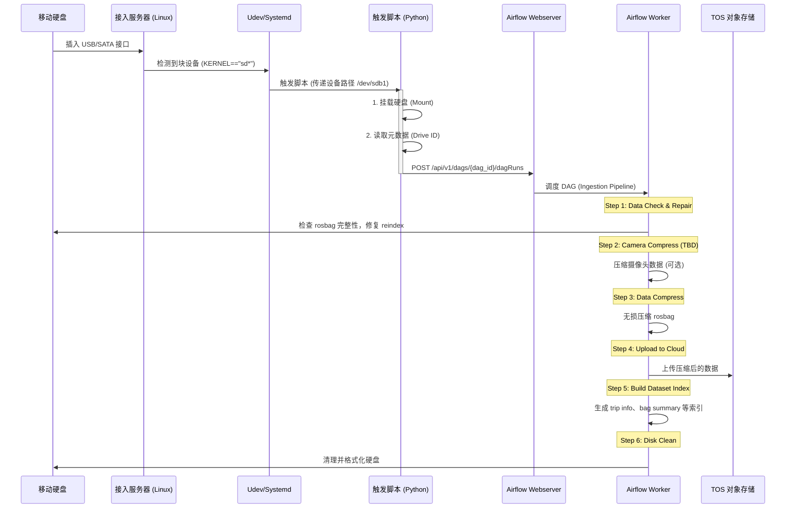

# 硬盘插入触发 Airflow DAG 自动化处理方案

这是一个经典的 "Sneakernet"（物理传输）与云端自动化结合的场景。实现这一流程的核心在于打通 **OS 硬件层 (Udev)** 与 **应用编排层 (Airflow)** 的通信。

## 1. 整体架构流程



---

## 2. 详细实现步骤

### 第一步：OS 层硬件检测 (Udev Rule)

在 Linux 数据接入服务器上，使用 `udev` 监听硬盘插入事件。

**文件**: `/etc/udev/rules.d/99-data-ingestion.rules`

```bash
# 当检测到特定厂商或标签的硬盘插入时，触发 Systemd 服务
# 假设我们的硬盘都有特定的标签前缀 "L4_DATA_"
ACTION=="add", KERNEL=="sd*[0-9]", ENV{ID_FS_LABEL}=="L4_DATA_*", TAG+="systemd", ENV{SYSTEMD_WANTS}="data-ingest@%k.service"
```

*注意：直接在 udev 规则中运行脚本会阻塞系统事件，建议通过 `systemd` 服务异步触发。*

### 第二步：Systemd 服务模板

创建一个 Systemd 服务模板，用于接收 udev 传递的设备名并启动 Python 脚本。

**文件**: `/etc/systemd/system/data-ingest@.service`

```ini
[Unit]
Description=Auto Ingest Data from Drive %I
After=network.target

[Service]
Type=oneshot
# %I 会被替换为设备名 (如 sdb1)
ExecStart=/usr/bin/python3 /opt/scripts/trigger_airflow.py --device /dev/%I
User=root
```

### 第三步：触发脚本 (Python)

这个脚本负责挂载硬盘、提取信息，并调用 Airflow REST API。

**文件**: `/opt/scripts/trigger_airflow.py`

```python
import argparse
import subprocess
import requests
import json
import os
import time

# Airflow 配置
AIRFLOW_URL = "http://airflow-webserver:8080"
DAG_ID = "drive_ingestion_pipeline"
# 建议使用 Base64 编码的 Basic Auth 或 Token
AUTH = ('admin', 'password') 

def mount_drive(device_path):
    mount_point = f"/mnt/ingest_{os.path.basename(device_path)}"
    os.makedirs(mount_point, exist_ok=True)
    # 简单挂载示例，生产环境需考虑只读挂载、权限等
    subprocess.run(["mount", device_path, mount_point], check=True)
    return mount_point

def trigger_dag(mount_point, device_path):
    # 假设硬盘根目录有个 metadata.json 记录了车辆ID等信息
    meta_path = os.path.join(mount_point, "metadata.json")
    drive_info = {}
    if os.path.exists(meta_path):
        with open(meta_path, 'r') as f:
            drive_info = json.load(f)
    
    # 构造传递给 DAG 的参数 (conf)
    payload = {
        "conf": {
            "source_path": mount_point,
            "device_node": device_path,
            "vehicle_id": drive_info.get("vehicle_id", "unknown"),
            "drive_id": drive_info.get("drive_id", "unknown"),
            "ingest_mode": "tier2_background"
        }
    }

    headers = {'Content-Type': 'application/json'}
    endpoint = f"{AIRFLOW_URL}/api/v1/dags/{DAG_ID}/dagRuns"
    
    try:
        response = requests.post(endpoint, json=payload, auth=AUTH, headers=headers)
        response.raise_for_status()
        print(f"Successfully triggered DAG: {response.json()['dag_run_id']}")
    except Exception as e:
        print(f"Failed to trigger Airflow: {e}")
        # 失败处理：可能需要卸载硬盘或报警

if __name__ == "__main__":
    parser = argparse.ArgumentParser()
    parser.add_argument("--device", required=True)
    args = parser.parse_args()
    
    # 等待设备就绪（可选）
    time.sleep(2)
    
    try:
        mp = mount_drive(args.device)
        trigger_dag(mp, args.device)
    except Exception as e:
        print(f"Error: {e}")
```

### 第四步：Airflow DAG 实现

在 Airflow 端，DAG 需要能够接收 `conf` 参数并执行完整的6步处理流程。

**文件**: `dags/drive_ingestion.py`

```python
from airflow import DAG
from airflow.operators.python import PythonOperator
from airflow.utils.dates import days_ago
from airflow.utils.task_group import TaskGroup
from airflow.models import Variable
from datetime import datetime, timedelta
import os
import subprocess
import json
import logging
from pathlib import Path

# 配置日志
logger = logging.getLogger(__name__)

# ========== Step 1: Data Check & Repair ==========
def data_check_and_repair(**context):
    """
    检查 rosbag 完整性，判断是否需要 reindex，如有问题则修复。
    使用 rosbag reindex 工具检查并修复损坏的 bag 文件。
    """
    conf = context['dag_run'].conf
    source_path = conf.get('source_path')
    drive_id = conf.get('drive_id')
    
    logger.info(f"[Step 1] Starting data check and repair for drive: {drive_id}")
    
    # 查找所有 rosbag 文件
    bag_files = list(Path(source_path).rglob("*.bag"))
    repaired_count = 0
    failed_files = []
    
    for bag_file in bag_files:
        try:
            # 使用 rosbag check 检查文件完整性
            result = subprocess.run(
                ["rosbag", "check", str(bag_file)],
                capture_output=True,
                text=True,
                timeout=300
            )
            
            if result.returncode != 0:
                logger.warning(f"Bag file {bag_file} needs repair, attempting reindex...")
                # 执行 reindex
                reindex_result = subprocess.run(
                    ["rosbag", "reindex", str(bag_file)],
                    capture_output=True,
                    text=True,
                    timeout=600
                )
                
                if reindex_result.returncode == 0:
                    repaired_count += 1
                    logger.info(f"Successfully repaired: {bag_file}")
                else:
                    failed_files.append(str(bag_file))
                    logger.error(f"Failed to repair: {bag_file}")
            else:
                logger.info(f"Bag file {bag_file} is healthy")
                
        except subprocess.TimeoutExpired:
            logger.error(f"Timeout while processing {bag_file}")
            failed_files.append(str(bag_file))
        except Exception as e:
            logger.error(f"Error processing {bag_file}: {e}")
            failed_files.append(str(bag_file))
    
    # 将结果存储到 XCom，供后续步骤使用
    context['ti'].xcom_push(key='repaired_count', value=repaired_count)
    context['ti'].xcom_push(key='failed_files', value=failed_files)
    context['ti'].xcom_push(key='total_bags', value=len(bag_files))
    
    if failed_files:
        raise Exception(f"Failed to repair {len(failed_files)} bag files: {failed_files}")
    
    return {
        'repaired_count': repaired_count,
        'total_bags': len(bag_files),
        'status': 'success'
    }

# ========== Step 2: Camera Compress (TBD) ==========
def camera_compress(**context):
    """
    对摄像头数据进行压缩以节省云端空间。
    当前为 TBD 状态，可根据后续需求实现。
    可能的实现方式：
    - 使用 FFmpeg 对视频进行重编码
    - 使用图像压缩算法（如 JPEG-XL, WebP）
    - 选择性压缩：只压缩低价值帧，保留关键帧
    """
    conf = context['dag_run'].conf
    source_path = conf.get('source_path')
    
    logger.info(f"[Step 2] Camera compress (TBD) for: {source_path}")
    
    # TODO: 实现摄像头数据压缩逻辑
    # 示例：查找所有图像/视频文件
    # image_files = list(Path(source_path).rglob("*.jpg")) + list(Path(source_path).rglob("*.png"))
    # video_files = list(Path(source_path).rglob("*.mp4"))
    
    # 当前仅记录跳过
    logger.info("Camera compress step skipped (TBD)")
    
    return {'status': 'skipped', 'reason': 'TBD'}

# ========== Step 3: Data Compress ==========
def data_compress(**context):
    """
    对 rosbag 进行无损压缩。
    使用 gzip 或 zstd 等压缩算法压缩 bag 文件。
    """
    conf = context['dag_run'].conf
    source_path = conf.get('source_path')
    work_dir = conf.get('work_dir', '/tmp/ingest_work')
    
    logger.info(f"[Step 3] Starting data compression for: {source_path}")
    
    os.makedirs(work_dir, exist_ok=True)
    bag_files = list(Path(source_path).rglob("*.bag"))
    compressed_files = []
    total_original_size = 0
    total_compressed_size = 0
    
    for bag_file in bag_files:
        try:
            original_size = bag_file.stat().st_size
            total_original_size += original_size
            
            # 使用 zstd 进行压缩（比 gzip 更快且压缩率更高）
            compressed_path = Path(work_dir) / f"{bag_file.stem}.bag.zst"
            
            result = subprocess.run(
                ["zstd", "-19", "-f", str(bag_file), "-o", str(compressed_path)],
                capture_output=True,
                text=True,
                timeout=3600  # 1小时超时
            )
            
            if result.returncode == 0:
                compressed_size = compressed_path.stat().st_size
                total_compressed_size += compressed_size
                compression_ratio = (1 - compressed_size / original_size) * 100
                
                compressed_files.append({
                    'original': str(bag_file),
                    'compressed': str(compressed_path),
                    'original_size': original_size,
                    'compressed_size': compressed_size,
                    'ratio': compression_ratio
                })
                
                logger.info(f"Compressed {bag_file.name}: {compression_ratio:.1f}% reduction")
            else:
                raise Exception(f"Compression failed: {result.stderr}")
                
        except Exception as e:
            logger.error(f"Error compressing {bag_file}: {e}")
            raise
    
    # 存储压缩结果
    context['ti'].xcom_push(key='compressed_files', value=compressed_files)
    context['ti'].xcom_push(key='total_original_size', value=total_original_size)
    context['ti'].xcom_push(key='total_compressed_size', value=total_compressed_size)
    
    overall_ratio = (1 - total_compressed_size / total_original_size) * 100 if total_original_size > 0 else 0
    
    logger.info(f"Compression complete: {overall_ratio:.1f}% overall reduction")
    
    return {
        'compressed_count': len(compressed_files),
        'total_original_size': total_original_size,
        'total_compressed_size': total_compressed_size,
        'compression_ratio': overall_ratio
    }

# ========== Step 4: Upload to Cloud ==========
def upload_to_cloud(**context):
    """
    将压缩后的数据上传到 TOS (对象存储)。
    使用 TOS SDK 或 s3cmd 等工具进行上传。
    """
    conf = context['dag_run'].conf
    work_dir = conf.get('work_dir', '/tmp/ingest_work')
    vehicle_id = conf.get('vehicle_id')
    drive_id = conf.get('drive_id')
    
    # 从 TOS 配置获取凭证（建议使用 Airflow Variables）
    tos_endpoint = Variable.get("TOS_ENDPOINT", default_var="")
    tos_access_key = Variable.get("TOS_ACCESS_KEY", default_var="")
    tos_secret_key = Variable.get("TOS_SECRET_KEY", default_var="")
    tos_bucket = Variable.get("TOS_BUCKET", default_var="l4-data")
    
    logger.info(f"[Step 4] Starting upload to TOS for drive: {drive_id}")
    
    # 获取压缩文件列表
    compressed_files = context['ti'].xcom_pull(key='compressed_files', task_ids='data_compress')
    
    uploaded_files = []
    failed_uploads = []
    
    # TOS 上传路径格式: s3://bucket/vehicle_id/drive_id/compressed_files/
    base_s3_path = f"s3://{tos_bucket}/{vehicle_id}/{drive_id}/"
    
    try:
        # 使用 boto3 或 TOS SDK 进行上传
        import boto3
        from botocore.exceptions import ClientError
        
        s3_client = boto3.client(
            's3',
            endpoint_url=tos_endpoint,
            aws_access_key_id=tos_access_key,
            aws_secret_access_key=tos_secret_key
        )
        
        for file_info in compressed_files:
            compressed_path = file_info['compressed']
            file_name = Path(compressed_path).name
            s3_key = f"{vehicle_id}/{drive_id}/{file_name}"
            
            try:
                logger.info(f"Uploading {file_name} to {s3_key}...")
                
                s3_client.upload_file(
                    compressed_path,
                    tos_bucket,
                    s3_key,
                    ExtraArgs={'ServerSideEncryption': 'AES256'}
                )
                
                uploaded_files.append({
                    'local_path': compressed_path,
                    's3_path': f"{base_s3_path}{file_name}",
                    'size': file_info['compressed_size']
                })
                
                logger.info(f"Successfully uploaded: {s3_key}")
                
            except ClientError as e:
                logger.error(f"Failed to upload {file_name}: {e}")
                failed_uploads.append(file_name)
                
    except ImportError:
        # 如果没有 boto3，可以使用 subprocess 调用 aws cli 或 tosutil
        logger.warning("boto3 not available, using alternative upload method")
        # TODO: 实现基于命令行工具的上传
        
    if failed_uploads:
        raise Exception(f"Failed to upload {len(failed_uploads)} files: {failed_uploads}")
    
    # 存储上传结果
    context['ti'].xcom_push(key='uploaded_files', value=uploaded_files)
    context['ti'].xcom_push(key='s3_base_path', value=base_s3_path)
    
    logger.info(f"Upload complete: {len(uploaded_files)} files uploaded")
    
    return {
        'uploaded_count': len(uploaded_files),
        's3_base_path': base_s3_path,
        'status': 'success'
    }

# ========== Step 5: Build Dataset Index ==========
def build_dataset_index(**context):
    """
    根据相关信息建立数据索引，包括：
    - Trip info: 行程信息（时间、路线、里程等）
    - Bag summary: rosbag 摘要（话题、时长、消息数等）
    - Metadata: 车辆ID、驱动ID、软件版本等
    """
    conf = context['dag_run'].conf
    source_path = conf.get('source_path')
    vehicle_id = conf.get('vehicle_id')
    drive_id = conf.get('drive_id')
    
    logger.info(f"[Step 5] Building dataset index for drive: {drive_id}")
    
    # 获取 bag 文件信息
    bag_files = list(Path(source_path).rglob("*.bag"))
    
    trip_info = {
        'vehicle_id': vehicle_id,
        'drive_id': drive_id,
        'ingest_timestamp': datetime.now().isoformat(),
        'source_path': source_path,
        'bag_count': len(bag_files)
    }
    
    bag_summaries = []
    
    for bag_file in bag_files:
        try:
            # 使用 rosbag info 获取 bag 文件摘要
            result = subprocess.run(
                ["rosbag", "info", str(bag_file)],
                capture_output=True,
                text=True,
                timeout=60
            )
            
            if result.returncode == 0:
                # 解析 rosbag info 输出，提取关键信息
                info_text = result.stdout
                
                # 提取时长、消息数、话题等信息（需要解析文本）
                bag_info = {
                    'bag_file': str(bag_file),
                    'file_size': bag_file.stat().st_size,
                    'info_text': info_text  # 可以进一步解析为结构化数据
                }
                
                bag_summaries.append(bag_info)
                
        except Exception as e:
            logger.error(f"Error getting info for {bag_file}: {e}")
    
    # 读取硬盘上的 metadata.json（如果存在）
    metadata_path = Path(source_path) / "metadata.json"
    drive_metadata = {}
    if metadata_path.exists():
        with open(metadata_path, 'r') as f:
            drive_metadata = json.load(f)
    
    # 合并所有索引信息
    dataset_index = {
        'trip_info': trip_info,
        'bag_summaries': bag_summaries,
        'drive_metadata': drive_metadata,
        'index_timestamp': datetime.now().isoformat()
    }
    
    # 将索引信息存储到数据库或文件系统
    # 选项1: 存储到 TOS
    # 选项2: 存储到元数据库（如 MongoDB, PostgreSQL）
    # 选项3: 存储到 FastDM 系统
    
    index_file = f"/tmp/index_{drive_id}.json"
    with open(index_file, 'w') as f:
        json.dump(dataset_index, f, indent=2)
    
    # 上传索引文件到 TOS
    # TODO: 实现索引文件上传逻辑
    
    context['ti'].xcom_push(key='dataset_index', value=dataset_index)
    context['ti'].xcom_push(key='index_file', value=index_file)
    
    logger.info(f"Dataset index built: {len(bag_summaries)} bags indexed")
    
    return dataset_index

# ========== Step 6: Disk Clean ==========
def disk_clean(**context):
    """
    清理并格式化硬盘。
    在确认数据已成功上传后，清理硬盘内容并格式化，准备下次使用。
    """
    conf = context['dag_run'].conf
    source_path = conf.get('source_path')
    device_node = conf.get('device_node')
    drive_id = conf.get('drive_id')
    
    logger.info(f"[Step 6] Starting disk clean for drive: {drive_id}")
    
    # 验证上传是否成功
    upload_result = context['ti'].xcom_pull(key='uploaded_files', task_ids='upload_to_cloud')
    if not upload_result:
        raise Exception("Cannot clean disk: upload verification failed")
    
    try:
        # 1. 卸载硬盘
        logger.info(f"Unmounting {source_path}...")
        subprocess.run(["umount", source_path], check=True, timeout=30)
        
        # 2. 清理挂载点
        if os.path.exists(source_path):
            os.rmdir(source_path)
        
        # 3. 格式化硬盘（可选，根据需求决定）
        # 注意：格式化会删除所有数据，确保已备份
        format_disk = conf.get('format_disk', False)
        
        if format_disk:
            logger.warning(f"Formatting device {device_node}...")
            # 使用 mkfs 格式化（根据文件系统类型选择）
            # subprocess.run(["mkfs.ext4", "-F", device_node], check=True, timeout=300)
            logger.info("Disk format completed")
        else:
            logger.info("Disk format skipped (set format_disk=true to enable)")
        
        logger.info(f"Disk clean completed for drive: {drive_id}")
        
        return {
            'status': 'success',
            'unmounted': True,
            'formatted': format_disk,
            'device': device_node
        }
        
    except subprocess.CalledProcessError as e:
        logger.error(f"Error during disk clean: {e}")
        raise
    except Exception as e:
        logger.error(f"Unexpected error during disk clean: {e}")
        raise

# ========== DAG 定义 ==========
with DAG(
    dag_id='drive_ingestion_pipeline',
    schedule_interval=None,  # 设为 None，只允许手动或 API 触发
    start_date=days_ago(1),
    catchup=False,
    tags=['ingestion', 'hardware-trigger', 'tier2'],
    default_args={
        'retries': 2,
        'retry_delay': timedelta(minutes=5),
        'on_failure_callback': None,  # 可以添加失败通知回调
    },
) as dag:

    # Step 1: Data Check & Repair
    task_check_repair = PythonOperator(
        task_id='data_check_and_repair',
        python_callable=data_check_and_repair,
        pool='data_processing',  # 使用资源池控制并发
        pool_slots=1,
    )

    # Step 2: Camera Compress (TBD)
    task_camera_compress = PythonOperator(
        task_id='camera_compress',
        python_callable=camera_compress,
        pool='data_processing',
    )

    # Step 3: Data Compress
    task_data_compress = PythonOperator(
        task_id='data_compress',
        python_callable=data_compress,
        pool='data_processing',
    )

    # Step 4: Upload to Cloud
    task_upload = PythonOperator(
        task_id='upload_to_cloud',
        python_callable=upload_to_cloud,
        pool='upload_pool',  # 单独的上传资源池
        pool_slots=1,
    )

    # Step 5: Build Dataset Index
    task_build_index = PythonOperator(
        task_id='build_dataset_index',
        python_callable=build_dataset_index,
    )

    # Step 6: Disk Clean
    task_disk_clean = PythonOperator(
        task_id='disk_clean',
        python_callable=disk_clean,
    )

    # 定义任务依赖关系
    task_check_repair >> task_camera_compress >> task_data_compress >> task_upload >> task_build_index >> task_disk_clean
```

## 3. 处理流程详细说明

### 3.1 Step 1: Data Check & Repair（数据检查与修复）

**目标**: 确保 rosbag 文件完整性，修复损坏的索引。

**实现要点**:
- 使用 `rosbag check` 检查每个 bag 文件的完整性
- 对于需要修复的文件，使用 `rosbag reindex` 重建索引
- 记录修复统计信息（修复数量、失败文件列表）
- 如果存在无法修复的文件，应记录并告警，但不一定阻止后续流程

**技术细节**:
- 超时设置：检查 5 分钟，修复 10 分钟（可根据文件大小调整）
- 错误处理：单个文件失败不应阻止整个流程，但需要记录
- 性能优化：可以并行检查多个小文件，但大文件需要串行处理

### 3.2 Step 2: Camera Compress（摄像头数据压缩）

**目标**: 压缩摄像头数据以节省云端存储空间。

**当前状态**: TBD（待定）

**可能的实现方向**:
- **选择性压缩**: 只压缩低价值帧，保留关键帧（如触发时刻前后）
- **重编码**: 使用 FFmpeg 将原始视频重编码为更高效的格式（H.265/HEVC）
- **图像压缩**: 对静态图像使用 JPEG-XL 或 WebP 格式
- **质量权衡**: 根据数据价值选择压缩质量（关键数据无损，背景数据有损）

**注意事项**:
- 压缩会消耗 CPU 资源，需要评估处理时间
- 压缩后的数据需要保持可读性，确保后续分析不受影响

### 3.3 Step 3: Data Compress（数据压缩）

**目标**: 对 rosbag 进行无损压缩，减少上传时间和存储成本。

**实现要点**:
- 使用 `zstd` 压缩算法（推荐，压缩率和速度平衡较好）
- 压缩级别：`-19`（最高压缩率，但速度较慢）
- 压缩后文件扩展名：`.bag.zst`
- 记录压缩统计：原始大小、压缩后大小、压缩率

**性能考虑**:
- 大文件压缩可能需要较长时间（TB 级数据可能需要数小时）
- 可以使用多线程并行压缩多个文件
- 压缩后的文件存储在临时工作目录，避免占用原始硬盘空间

### 3.4 Step 4: Upload to Cloud（上传到云端）

**目标**: 将压缩后的数据上传到 TOS 对象存储。

**实现要点**:
- 使用 TOS SDK 或 boto3（兼容 S3 API）进行上传
- 上传路径格式：`s3://bucket/vehicle_id/drive_id/filename.bag.zst`
- 支持断点续传：对于大文件，使用分片上传
- 上传后验证：计算 MD5/SHA256 校验和，确保数据完整性

**配置管理**:
- TOS 凭证存储在 Airflow Variables 中，避免硬编码
- 支持多区域上传（根据车辆位置选择最近的区域）

**错误处理**:
- 上传失败的文件需要重试机制
- 记录上传进度，支持从失败点恢复
- 上传完成后，可以删除本地压缩文件以释放空间

### 3.5 Step 5: Build Dataset Index（构建数据集索引）

**目标**: 建立数据索引，支持后续快速检索和查询。

**索引内容**:
- **Trip Info（行程信息）**:
  - 车辆ID、驱动ID
  - 数据采集时间范围
  - 行程路线（GPS 轨迹）
  - 总里程、行驶时长
  - 软件版本、地图版本

- **Bag Summary（Bag 摘要）**:
  - 每个 bag 文件的话题列表
  - 消息数量、数据大小
  - 时间范围（开始/结束时间戳）
  - 关键传感器状态（Lidar、Camera 帧率等）

- **Metadata（元数据）**:
  - 从硬盘 metadata.json 读取的信息
  - 数据质量评分
  - 触发事件列表（如果有）

**存储方式**:
- 索引文件以 JSON 格式存储
- 上传到 TOS 的元数据目录
- 同时写入 FastDM 元数据库，支持 SQL 查询

### 3.6 Step 6: Disk Clean（硬盘清理）

**目标**: 清理并格式化硬盘，准备下次使用。

**安全措施**:
- **验证上传**: 在清理前，必须验证所有数据已成功上传
- **备份确认**: 可以保留一份本地备份（可选）
- **日志记录**: 记录清理操作，包括时间戳和操作人员

**清理步骤**:
1. 卸载硬盘文件系统
2. 清理挂载点目录
3. （可选）格式化硬盘为指定文件系统
4. 更新硬盘标签，标记为"已处理"

**注意事项**:
- 格式化操作不可逆，需要谨慎
- 建议在格式化前先进行数据完整性验证
- 可以设置 `format_disk` 参数控制是否格式化（默认 false）

## 4. 关键考虑点

### 4.1 安全性 (Security)

- **API Auth**: 脚本中不要硬编码密码，应使用环境变量或 Airflow Variables。
- **Mount 权限**: 确保挂载操作安全，防止恶意硬盘执行代码。建议使用 `noexec,nodev,nosuid` 挂载选项。
- **数据加密**: 上传到 TOS 时启用服务端加密（SSE）。
- **访问控制**: TOS 凭证使用最小权限原则，只授予必要的读写权限。

### 4.2 并发处理 (Concurrency)

- **多硬盘并发**: 如果同时插入多个硬盘，Systemd 会启动多个脚本实例，Airflow 会创建多个 DAG Run。
- **资源池管理**: 
  - `data_processing` 池：控制数据检查和压缩的并发数（建议 2-4）
  - `upload_pool` 池：控制上传任务的并发数（建议 1-2，避免带宽打满）
- **IO 限制**: 使用 `ionice` 和 `nice` 控制进程优先级，避免影响系统其他服务。

### 4.3 错误处理与重试 (Error Handling)

- **任务级重试**: 每个任务配置 `retries=2`，失败后自动重试。
- **关键步骤验证**: 
  - Step 4 上传失败：阻止后续清理步骤
  - Step 1 修复失败：记录告警，但可以继续（取决于业务需求）
- **失败通知**: 配置 `on_failure_callback`，发送告警到监控系统（如 PagerDuty、Slack）。

### 4.4 错误反馈 (Feedback)

- **硬件反馈**: 脚本成功触发 API 后，可以控制服务器上的 LED 灯闪烁，或者通过蜂鸣器发出"滴"声。
- **状态监控**: 在 Airflow UI 中实时查看处理进度。
- **日志聚合**: 使用 ELK 或类似工具聚合日志，方便排查问题。

### 4.5 幂等性 (Idempotency)

- **Drive ID 检查**: 在 DAG 开始时检查该 Drive ID 是否已经处理过（查询元数据库）。
- **重复运行保护**: 如果检测到重复处理，可以选择跳过或更新索引。
- **部分完成恢复**: 如果 DAG 在中间步骤失败，支持从失败点继续执行（使用 Airflow 的 `clear` 功能）。

### 4.6 性能优化 (Performance)

- **并行处理**: Step 1 和 Step 3 可以并行处理多个文件（使用多进程/多线程）。
- **增量处理**: 如果硬盘包含已处理的数据，支持增量处理（只处理新数据）。
- **资源监控**: 监控 CPU、内存、磁盘 IO、网络带宽使用情况，及时调整资源池大小。

### 4.7 数据完整性 (Data Integrity)

- **校验和验证**: 上传前后计算文件校验和（MD5/SHA256），确保数据未损坏。
- **传输验证**: 使用 TOS 的 multipart upload 功能，支持大文件断点续传。
- **索引一致性**: 确保索引信息与实际数据一致，定期进行一致性检查。

### 4.8 成本控制 (Cost Management)

- **存储分层**: 根据数据价值选择存储类型（标准存储 vs 归档存储）。
- **压缩优化**: 通过压缩减少存储和传输成本。
- **生命周期管理**: 配置 TOS 生命周期策略，自动将旧数据迁移到更便宜的存储类型。

---

## 5. 实施检查清单

### 5.1 基础设施准备

- [ ] 配置 Udev 规则文件 `/etc/udev/rules.d/99-data-ingestion.rules`
- [ ] 创建 Systemd 服务模板 `/etc/systemd/system/data-ingest@.service`
- [ ] 部署触发脚本 `/opt/scripts/trigger_airflow.py`
- [ ] 配置 Airflow 资源池（`data_processing`, `upload_pool`）
- [ ] 配置 Airflow Variables（TOS 凭证等）

### 5.2 依赖安装

- [ ] 安装 ROS 工具链（rosbag, rosbag check, rosbag reindex）
- [ ] 安装压缩工具（zstd）
- [ ] 安装 Python 依赖（boto3, requests）
- [ ] 安装 TOS SDK 或配置 AWS CLI

### 5.3 测试验证

- [ ] 测试 Udev 规则触发
- [ ] 测试 Airflow API 调用
- [ ] 测试每个处理步骤（使用测试数据）
- [ ] 测试错误处理和重试机制
- [ ] 测试并发处理（多个硬盘同时插入）

### 5.4 监控与告警

- [ ] 配置 Airflow 失败通知（Slack/PagerDuty）
- [ ] 设置日志聚合（ELK/Grafana）
- [ ] 配置资源监控（CPU、内存、IO、网络）
- [ ] 设置数据完整性检查告警

---

## 6. 总结

本方案实现了一个完整的硬盘插入自动化处理流程，从硬件检测到数据上传、索引构建和硬盘清理，实现了端到端的自动化。

**核心优势**:
1. **自动化**: 硬盘插入后自动触发，无需人工干预
2. **可靠性**: 多层次的错误处理和重试机制
3. **可扩展**: 使用 Airflow 资源池控制并发，支持多硬盘同时处理
4. **可观测**: 完整的日志和监控，便于问题排查
5. **安全性**: 数据加密、访问控制、完整性验证

**后续优化方向**:
- 实现 Step 2（Camera Compress）的具体压缩策略
- 优化压缩算法，平衡压缩率和处理时间
- 实现增量处理，支持部分数据更新
- 集成 FastDM 系统，实现更强大的数据检索能力
- 添加数据质量评分和自动标注功能
