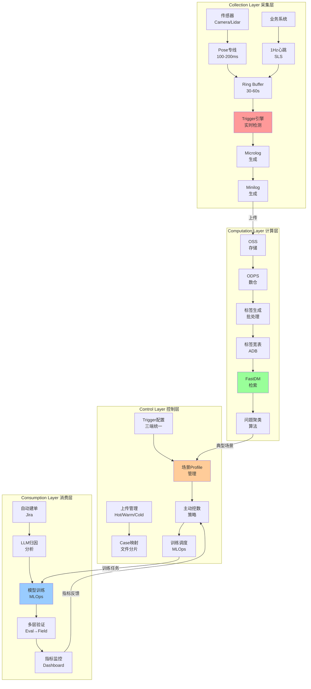
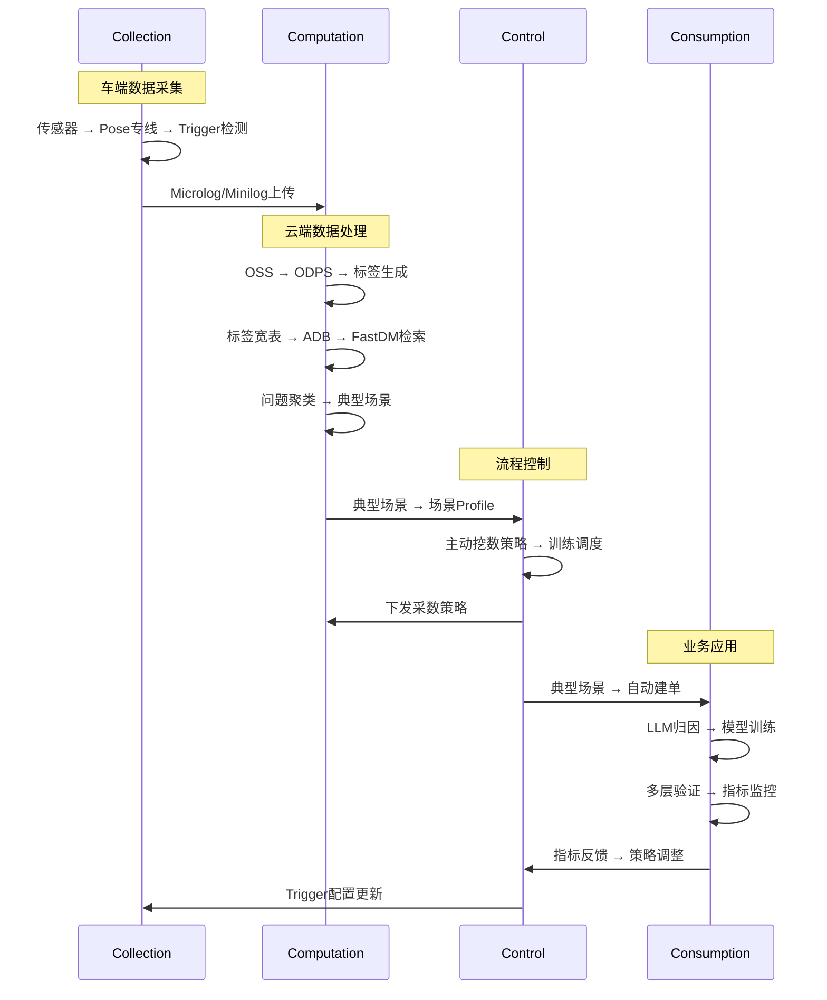

# L4 自动驾驶数据闭环 4C 架构设计

> **专业架构设计文档**
> 
> 本文档详细描述L4自动驾驶数据闭环系统的4C架构设计，包括Collection（采集层）、Computation（计算层）、Control（控制层）、Consumption（消费层）四个核心层次的详细设计。

---

## 一、4C架构概览

### 1.1 架构定义

**4C架构**是L4自动驾驶数据闭环系统的核心架构模式，将整个系统划分为四个关键层次：

| 层级 | 英文名称 | 核心职责 | 关键输出 |
|------|---------|---------|---------|
| **Collection** | 采集层 | 数据采集和初步处理 | Microlog/Minilog |
| **Computation** | 计算层 | 数据处理和特征提取 | 标签、Case、典型场景 |
| **Control** | 控制层 | 流程控制和资源调度 | 策略、配置、任务 |
| **Consumption** | 消费层 | 数据应用和业务闭环 | 模型、Issue、指标 |

### 1.2 架构全景图



---

## 二、Collection Layer（采集层）

### 2.1 核心职责

在车端有限算力下，精准捕获高价值数据，为后续处理提供高质量数据源。

### 2.2 关键组件

#### 2.2.1 Pose专线

**功能**：采集车体姿态和底盘状态数据

**技术规格**：
- 采样频率：100-200ms/条
- 数据内容：位置、速度、加速度、航向角、控制指令
- 存储格式：Protobuf
- 特点：轻量级、长期可存、与算法解耦

**实现要点**：
```cpp
class PoseStream {
    void WritePose(const PoseData& pose);
    // 无锁Ring Buffer，不阻塞主线程
    // 固定频率写入，不做任何判断
};
```

#### 2.2.2 1Hz心跳

**功能**：业务状态心跳，用于运营指标统计

**技术规格**：
- 频率：1秒/条
- 数据内容：驾驶模式、速度、道路类型、任务状态
- 传输方式：SLS实时流
- 用途：自动驾驶率、里程、速度统计

#### 2.2.3 Ring Buffer

**功能**：数据回溯缓冲区

**技术规格**：
- 容量：30-60秒数据
- 用途：Trigger触发时回溯历史数据
- 实现：无锁环形缓冲区

#### 2.2.4 Trigger引擎

**功能**：实时异常检测

**技术规格**：
- 类型：规则Trigger、Python Trigger
- 运行环境：车端沙箱
- 特点：三端统一（车端/云端/仿真端）

**Trigger示例**：
```python
# 急刹检测Trigger
def hard_brake_trigger(pose_data):
    if pose_data.acceleration < -0.5:  # m/s²
        return True
    return False
```

#### 2.2.5 Microlog/Minilog生成器

**功能**：生成轻量级数据格式

**数据大小对比**：
- Microlog（30秒）：~100KB
- Minilog（30秒）：~5MB
- Raw Data（30秒）：~2GB

### 2.3 数据流

```
传感器数据 → Pose专线 → Ring Buffer
业务系统 → 1Hz心跳 → Ring Buffer
                ↓
          Trigger引擎检测
                ↓
        Microlog/Minilog生成
                ↓
          加入上传队列
```

---

## 三、Computation Layer（计算层）

### 3.1 核心职责

处理海量数据，生成结构化特征，支持秒级检索和分析。

### 3.2 关键组件

#### 3.2.1 存储系统

**OSS（对象存储）**：
- 存储原始文件（Microlog/Minilog/Raw）
- 支持分级存储（Hot/Warm/Cold）

**ODPS（MaxCompute）**：
- 存储索引和元数据
- 数仓分层：ODS/DWD/DWS/ADS
- 支持PB级数据处理

**SLS（日志服务）**：
- 实时心跳和事件流
- Flink流式处理

#### 3.2.2 标签生成系统

**秒级标签生成**：
- 输入：OSS原始数据
- 处理：ODPS SQL + Python UDF
- 输出：标签竖表（Tall Table）

**标签宽表构建**：
- 输入：标签竖表
- 处理：PIVOT操作
- 输出：标签宽表（Wide Table，300+列）

**ADB同步**：
- 同步标签宽表到ADB
- 实现秒级查询

#### 3.2.3 FastDM检索引擎

**功能**：秒级数据检索

**查询流程**：
1. 用户配置标签过滤条件
2. 系统转换为SQL查询
3. 在ADB宽表上执行
4. Session聚合
5. 返回Case列表

**性能指标**：
- 月级数据检索：< 1分钟
- P99查询延迟：< 1秒

#### 3.2.4 问题聚类算法

**两阶段聚类**：
1. **规则分桶**：按现象和场景粗略分桶
2. **Embedding聚类**：在每个桶内精细聚类

**特征提取**：
- 秒级标签特征
- 图像/点云Embedding
- Trigger语义token

---

## 四、Control Layer（控制层）

### 4.1 核心职责

流程控制、资源调度、策略管理，确保整个系统高效运行。

### 4.2 关键组件

#### 4.2.1 上传管理器

**功能**：分级上传管理

**策略**：
- **Hot Data**：4G/5G立即上传（碰撞、接管、急刹）
- **Warm Data**：Wi-Fi回场站上传（Trigger事件、用户反馈）
- **Cold Data**：物理硬盘回收（全量Raw数据）

#### 4.2.2 CaseID映射系统

**功能**：Case与文件分片的逻辑映射

**映射关系**：
```
CaseID → [Chunk1, Chunk2, ..., ChunkN]
每个Chunk: {chunk_id, file_path, start_ts, end_ts, file_size}
```

#### 4.2.3 Trigger配置中心

**功能**：三端统一的Trigger规则管理

**特点**：
- 支持动态下发
- 车端/云端/仿真端统一
- 版本管理

#### 4.2.4 场景Profile管理

**功能**：典型问题场景的Profile定义

**Profile内容**：
- 结构化标签规则
- Trigger模板
- 数据需求（Microlog/Minilog/Raw）
- 优先级策略

#### 4.2.5 主动挖数策略

**功能**：基于场景Profile的智能采数

**优先级计算**：
```
采数优先级 = (风险权重 × MPD贡献) ÷ 已有样本数
```

#### 4.2.6 训练任务调度

**功能**：MLOps Pipeline自动化调度

**流程**：
1. 场景Profile触发
2. 主动挖数
3. 数据标注
4. 模型训练
5. 多层验证
6. 部署上线

---

## 五、Consumption Layer（消费层）

### 5.1 核心职责

数据应用、模型训练、业务闭环，实现从问题到解决的完整闭环。

### 5.2 关键组件

#### 5.2.1 自动建单系统

**功能**：Trigger触发自动创建Jira Issue

**流程**：
1. Trigger触发
2. 去重检查
3. LLM归因分析
4. 路由到团队
5. 创建Issue

#### 5.2.2 LLM归因分析

**功能**：自动分析问题根本原因

**分析维度**：
- 感知漏检/误检
- 规划策略问题
- 定位抖动
- 传感器问题
- 地图/环境问题

#### 5.2.3 模型训练

**功能**：增量训练/Fine-tune

**训练流程**：
1. 场景选择
2. 定向挖数
3. 增值标注
4. 增量训练
5. 版本对比评测

#### 5.2.4 多层验证

**验证流程**：
1. **Model Eval**：离线指标测试
2. **Log Replay**：历史数据开环回放
3. **World Sim**：虚拟场景闭环测试
4. **实车灰度**：10%→40%→100%渐进式灰度

#### 5.2.5 指标Dashboard

**功能**：关键指标监控

**核心指标**：
- MPS（Miles Per Stupid）
- MPD（Miles Per Dangerous）
- 自动驾驶率
- 各场景问题分布

---

## 六、4C架构数据流

### 6.1 完整数据流



### 6.2 关键数据流说明

1. **采集→计算**：Microlog/Minilog上传到OSS，ODPS建立索引
2. **计算→控制**：FastDM检索结果和聚类结果传递给Control层
3. **控制→计算**：Control层下发采数策略，Computation层执行
4. **控制→消费**：场景Profile触发训练任务
5. **消费→控制**：指标反馈调整策略和配置

---

## 七、4C架构优势

### 7.1 架构优势

1. **清晰的职责分离**
   - 每层职责明确，便于理解和维护
   - 降低系统复杂度

2. **高度解耦**
   - 各层通过标准接口交互
   - 可以独立演进和优化
   - 便于分布式部署

3. **可扩展性强**
   - 每层都可以水平扩展
   - 支持大规模车队和数据处理

4. **自动化程度高**
   - Control层统一调度
   - 从采集到应用全流程自动化

5. **数据驱动**
   - 所有决策基于数据
   - 通过指标反馈持续优化

### 7.2 技术优势

1. **性能优化**
   - ADB列存 + 索引优化
   - 秒级查询能力
   - 增量处理机制

2. **成本控制**
   - 分级存储策略
   - 按需补采机制
   - 智能优先级调度

3. **质量保证**
   - 多层验证机制
   - 自动化测试
   - 持续监控

---

## 八、实施建议

### 8.1 分阶段实施

1. **Phase 1**：Collection层（Month 1-3）
2. **Phase 2**：Computation层（Month 4-9）
3. **Phase 3**：Control层（Month 10-12）
4. **Phase 4**：Consumption层（Month 13-15）

### 8.2 关键技术选型

- **Collection**：C++/Rust, Protobuf, SLS SDK
- **Computation**：ODPS, ADB, FastDM
- **Control**：配置中心, Airflow, Kubernetes
- **Consumption**：Jira API, LLM, MLOps

### 8.3 性能指标

- **Collection**：采样延迟 < 10ms, 心跳成功率 > 99.9%
- **Computation**：标签生成延迟 < 1小时, 查询P99 < 1秒
- **Control**：配置下发延迟 < 5秒, 任务成功率 > 99%
- **Consumption**：建单延迟 < 10秒, LLM归因 < 30秒

---

## 九、总结

4C架构为L4自动驾驶数据闭环系统提供了清晰的分层设计：

- **Collection层**：专注数据采集，确保数据质量
- **Computation层**：专注数据处理，提供秒级检索能力
- **Control层**：专注流程控制，实现自动化调度
- **Consumption层**：专注业务应用，实现完整闭环

通过4C架构，我们可以构建一个**自动化、可扩展、数据驱动**的L4自动驾驶数据闭环系统。

---

*文档版本：v1.0*  
*最后更新：2025年*

