# L4 自动驾驶数据闭环完整分层架构设计

> **基于《L4自动驾驶数据闭环实战》系列七篇文章的专业架构设计**
> 
> 本文档提供 L4 自动驾驶数据闭环系统的完整分层架构设计，包括 Trigger、Tag、Microlog、Minilog 等核心组件的详细设计和实现步骤。

---

## 目录

1. [4C架构设计](#一4c架构设计)
2. [整体架构概览](#二整体架构概览)
   - [2.1 架构分层图](#21-架构分层图)
   - [2.2 整体应用架构图](#22-整体应用架构图)
   - [2.3 应用服务详细架构](#23-应用服务详细架构)
   - [2.4 核心数据流](#24-核心数据流)
   - [2.5 应用服务交互流程](#25-应用服务交互流程)
   - [2.6 应用服务详细说明](#26-应用服务详细说明)
   - [2.7 服务间通信](#27-服务间通信)
   - [2.8 数据访问层设计](#28-数据访问层设计)
3. [分层架构设计](#三分层架构设计)
4. [核心组件设计](#四核心组件设计)
5. [数据流转路径](#五数据流转路径)
6. [实现步骤](#六实现步骤)
7. [关键技术细节](#七关键技术细节)
8. [性能优化建议](#八性能优化建议)
9. [总结](#九总结)
10. [关键优化建议](#十关键优化建议)
11. [常见问题与解决方案](#十一常见问题与解决方案)
12. [MVP（最小可行产品）设计](#十二mvp最小可行产品设计)
13. [参考资源](#十三参考资源)

---

## 一、4C架构设计

### 1.1 4C架构概览

**4C架构**是L4自动驾驶数据闭环系统的核心架构模式，将整个系统划分为四个关键层次：

- **Collection（采集层）**：负责数据采集和初步处理
- **Computation（计算层）**：负责数据处理、标签生成和特征提取
- **Control（控制层）**：负责流程控制、调度和决策
- **Consumption（消费层）**：负责数据应用、模型训练和业务闭环

### 1.2 4C架构图

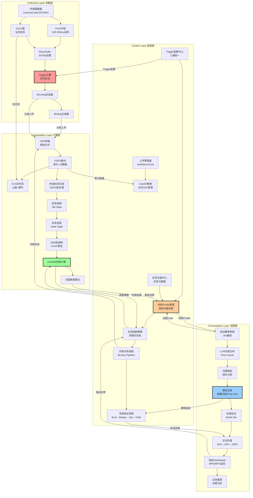

### 1.3 4C架构详细说明

#### Collection Layer（采集层）

**职责**：在车端有限算力下，精准捕获高价值数据

**核心组件**：
- **传感器数据采集**：Camera、Lidar、GPS、IMU等原始传感器数据
- **Pose专线**：100-200ms频率的车体姿态数据流
- **1Hz心跳**：每秒一条的业务状态心跳
- **Ring Buffer**：30-60秒的数据回溯缓冲区
- **Trigger引擎**：实时异常检测引擎（规则Trigger + Python Trigger）
- **Microlog/Minilog生成器**：轻量级数据格式生成

**关键特性**：
- 轻量级：只采集必要数据，不阻塞主线程
- 实时性：Trigger实时检测，快速响应
- 可回溯：Ring Buffer保证能回溯历史数据
- 三端统一：Trigger逻辑可在车端/云端/仿真端复用

#### Computation Layer（计算层）

**职责**：处理海量数据，生成结构化特征，支持秒级检索

**核心组件**：
- **OSS存储**：原始文件对象存储
- **ODPS数仓**：索引和元数据管理（ODS/DWD/DWS/ADS）
- **SLS实时流**：实时心跳和事件流处理
- **秒级标签生成**：ODPS批处理生成标签
- **标签竖表/宽表**：标签存储和查询优化
- **ADB加速库**：OLAP查询加速
- **FastDM检索引擎**：秒级数据检索
- **问题聚类算法**：Scene-Cause-Phenomenon聚类

**关键特性**：
- 高性能：ADB列存 + 索引优化，实现秒级查询
- 可扩展：ODPS支持PB级数据处理
- 实时+离线：SLS实时流 + ODPS离线批处理
- 智能化：LLM辅助聚类和归因分析

#### Control Layer（控制层）

**职责**：流程控制、资源调度、策略管理

**核心组件**：
- **上传管理器**：Hot/Warm/Cold数据分级上传
- **CaseID映射**：Case与文件分片的逻辑映射
- **Trigger配置中心**：三端统一的Trigger规则管理
- **标签注册中心**：标签元数据和生成方式管理
- **场景Profile管理**：典型问题场景的Profile定义
- **主动挖数策略**：基于场景Profile的采数优先级计算
- **训练任务调度**：MLOps Pipeline自动化调度
- **多层验证流程**：Eval→Replay→Sim→Field验证流程控制

**关键特性**：
- 自动化：从问题发现到模型训练全流程自动化
- 可配置：所有策略和规则可配置化
- 优先级管理：智能的采数和训练优先级调度
- 流程管控：完整的验证和上线流程控制

#### Consumption Layer（消费层）

**职责**：数据应用、模型训练、业务闭环

**核心组件**：
- **自动建单系统**：Trigger触发自动创建Jira Issue
- **LLM归因分析**：自动分析问题根本原因
- **问题路由**：智能路由到对应团队
- **模型训练**：增量训练/Fine-tune自动化
- **仿真验证**：World Sim闭环仿真验证
- **实车灰度**：10%→40%→100%渐进式灰度
- **指标Dashboard**：MPS/MPD等关键指标监控
- **业务报表**：运营分析和业务决策支持

**关键特性**：
- 业务闭环：从问题到解决的完整闭环
- 智能化：LLM辅助分析和决策
- 数据驱动：所有决策基于数据和指标
- 持续改进：通过指标反馈持续优化

### 1.4 4C架构数据流

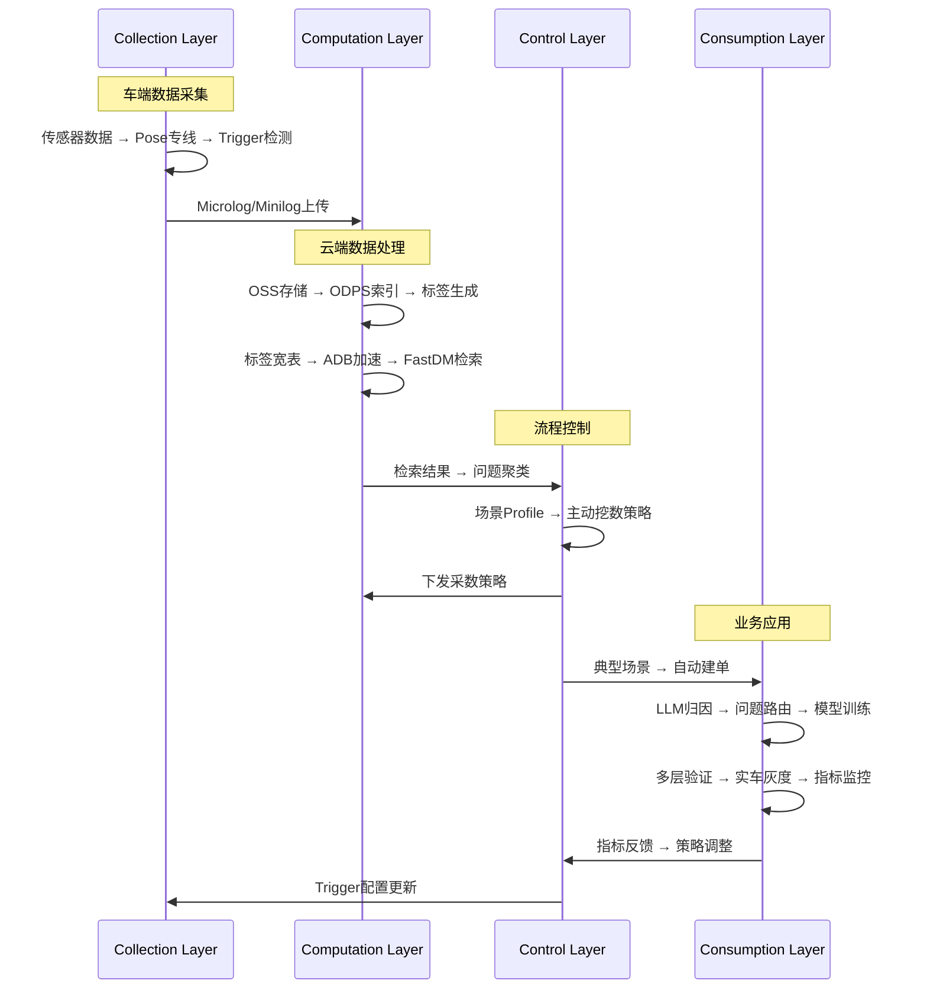

### 1.5 4C架构优势

1. **清晰的职责分离**
   - Collection专注数据采集
   - Computation专注数据处理
   - Control专注流程控制
   - Consumption专注业务应用

2. **高度解耦**
   - 各层通过标准接口交互
   - 可以独立演进和优化
   - 便于分布式部署

3. **可扩展性强**
   - 每层都可以水平扩展
   - 支持大规模车队和数据处理

4. **自动化程度高**
   - Control层统一调度
   - 从采集到应用全流程自动化

5. **数据驱动**
   - 所有决策基于数据
   - 通过指标反馈持续优化

### 1.6 4C架构组件映射表

| 4C层级 | 核心组件 | 技术栈 | 关键指标 |
|--------|---------|--------|---------|
| **Collection** | Pose专线 | C++/Rust | 采样频率、延迟 |
| | 1Hz心跳 | SLS | 心跳丢失率 |
| | Ring Buffer | 内存 | 容量、回溯时长 |
| | Trigger引擎 | Python沙箱 | 检测准确率、延迟 |
| | Microlog/Minilog | Protobuf | 压缩率、大小 |
| **Computation** | OSS存储 | 对象存储 | 存储容量、访问速度 |
| | ODPS数仓 | MaxCompute | 处理能力、查询延迟 |
| | SLS实时流 | 日志服务 | 吞吐量、延迟 |
| | 标签生成 | ODPS UDF | 生成速度、覆盖率 |
| | ADB加速库 | AnalyticDB | 查询速度、并发数 |
| | FastDM检索 | ADB + SQL | 检索延迟、准确率 |
| **Control** | 上传管理器 | Python | 上传成功率、优先级 |
| | CaseID映射 | ODPS表 | 映射准确率 |
| | Trigger配置中心 | 配置服务 | 配置下发延迟 |
| | 场景Profile | 元数据管理 | Profile覆盖率 |
| | 训练调度 | MLOps | 任务成功率 |
| **Consumption** | 自动建单 | Jira API | 建单准确率 |
| | LLM归因 | LLM服务 | 归因准确率 |
| | 模型训练 | GPU集群 | 训练速度、模型质量 |
| | 多层验证 | 验证框架 | 验证覆盖率 |
| | 指标Dashboard | 可视化 | 指标实时性 |

### 1.7 4C架构关键技术选型

#### Collection Layer 技术选型

```yaml
数据采集:
  - Pose专线: C++/Rust, 无锁Ring Buffer
  - 心跳发送: SLS SDK, 异步发送
  - Trigger引擎: Python沙箱, 动态加载
  - 数据格式: Protobuf, 压缩算法

性能要求:
  - Pose采样: 100-200ms, 延迟 < 10ms
  - 心跳发送: 1Hz, 成功率 > 99.9%
  - Trigger检测: 延迟 < 50ms
  - Ring Buffer: 容量 30-60s, 内存占用 < 100MB
```

#### Computation Layer 技术选型

```yaml
存储:
  - OSS: 阿里云OSS / AWS S3
  - ODPS: 阿里云MaxCompute
  - SLS: 阿里云日志服务
  - ADB: 阿里云AnalyticDB

计算:
  - 批处理: ODPS SQL + Python UDF
  - 流处理: Flink / Spark Streaming
  - OLAP查询: ADB列存引擎

性能要求:
  - 标签生成: 增量处理, 延迟 < 1小时
  - ADB查询: P99延迟 < 1秒
  - FastDM检索: 月级数据检索 < 1分钟
```

#### Control Layer 技术选型

```yaml
配置管理:
  - Trigger配置: Nacos / Consul / 自研配置中心
  - 标签注册: 元数据管理系统
  - 场景Profile: 数据库 + 版本管理

调度系统:
  - 训练调度: Airflow / Kubeflow
  - 任务队列: Redis / RabbitMQ
  - 资源管理: Kubernetes

性能要求:
  - 配置下发: 延迟 < 5秒
  - 任务调度: 成功率 > 99%
```

#### Consumption Layer 技术选型

```yaml
应用服务:
  - 自动建单: Jira API集成
  - LLM服务: 自建LLM / 第三方API
  - 模型训练: PyTorch / TensorFlow
  - 仿真平台: 自研 / CARLA / VTD

可视化:
  - Dashboard: Grafana / 自研
  - 报表系统: 自研 / Tableau

性能要求:
  - 建单延迟: < 10秒
  - LLM归因: < 30秒
  - 模型训练: 根据数据集大小
```

### 1.8 4C架构部署架构

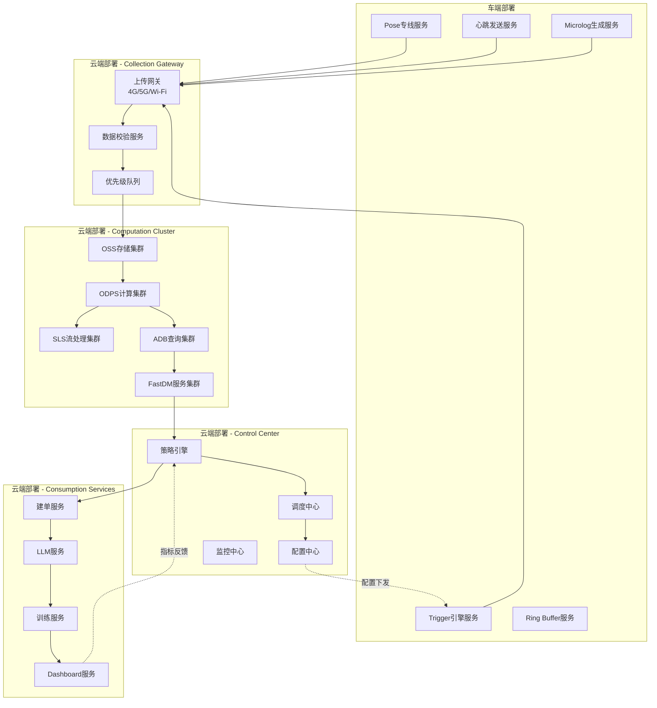

---

## 二、整体架构概览

### 2.1 架构分层图

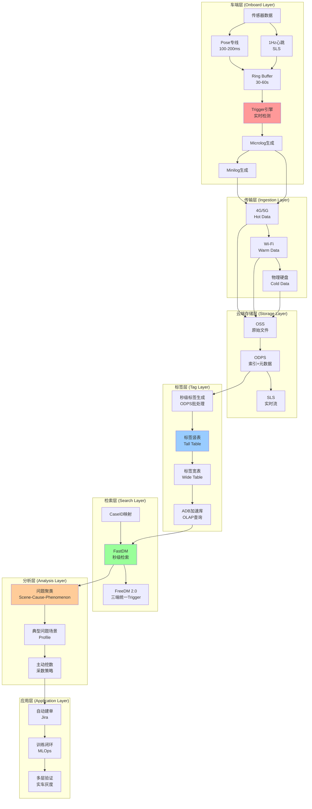

### 2.2 整体应用架构图

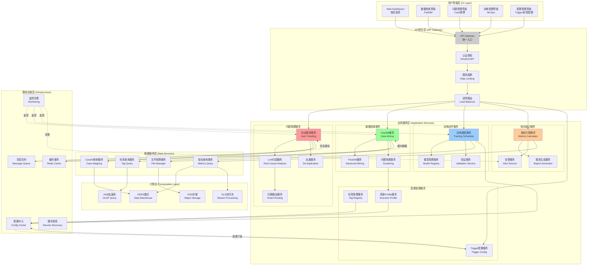

### 2.3 应用服务详细架构

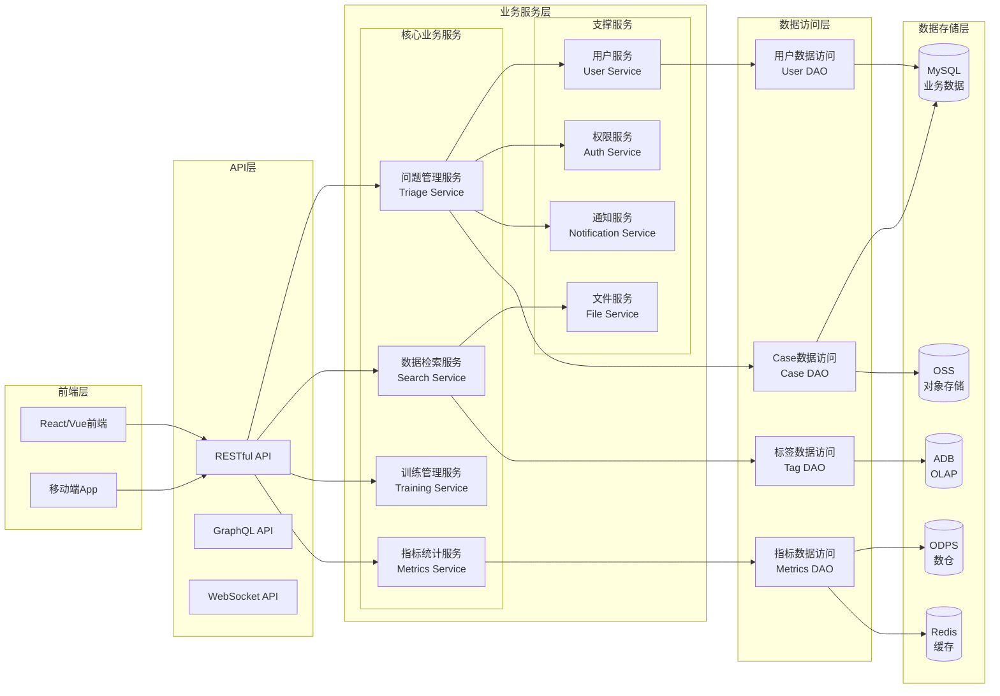

### 2.4 核心数据流

```
传感器数据 → Pose专线/心跳 → Trigger检测 → Microlog/Minilog生成
    ↓
分级上传 (Hot/Warm/Cold) → OSS存储 → ODPS索引
    ↓
秒级标签生成 → 标签竖表 → 标签宽表 → ADB加速
    ↓
FastDM检索 → 问题聚类 → 典型场景 → 主动挖数
    ↓
自动建单 → 训练闭环 → 多层验证 → 部署上线
```

### 2.5 应用服务交互流程

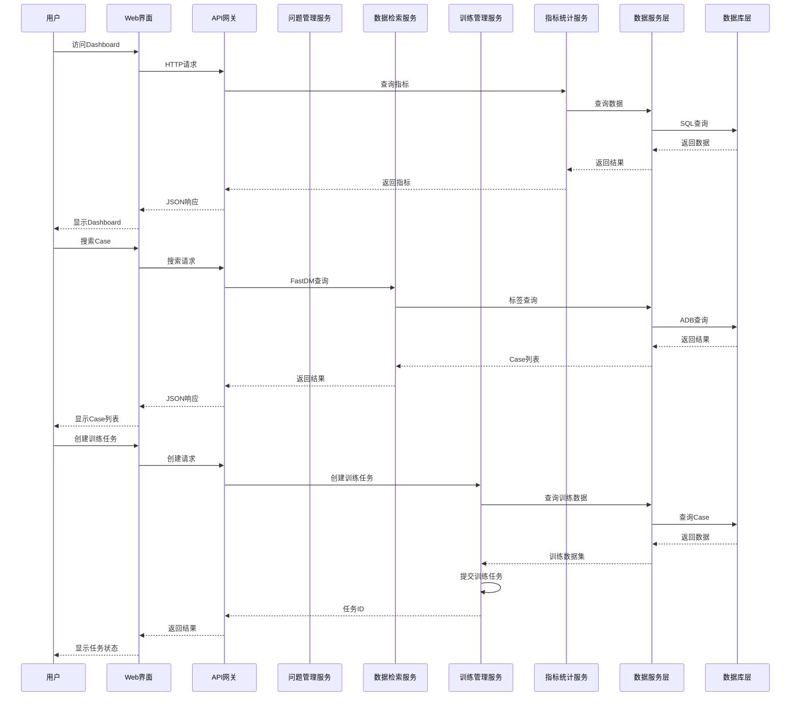

### 2.6 应用服务详细说明

#### 2.6.1 API网关层

**职责**：统一入口、认证授权、限流熔断、请求路由

**核心功能**：
- **统一入口**：所有外部请求统一通过API网关
- **认证授权**：OAuth2/JWT token验证
- **限流熔断**：防止服务过载，保护后端服务
- **请求路由**：根据路径和规则路由到对应服务
- **日志记录**：记录所有API请求日志

**技术选型**：
- Kong / Nginx / Spring Cloud Gateway
- 支持插件扩展（认证、限流、监控等）

#### 2.6.2 问题管理服务组

**自动建单服务 (Auto Ticketing Service)**

**职责**：
- Trigger触发后自动创建Jira Issue
- 管理Case生命周期（pending → analyzing → resolved）
- 关联Case与Issue

**核心接口**：
```python
POST /api/v1/tickets
{
    "case_id": "case_xxx",
    "trigger_type": "hard_brake",
    "car_id": "V001",
    "priority": "high"
}

GET /api/v1/tickets/{ticket_id}
PUT /api/v1/tickets/{ticket_id}/status
```

**LLM归因服务 (Root Cause Analysis Service)**

**职责**：
- 使用LLM分析问题根本原因
- 生成归因报告
- 提供置信度评分

**核心接口**：
```python
POST /api/v1/analysis/root-cause
{
    "case_id": "case_xxx",
    "context": {...}
}

Response:
{
    "root_cause": "perception_miss",
    "confidence": 0.85,
    "reasoning": "..."
}
```

**问题路由服务 (Smart Routing Service)**

**职责**：
- 根据归因结果路由到对应团队
- 学习历史路由记录
- 优化路由准确率

**核心接口**：
```python
POST /api/v1/routing/route
{
    "case_id": "case_xxx",
    "root_cause": "perception_miss"
}

Response:
{
    "team": "perception-team",
    "assignee": "user_xxx",
    "confidence": 0.9
}
```

**去重服务 (De-duplication Service)**

**职责**：
- 检测重复Case
- 合并相似Case
- 生成Case指纹

**核心接口**：
```python
POST /api/v1/dedup/check
{
    "case_id": "case_xxx",
    "fingerprint": {...}
}

Response:
{
    "is_duplicate": true,
    "existing_case_id": "case_yyy",
    "similarity": 0.95
}
```

#### 2.6.3 数据检索服务组

**FastDM服务 (Fast Data Mining Service)**

**职责**：
- 提供秒级数据检索能力
- 支持标签组合查询
- Session聚合

**核心接口**：
```python
POST /api/v1/search/fastdm
{
    "filters": {
        "tag_weather": "rain",
        "tag_scene": "intersection",
        "tag_hard_brake": true
    },
    "time_range": {
        "start": 1234567890,
        "end": 1234567990
    },
    "session_config": {
        "max_gap_seconds": 5,
        "max_duration_seconds": 60
    }
}

Response:
{
    "cases": [...],
    "total": 100,
    "query_time_ms": 500
}
```

**FreeDM服务 (Free Data Mining Service)**

**职责**：
- 提供高级数据挖掘能力
- 支持Python Trigger查询
- 复杂时序模式识别

**核心接口**：
```python
POST /api/v1/search/freedm
{
    "trigger_code": "python_code_here",
    "time_range": {...},
    "data_source": "odps"
}
```

**问题聚类服务 (Clustering Service)**

**职责**：
- 对Case进行聚类分析
- 生成典型问题场景
- 构建场景Profile

**核心接口**：
```python
POST /api/v1/clustering/cluster
{
    "case_ids": ["case_1", "case_2", ...],
    "method": "two_stage"
}

Response:
{
    "clusters": [
        {
            "cluster_id": "cluster_1",
            "cases": [...],
            "profile": {...}
        }
    ]
}
```

#### 2.6.4 训练闭环服务组

**训练调度服务 (Training Scheduler Service)**

**职责**：
- 管理训练任务生命周期
- 调度训练资源
- 监控训练进度

**核心接口**：
```python
POST /api/v1/training/jobs
{
    "scenario_profile_id": "profile_xxx",
    "model_config": {...},
    "hyperparameters": {...}
}

GET /api/v1/training/jobs/{job_id}
PUT /api/v1/training/jobs/{job_id}/cancel
```

**模型管理服务 (Model Registry Service)**

**职责**：
- 管理模型版本
- 模型元数据管理
- 模型部署管理

**核心接口**：
```python
POST /api/v1/models
{
    "model_name": "perception_v2",
    "version": "v2.1",
    "metrics": {...}
}

GET /api/v1/models/{model_id}
GET /api/v1/models/{model_id}/versions
```

**验证服务 (Validation Service)**

**职责**：
- 多层验证流程管理
- 验证结果收集和分析
- 验证报告生成

**核心接口**：
```python
POST /api/v1/validation/validate
{
    "model_version": "v2.1",
    "validation_cases": [...],
    "stages": ["model_eval", "log_replay", "world_sim", "field_test"]
}

Response:
{
    "results": {
        "model_eval": {"passed": true, "metrics": {...}},
        "log_replay": {"passed": true, "results": [...]},
        ...
    },
    "overall_passed": true
}
```

#### 2.6.5 指标统计服务组

**指标计算服务 (Metrics Calculator Service)**

**职责**：
- 计算MPS/MPD等关键指标
- 按维度聚合统计
- 指标趋势分析

**核心接口**：
```python
GET /api/v1/metrics/mps
{
    "start_date": "2025-01-01",
    "end_date": "2025-01-31",
    "dimensions": ["car_id", "trigger_type"]
}

Response:
{
    "mps": {
        "hard_brake": 0.5,
        "lane_weaving": 0.3
    },
    "trend": [...]
}
```

**报表生成服务 (Report Generator Service)**

**职责**：
- 生成各类业务报表
- 支持自定义报表
- 报表导出功能

**核心接口**：
```python
POST /api/v1/reports/generate
{
    "report_type": "daily_summary",
    "date": "2025-01-01",
    "format": "pdf"
}

GET /api/v1/reports/{report_id}/download
```

**告警服务 (Alert Service)**

**职责**：
- 监控指标异常
- 发送告警通知
- 告警规则管理

**核心接口**：
```python
POST /api/v1/alerts/rules
{
    "metric": "mps",
    "threshold": 1.0,
    "condition": "gt",
    "notification": {...}
}

GET /api/v1/alerts/history
```

#### 2.6.6 配置管理服务组

**Trigger配置服务 (Trigger Config Service)**

**职责**：
- Trigger规则管理
- 三端统一配置下发
- 配置版本管理

**核心接口**：
```python
POST /api/v1/triggers
{
    "trigger_id": "hard_brake_001",
    "trigger_name": "急刹检测",
    "trigger_type": "rule",
    "run_env": ["car", "cloud", "sim"],
    "config": {...}
}

GET /api/v1/triggers/{trigger_id}
PUT /api/v1/triggers/{trigger_id}/deploy
```

**标签管理服务 (Tag Registry Service)**

**职责**：
- 标签注册和管理
- 标签元数据管理
- 标签生成方式配置

**核心接口**：
```python
POST /api/v1/tags
{
    "tag_id": 1,
    "tag_name": "speed",
    "tag_value_type": "number",
    "generation": {...}
}

GET /api/v1/tags
GET /api/v1/tags/{tag_id}
```

**场景Profile服务 (Scenario Profile Service)**

**职责**：
- 典型问题场景Profile管理
- Profile版本管理
- Profile与训练任务关联

**核心接口**：
```python
POST /api/v1/profiles
{
    "cluster_id": "cluster_xxx",
    "tag_rules": {...},
    "trigger_template": {...},
    "data_requirements": {...}
}

GET /api/v1/profiles/{profile_id}
PUT /api/v1/profiles/{profile_id}/mining-strategy
```

### 2.7 服务间通信

#### 2.7.1 同步通信（RESTful API）

**使用场景**：
- 用户请求处理
- 实时查询
- 状态查询

**技术选型**：
- HTTP/HTTPS
- RESTful API设计
- JSON格式数据交换

#### 2.7.2 异步通信（消息队列）

**使用场景**：
- Trigger触发事件
- 训练任务通知
- 指标计算任务

**技术选型**：
- Kafka / RabbitMQ / RocketMQ
- 支持消息持久化
- 支持消息重试

#### 2.7.3 服务发现

**技术选型**：
- Consul / Eureka / Nacos
- 支持健康检查
- 支持负载均衡

### 2.8 数据访问层设计

#### 2.8.1 DAO模式

**设计原则**：
- 数据访问对象（DAO）封装数据库操作
- 服务层不直接访问数据库
- 支持多数据源切换

**示例**：
```python
class CaseDAO:
    def create_case(self, case_data):
        """创建Case"""
        pass
    
    def get_case_by_id(self, case_id):
        """根据ID查询Case"""
        pass
    
    def query_cases(self, filters):
        """查询Case列表"""
        pass
```

#### 2.8.2 缓存策略

**缓存层级**：
- L1缓存：本地缓存（Caffeine）
- L2缓存：分布式缓存（Redis）
- L3缓存：数据库查询结果缓存

**缓存策略**：
- 热点数据：缓存时间较长
- 实时数据：缓存时间较短
- 写操作：更新缓存或失效缓存

---

### 3.1 车端层 (Onboard Layer)

**职责**：在车端有限算力下，精准捕获高价值数据

**核心组件**：

1. **Pose 专线**
   - 频率：100-200ms/条
   - 内容：车体姿态、底盘状态、任务属性
   - 特点：轻量级、长期可存、与算法解耦

2. **1Hz 心跳**
   - 频率：1秒/条
   - 内容：驾驶模式、速度、道路类型、任务状态
   - 用途：业务指标统计、实时监控

3. **Ring Buffer**
   - 容量：30-60秒数据
   - 用途：Trigger触发时回溯历史数据

4. **Trigger 引擎**
   - 类型：规则Trigger、Python Trigger
   - 运行环境：车端沙箱
   - 功能：实时检测异常事件

5. **Microlog/Minilog 生成器**
   - Microlog：Pose + 中间结果
   - Minilog：Microlog + 压缩视频

---

## 四、核心组件设计

### 4.1 Trigger 框架设计

**3.1.1 Trigger 分类**

| Trigger类型 | 运行环境 | 生成方式 | 示例 |
|------------|---------|---------|------|
| **规则Trigger** | 车端/云端/仿真 | car_rule + cloud_rule | 急刹检测、画龙检测 |
| **Python Trigger** | 车端沙箱/ODPS/仿真 | car_python + cloud_python | 复杂时序模式识别 |
| **天然Trigger** | 业务系统 | 业务行为 | 远程接管、error code |

**3.1.2 Trigger 注册中心**

```python
# Trigger 注册表结构
{
    "trigger_id": "hard_brake_001",
    "trigger_name": "急刹检测",
    "trigger_type": "rule",  # rule / python / natural
    "run_env": ["car", "cloud", "sim"],  # 三端统一
    "generation": "car_rule + cloud_rule",
    "dependencies": ["pose_stream", "acceleration"],
    "threshold": {
        "deceleration": -0.5,  # m/s²
        "duration": 0.5  # 秒
    },
    "output": {
        "event_type": "hard_brake",
        "severity": "high",
        "data_required": ["microlog", "minilog"]
    }
}
```

**3.1.3 Trigger 执行流程**

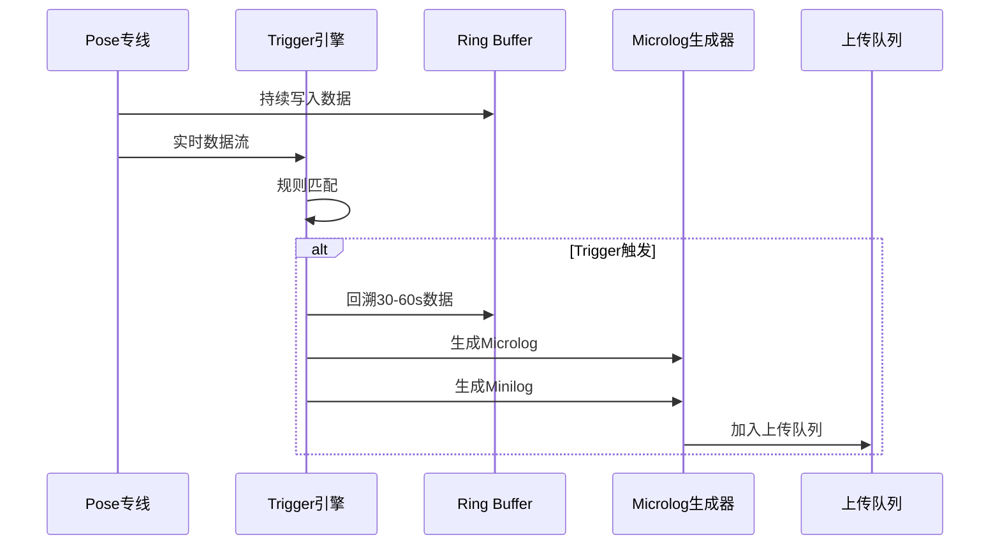

---

### 4.2 Tag（标签）体系设计

**3.2.1 标签分类**

| 标签类型 | 值类型 | 示例 | 存储方式 |
|---------|-------|------|---------|
| **数值型** | number | 速度、加速度、距离 | 标签竖表 |
| **枚举型** | enum | 天气、场景类型 | 标签竖表 |
| **布尔型** | bool | 是否急刹、是否画龙 | 标签竖表 |
| **表型** | table | 障碍物列表、车道线 | 扩展表 |

**3.2.2 标签竖表结构**

```sql
-- 标签竖表 (t_tag_tall)
CREATE TABLE t_tag_tall (
    car_id VARCHAR(64),
    ts_second BIGINT,
    tag_id INT,
    tag_name VARCHAR(128),
    tag_value_type VARCHAR(16),  -- enum/number/bool/string/array/table
    tag_value TEXT,  -- JSON格式存储
    PRIMARY KEY (car_id, ts_second, tag_id)
);

-- 示例数据
-- car_id='V001', ts_second=1234567890, tag_id=1, tag_name='speed', tag_value_type='number', tag_value='30.5'
-- car_id='V001', ts_second=1234567890, tag_id=2, tag_name='weather', tag_value_type='enum', tag_value='rain'
-- car_id='V001', ts_second=1234567890, tag_id=3, tag_name='hard_brake', tag_value_type='bool', tag_value='true'
```

**3.2.3 标签宽表结构**

```sql
-- 标签宽表 (t_tag_wide)
CREATE TABLE t_tag_wide (
    car_id VARCHAR(64),
    ts_second BIGINT,
    tag_speed DECIMAL(5,2),
    tag_acceleration DECIMAL(5,2),
    tag_weather VARCHAR(16),
    tag_scene VARCHAR(32),
    tag_hard_brake BOOLEAN,
    tag_lane_weaving BOOLEAN,
    -- ... 300+ 列
    PRIMARY KEY (car_id, ts_second)
);
```

**3.2.4 标签注册中心**

```python
# 标签注册表结构
{
    "tag_id": 1,
    "tag_name": "speed",
    "tag_value_type": "number",
    "category": "pose",  # pose / scene / behavior / diagnosis
    "generation": {
        "method": "cloud_sql_only",  # cloud_sql_only / car_rule+cloud_rule / car_python+cloud_python
        "dependencies": ["pose_stream"],
        "formula": "SELECT speed FROM pose_stream WHERE ts_second = ?"
    },
    "description": "车辆速度 (km/h)"
}
```

---

### 4.3 Microlog / Minilog 设计

**3.3.1 Microlog 结构**

```protobuf
// Microlog.proto
message Microlog {
    // 元数据
    string case_id = 1;
    string car_id = 2;
    int64 start_ts = 3;
    int64 end_ts = 4;
    string trigger_type = 5;
    
    // Pose数据 (100-200ms采样)
    repeated PoseFrame pose_frames = 10;
    
    // 中间结果
    repeated ObstacleDetection obstacles = 20;
    repeated LaneMarking lane_markings = 21;
    TrafficLightState traffic_light = 22;
    
    // 控制指令
    repeated ControlCommand control_commands = 30;
}

message PoseFrame {
    int64 timestamp = 1;
    double latitude = 2;
    double longitude = 3;
    double speed = 4;
    double acceleration_longitudinal = 5;
    double acceleration_lateral = 6;
    double heading = 7;
    double angular_velocity = 8;
}
```

**3.3.2 Minilog 结构**

```protobuf
// Minilog.proto
message Minilog {
    Microlog microlog = 1;  // 包含完整的Microlog
    
    // 压缩视频片段
    repeated CompressedFrame video_frames = 10;
    
    // 关键帧索引
    repeated int32 key_frame_indices = 11;
}

message CompressedFrame {
    int64 timestamp = 1;
    bytes compressed_image = 2;  // JPEG/HEVC压缩
    int32 width = 3;
    int32 height = 4;
    CameraInfo camera_info = 5;
}
```

**3.3.3 数据大小对比**

| 数据类型 | 时长 | 大小 | 用途 |
|---------|------|------|------|
| **Microlog** | 30秒 | ~100KB | 快速定位、场景重建 |
| **Minilog** | 30秒 | ~5MB | 场景重建、生成式数据 |
| **Raw Data** | 30秒 | ~2GB | 精细分析、训练 |

---

## 五、数据流转路径

### 5.1 完整数据流

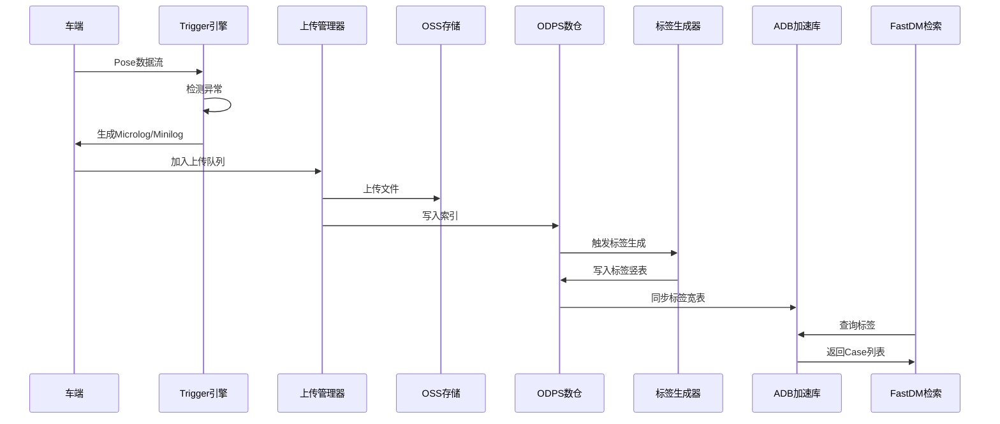

---

## 六、实现步骤

### Phase 1: 车端数据基座 (Month 1-3)

**目标**：建立车端数据采集和上传能力

**步骤 1.1：Pose 专线实现**

```cpp
// PoseStream.h
class PoseStream {
public:
    void Start(int frequency_ms = 100);
    void Stop();
    void WritePose(const PoseData& pose);
    
private:
    RingBuffer<PoseData> buffer_;
    std::thread writer_thread_;
    int frequency_ms_;
};

// 实现要点：
// 1. 使用无锁Ring Buffer，确保不阻塞主线程
// 2. 固定频率写入（100ms或200ms）
// 3. 只记录标量数据，不做任何判断
```

**步骤 1.2：1Hz 心跳实现**

```cpp
// HeartbeatSender.h
class HeartbeatSender {
public:
    void SendHeartbeat(const HeartbeatData& data);
    
private:
    SLSClient sls_client_;
    std::string logstore_name_;
};

// 心跳数据结构
struct HeartbeatData {
    std::string car_id;
    int64_t timestamp;
    DrivingMode mode;  // Auto/Remote/Manual
    double speed;
    RoadType road_type;
    std::string task_id;
    TaskStatus task_status;
};
```

**步骤 1.3：Ring Buffer 实现**

```cpp
// RingBuffer.h
template<typename T>
class RingBuffer {
public:
    RingBuffer(size_t capacity, int64_t duration_ms);
    void Write(const T& data);
    std::vector<T> ReadRange(int64_t start_ts, int64_t end_ts);
    
private:
    std::vector<T> buffer_;
    size_t capacity_;
    int64_t duration_ms_;
    std::atomic<size_t> write_index_;
};
```

**步骤 1.4：Trigger 引擎实现**

```python
# trigger_engine.py
class TriggerEngine:
    def __init__(self, ring_buffer, config_center):
        self.ring_buffer = ring_buffer
        self.config_center = config_center
        self.triggers = []
        self.load_triggers()
    
    def load_triggers(self):
        """从配置中心加载Trigger规则"""
        triggers_config = self.config_center.get_triggers()
        for config in triggers_config:
            if config['type'] == 'rule':
                trigger = RuleTrigger(config)
            elif config['type'] == 'python':
                trigger = PythonTrigger(config)
            self.triggers.append(trigger)
    
    def process_pose(self, pose_data):
        """处理Pose数据，检测Trigger"""
        for trigger in self.triggers:
            if trigger.match(pose_data):
                self.on_trigger(trigger, pose_data)
    
    def on_trigger(self, trigger, pose_data):
        """Trigger触发时的处理"""
        # 回溯历史数据
        start_ts = pose_data.timestamp - 30000  # 30秒前
        end_ts = pose_data.timestamp + 10000     # 10秒后
        history_data = self.ring_buffer.read_range(start_ts, end_ts)
        
        # 生成Microlog
        microlog = MicrologGenerator.generate(history_data, trigger)
        
        # 生成Minilog（如果需要）
        if trigger.requires_video:
            minilog = MinilogGenerator.generate(microlog, history_data)
            UploadManager.enqueue(minilog, priority='high')
        else:
            UploadManager.enqueue(microlog, priority='normal')
```

**步骤 1.5：Microlog/Minilog 生成器**

```python
# microlog_generator.py
class MicrologGenerator:
    @staticmethod
    def generate(pose_frames, trigger_info):
        microlog = Microlog()
        microlog.case_id = generate_uuid()
        microlog.car_id = pose_frames[0].car_id
        microlog.start_ts = pose_frames[0].timestamp
        microlog.end_ts = pose_frames[-1].timestamp
        microlog.trigger_type = trigger_info.type
        
        # 转换Pose数据
        for frame in pose_frames:
            pose_frame = PoseFrame()
            pose_frame.timestamp = frame.timestamp
            pose_frame.latitude = frame.latitude
            pose_frame.longitude = frame.longitude
            pose_frame.speed = frame.speed
            # ... 其他字段
            microlog.pose_frames.append(pose_frame)
        
        # 添加中间结果（如果有）
        # ...
        
        return microlog
```

---

**第一阶段完成检查点**：
- [ ] Pose专线正常运行，数据写入Ring Buffer
- [ ] 1Hz心跳正常发送到SLS
- [ ] Ring Buffer能正确回溯30-60秒数据
- [ ] Trigger引擎能检测到急刹、画龙等事件
- [ ] Microlog/Minilog能正确生成并加入上传队列

---

### Phase 2: 数据传输与映射 (Month 4-6)

**目标**：实现分级上传和Case逻辑映射

**步骤 2.1：上传管理器实现**

```python
# upload_manager.py
class UploadManager:
    def __init__(self):
        self.hot_queue = PriorityQueue()      # Hot Data队列
        self.warm_queue = PriorityQueue()     # Warm Data队列
        self.cold_queue = Queue()             # Cold Data队列
        self.upload_threads = []
    
    def enqueue(self, data, priority='normal', tier='warm'):
        """加入上传队列"""
        if tier == 'hot':
            self.hot_queue.put((priority, time.time(), data))
        elif tier == 'warm':
            self.warm_queue.put((priority, time.time(), data))
        else:
            self.cold_queue.put(data)
    
    def upload_hot_data(self):
        """4G/5G立即上传"""
        while True:
            priority, timestamp, data = self.hot_queue.get()
            try:
                self.upload_to_oss(data, endpoint='4g')
                self.write_index_to_odps(data)
            except Exception as e:
                logger.error(f"Hot data upload failed: {e}")
                # 降级到Warm队列
                self.warm_queue.put((priority, timestamp, data))
    
    def upload_warm_data(self):
        """Wi-Fi回场站上传"""
        while True:
            if self.is_wifi_connected():
                priority, timestamp, data = self.warm_queue.get()
                try:
                    self.upload_to_oss(data, endpoint='wifi')
                    self.write_index_to_odps(data)
                except Exception as e:
                    logger.error(f"Warm data upload failed: {e}")
```

**步骤 2.2：CaseID 映射系统**

```python
# case_mapping.py
class CaseMapping:
    def __init__(self, odps_client):
        self.odps_client = odps_client
        self.case_table = odps_client.get_table('t_case_mapping')
    
    def create_case(self, microlog, trigger_info):
        """创建Case并建立映射"""
        case_id = generate_uuid()
        
        # 计算文件分片
        file_chunks = self.split_to_chunks(microlog, chunk_duration_ms=20000)
        
        # 写入映射表
        for chunk in file_chunks:
            record = {
                'case_id': case_id,
                'chunk_id': chunk.chunk_id,
                'car_id': microlog.car_id,
                'start_ts': chunk.start_ts,
                'end_ts': chunk.end_ts,
                'file_path': chunk.oss_path,
                'file_size': chunk.size,
                'trigger_type': trigger_info.type,
                'data_type': 'microlog'  # or 'minilog' or 'raw'
            }
            self.case_table.insert(record)
        
        return case_id
    
    def query_cases_by_trigger(self, trigger_type, start_time, end_time):
        """根据Trigger类型查询Case"""
        sql = f"""
        SELECT DISTINCT case_id, car_id, start_ts, end_ts
        FROM {self.case_table.name}
        WHERE trigger_type = '{trigger_type}'
          AND start_ts >= {start_time}
          AND start_ts <= {end_time}
        """
        return self.odps_client.execute_sql(sql)
```

**步骤 2.3：ODPS 索引表设计**

```sql
-- Case映射表
CREATE TABLE t_case_mapping (
    case_id VARCHAR(64),
    chunk_id VARCHAR(64),
    car_id VARCHAR(64),
    start_ts BIGINT,
    end_ts BIGINT,
    file_path VARCHAR(512),
    file_size BIGINT,
    trigger_type VARCHAR(64),
    data_type VARCHAR(16),  -- microlog/minilog/raw
    upload_time TIMESTAMP,
    PRIMARY KEY (case_id, chunk_id)
);

-- 文件索引表
CREATE TABLE t_file_index (
    file_id VARCHAR(64),
    car_id VARCHAR(64),
    start_ts BIGINT,
    end_ts BIGINT,
    file_path VARCHAR(512),
    file_size BIGINT,
    file_type VARCHAR(16),
    upload_time TIMESTAMP,
    PRIMARY KEY (file_id)
);
```

---

### Phase 3: 标签体系构建 (Month 7-9)

**目标**：建立秒级标签体系和FastDM检索能力

**步骤 3.1：标签生成器实现**

```python
# tag_generator.py
class TagGenerator:
    def __init__(self, odps_client, tag_registry):
        self.odps_client = odps_client
        self.tag_registry = tag_registry
        self.tag_table = odps_client.get_table('t_tag_tall')
    
    def generate_tags_batch(self, start_time, end_time):
        """批量生成标签"""
        # 获取所有需要生成的标签配置
        tag_configs = self.tag_registry.get_all_tags()
        
        for tag_config in tag_configs:
            if tag_config['generation']['method'] == 'cloud_sql_only':
                self.generate_by_sql(tag_config, start_time, end_time)
            elif 'cloud_rule' in tag_config['generation']['method']:
                self.generate_by_rule(tag_config, start_time, end_time)
            elif 'cloud_python' in tag_config['generation']['method']:
                self.generate_by_python(tag_config, start_time, end_time)
    
    def generate_by_sql(self, tag_config, start_time, end_time):
        """通过SQL生成标签"""
        sql = f"""
        INSERT INTO {self.tag_table.name}
        SELECT 
            car_id,
            ts_second,
            {tag_config['tag_id']} as tag_id,
            '{tag_config['tag_name']}' as tag_name,
            '{tag_config['tag_value_type']}' as tag_value_type,
            {tag_config['generation']['formula']} as tag_value
        FROM pose_stream
        WHERE ts_second >= {start_time}
          AND ts_second <= {end_time}
        """
        self.odps_client.execute_sql(sql)
    
    def generate_by_python(self, tag_config, start_time, end_time):
        """通过Python UDF生成标签"""
        # 读取原始数据
        raw_data = self.load_raw_data(start_time, end_time)
        
        # 执行Python逻辑
        tag_values = []
        for record in raw_data:
            value = self.execute_python_trigger(
                tag_config['generation']['python_code'],
                record
            )
            if value is not None:
                tag_values.append({
                    'car_id': record['car_id'],
                    'ts_second': record['ts_second'],
                    'tag_id': tag_config['tag_id'],
                    'tag_name': tag_config['tag_name'],
                    'tag_value_type': tag_config['tag_value_type'],
                    'tag_value': json.dumps(value)
                })
        
        # 批量写入
        if tag_values:
            self.tag_table.insert(tag_values)
```

**步骤 3.2：标签宽表构建**

```python
# tag_wide_table.py
class TagWideTableBuilder:
    def __init__(self, odps_client):
        self.odps_client = odps_client
        self.tag_tall_table = odps_client.get_table('t_tag_tall')
        self.tag_wide_table = odps_client.get_table('t_tag_wide')
    
    def build_wide_table(self, start_time, end_time):
        """构建宽表"""
        # 获取所有标签配置
        tag_configs = self.get_tag_configs()
        
        # 构建PIVOT SQL
        pivot_columns = []
        for tag_config in tag_configs:
            if tag_config['tag_value_type'] == 'number':
                pivot_columns.append(
                    f"MAX(CASE WHEN tag_id = {tag_config['tag_id']} "
                    f"THEN CAST(tag_value AS DOUBLE) END) AS tag_{tag_config['tag_name']}"
                )
            elif tag_config['tag_value_type'] == 'enum':
                pivot_columns.append(
                    f"MAX(CASE WHEN tag_id = {tag_config['tag_id']} "
                    f"THEN tag_value END) AS tag_{tag_config['tag_name']}"
                )
            elif tag_config['tag_value_type'] == 'bool':
                pivot_columns.append(
                    f"MAX(CASE WHEN tag_id = {tag_config['tag_id']} "
                    f"THEN CAST(tag_value AS BOOLEAN) END) AS tag_{tag_config['tag_name']}"
                )
        
        sql = f"""
        INSERT INTO {self.tag_wide_table.name}
        SELECT 
            car_id,
            ts_second,
            {', '.join(pivot_columns)}
        FROM {self.tag_tall_table.name}
        WHERE ts_second >= {start_time}
          AND ts_second <= {end_time}
        GROUP BY car_id, ts_second
        """
        self.odps_client.execute_sql(sql)
```

**步骤 3.3：ADB 同步机制**

```python
# adb_sync.py
class ADBSync:
    def __init__(self, odps_client, adb_client):
        self.odps_client = odps_client
        self.adb_client = adb_client
    
    def sync_to_adb(self, start_time, end_time):
        """同步标签宽表到ADB"""
        # 从ODPS读取数据
        sql = f"""
        SELECT *
        FROM t_tag_wide
        WHERE ts_second >= {start_time}
          AND ts_second <= {end_time}
        """
        data = self.odps_client.execute_sql(sql)
        
        # 写入ADB
        self.adb_client.batch_insert('tag_wide_table', data)
    
    def incremental_sync(self):
        """增量同步（定时任务）"""
        # 获取上次同步时间
        last_sync_time = self.get_last_sync_time()
        current_time = int(time.time())
        
        # 同步新数据
        self.sync_to_adb(last_sync_time, current_time)
        
        # 更新同步时间
        self.update_last_sync_time(current_time)
```

---

**第二阶段完成检查点**：
- [ ] 上传管理器能正确处理Hot/Warm/Cold数据
- [ ] CaseID映射系统能正确建立Case与文件分片的关联
- [ ] ODPS索引表能正确记录文件元数据
- [ ] 标签生成器能批量生成秒级标签
- [ ] 标签宽表能正确构建
- [ ] ADB同步机制能正常工作

---

### Phase 4: FastDM 检索系统 (Month 10-12)

**目标**：实现秒级检索和问题聚类能力

**步骤 4.1：FastDM 核心实现**

```python
# fastdm.py
class FastDM:
    def __init__(self, adb_client, case_mapping):
        self.adb_client = adb_client
        self.case_mapping = case_mapping
    
    def search(self, tag_filters, time_range, session_config=None):
        """
        搜索Case
        
        Args:
            tag_filters: 标签过滤条件，例如：
                {
                    'tag_weather': 'rain',
                    'tag_scene': 'intersection',
                    'tag_hard_brake': True,
                    'tag_speed': {'min': 30, 'max': 60}
                }
            time_range: (start_time, end_time)
            session_config: Session聚合配置
                {
                    'max_gap_seconds': 5,
                    'max_duration_seconds': 60
                }
        """
        # 构建SQL查询
        sql = self.build_query_sql(tag_filters, time_range)
        
        # 在ADB上执行查询
        matched_seconds = self.adb_client.execute_sql(sql)
        
        # Session聚合
        if session_config:
            sessions = self.aggregate_sessions(
                matched_seconds, 
                session_config
            )
            return sessions
        else:
            return matched_seconds
    
    def build_query_sql(self, tag_filters, time_range):
        """构建SQL查询语句"""
        conditions = []
        
        for tag_name, value in tag_filters.items():
            if isinstance(value, bool):
                conditions.append(f"{tag_name} = {value}")
            elif isinstance(value, str):
                conditions.append(f"{tag_name} = '{value}'")
            elif isinstance(value, dict):
                if 'min' in value:
                    conditions.append(f"{tag_name} >= {value['min']}")
                if 'max' in value:
                    conditions.append(f"{tag_name} <= {value['max']}")
            elif isinstance(value, list):
                conditions.append(f"{tag_name} IN {tuple(value)}")
        
        where_clause = " AND ".join(conditions)
        sql = f"""
        SELECT car_id, ts_second
        FROM tag_wide_table
        WHERE {where_clause}
          AND ts_second >= {time_range[0]}
          AND ts_second <= {time_range[1]}
        """
        return sql
    
    def aggregate_sessions(self, matched_seconds, session_config):
        """Session聚合"""
        # 按car_id和时间排序
        sorted_seconds = sorted(
            matched_seconds, 
            key=lambda x: (x['car_id'], x['ts_second'])
        )
        
        sessions = []
        current_session = None
        
        for record in sorted_seconds:
            if current_session is None:
                # 开始新Session
                current_session = {
                    'car_id': record['car_id'],
                    'start_ts': record['ts_second'],
                    'end_ts': record['ts_second'],
                    'matched_seconds': [record['ts_second']]
                }
            else:
                # 检查是否属于当前Session
                gap = record['ts_second'] - current_session['end_ts']
                duration = record['ts_second'] - current_session['start_ts']
                
                if (record['car_id'] == current_session['car_id'] and
                    gap <= session_config['max_gap_seconds'] and
                    duration <= session_config['max_duration_seconds']):
                    # 扩展当前Session
                    current_session['end_ts'] = record['ts_second']
                    current_session['matched_seconds'].append(record['ts_second'])
                else:
                    # 结束当前Session，开始新Session
                    sessions.append(self.create_case(current_session))
                    current_session = {
                        'car_id': record['car_id'],
                        'start_ts': record['ts_second'],
                        'end_ts': record['ts_second'],
                        'matched_seconds': [record['ts_second']]
                    }
        
        # 添加最后一个Session
        if current_session:
            sessions.append(self.create_case(current_session))
        
        return sessions
    
    def create_case(self, session):
        """为Session创建Case"""
        case_id = f"fastdm_{session['car_id']}_{session['start_ts']}"
        
        # 查询对应的文件分片
        file_chunks = self.case_mapping.query_by_time_range(
            session['car_id'],
            session['start_ts'],
            session['end_ts']
        )
        
        return {
            'case_id': case_id,
            'case_type': 'fastdm',
            'car_id': session['car_id'],
            'start_ts': session['start_ts'],
            'end_ts': session['end_ts'],
            'file_chunks': file_chunks,
            'matched_seconds': session['matched_seconds']
        }
```

**步骤 4.2：问题聚类实现**

```python
# problem_clustering.py
class ProblemClustering:
    def __init__(self, fastdm, embedding_model):
        self.fastdm = fastdm
        self.embedding_model = embedding_model
    
    def cluster_cases(self, cases, method='two_stage'):
        """
        两阶段聚类
        
        Stage 1: 规则分桶（粗分科）
        Stage 2: Embedding + 聚类（细分病种）
        """
        if method == 'two_stage':
            # 第一阶段：规则分桶
            buckets = self.rule_bucketing(cases)
            
            # 第二阶段：每个桶内精细聚类
            clusters = []
            for bucket_name, bucket_cases in buckets.items():
                sub_clusters = self.embedding_clustering(bucket_cases)
                clusters.extend(sub_clusters)
            
            return clusters
        else:
            # 直接Embedding聚类
            return self.embedding_clustering(cases)
    
    def rule_bucketing(self, cases):
        """规则分桶"""
        buckets = {
            'hard_brake': [],
            'lane_weaving': [],
            'parking_stuck': []
        }
        
        for case in cases:
            # 根据标签判断属于哪个桶
            tags = case.get('tags', {})
            
            if tags.get('tag_hard_brake'):
                buckets['hard_brake'].append(case)
            elif tags.get('tag_lane_weaving'):
                buckets['lane_weaving'].append(case)
            elif tags.get('tag_parking_stuck'):
                buckets['parking_stuck'].append(case)
        
        return buckets
    
    def embedding_clustering(self, cases):
        """Embedding聚类"""
        # 提取特征
        features = []
        for case in cases:
            # 组合多种特征
            feature_vector = []
            
            # 1. 秒级标签特征
            tags = case.get('tags', {})
            tag_features = self.extract_tag_features(tags)
            feature_vector.extend(tag_features)
            
            # 2. 图像/点云Embedding（如果有）
            if 'key_frames' in case:
                image_embeddings = self.embedding_model.encode_images(
                    case['key_frames']
                )
                feature_vector.extend(image_embeddings)
            
            features.append(feature_vector)
        
        # 聚类（使用DBSCAN或K-means）
        from sklearn.cluster import DBSCAN
        clustering = DBSCAN(eps=0.5, min_samples=3)
        labels = clustering.fit_predict(features)
        
        # 组织结果
        clusters = {}
        for i, label in enumerate(labels):
            if label == -1:
                continue  # 噪声点
            if label not in clusters:
                clusters[label] = []
            clusters[label].append(cases[i])
        
        return list(clusters.values())
    
    def extract_tag_features(self, tags):
        """提取标签特征向量"""
        # 将标签转换为数值特征
        feature = []
        
        # 枚举型标签：one-hot编码
        weather_map = {'sunny': 0, 'rain': 1, 'fog': 2, 'snow': 3}
        scene_map = {'highway': 0, 'urban': 1, 'intersection': 2, 'parking': 3}
        
        feature.append(weather_map.get(tags.get('tag_weather', 'sunny'), 0))
        feature.append(scene_map.get(tags.get('tag_scene', 'urban'), 0))
        
        # 数值型标签：归一化
        feature.append(tags.get('tag_speed', 0) / 100.0)  # 假设最大速度100km/h
        feature.append(tags.get('tag_acceleration', 0) / 10.0)  # 假设最大加速度10m/s²
        
        # 布尔型标签：0/1
        feature.append(1 if tags.get('tag_hard_brake') else 0)
        feature.append(1 if tags.get('tag_lane_weaving') else 0)
        
        return feature
```

**步骤 4.3：典型问题场景 Profile**

```python
# scenario_profile.py
class ScenarioProfile:
    def __init__(self, cluster_id, cluster_cases):
        self.cluster_id = cluster_id
        self.cluster_cases = cluster_cases
        self.profile = self.build_profile()
    
    def build_profile(self):
        """构建场景Profile"""
        # 统计标签分布
        tag_stats = self.aggregate_tags()
        
        # 提取Trigger模板
        trigger_template = self.extract_trigger_template()
        
        # 确定数据类型和优先级
        data_requirements = self.determine_data_requirements()
        
        return {
            'cluster_id': self.cluster_id,
            'tag_rules': tag_stats,
            'trigger_template': trigger_template,
            'data_requirements': data_requirements,
            'sample_count': len(self.cluster_cases),
            'risk_weight': self.calculate_risk_weight()
        }
    
    def aggregate_tags(self):
        """聚合标签统计"""
        tag_counts = {}
        for case in self.cluster_cases:
            tags = case.get('tags', {})
            for tag_name, tag_value in tags.items():
                if tag_name not in tag_counts:
                    tag_counts[tag_name] = {}
                if tag_value not in tag_counts[tag_name]:
                    tag_counts[tag_name][tag_value] = 0
                tag_counts[tag_name][tag_value] += 1
        
        # 转换为规则
        tag_rules = {}
        for tag_name, value_counts in tag_counts.items():
            # 取出现频率最高的值
            most_common = max(value_counts.items(), key=lambda x: x[1])
            tag_rules[tag_name] = {
                'value': most_common[0],
                'frequency': most_common[1] / len(self.cluster_cases)
            }
        
        return tag_rules
    
    def extract_trigger_template(self):
        """提取Trigger模板"""
        # 找出最常见的Trigger类型
        trigger_types = [case.get('trigger_type') for case in self.cluster_cases]
        most_common_trigger = max(set(trigger_types), key=trigger_types.count)
        
        return {
            'trigger_type': most_common_trigger,
            'conditions': self.infer_trigger_conditions()
        }
    
    def determine_data_requirements(self):
        """确定数据需求"""
        # 根据场景特点决定需要什么数据
        requirements = {
            'microlog': True,  # 总是需要
            'minilog': False,
            'raw': False
        }
        
        # 如果涉及感知问题，需要Minilog
        if any('perception' in case.get('cause', '') for case in self.cluster_cases):
            requirements['minilog'] = True
        
        # 如果风险很高，需要Raw数据
        if self.calculate_risk_weight() > 0.8:
            requirements['raw'] = True
        
        return requirements
```

---

**第三阶段完成检查点**：
- [ ] FastDM能实现秒级检索
- [ ] Session聚合功能正常
- [ ] 问题聚类能正确识别典型场景
- [ ] 场景Profile能正确生成
- [ ] 主动挖数策略能正确下发

---

### Phase 5: 自动建单与训练闭环 (Month 13-15)

**目标**：实现自动化问题处理和模型训练闭环

**步骤 5.1：自动建单系统**

```python
# auto_ticketing.py
class AutoTicketing:
    def __init__(self, jira_client, llm_client, case_mapping):
        self.jira_client = jira_client
        self.llm_client = llm_client
        self.case_mapping = case_mapping
    
    def create_ticket(self, case, trigger_info):
        """自动创建问题单"""
        # 1. 去重检查
        if self.is_duplicate(case):
            return self.link_to_existing_ticket(case)
        
        # 2. LLM归因分析
        root_cause = self.analyze_root_cause(case, trigger_info)
        
        # 3. 路由到对应团队
        assignee = self.route_to_team(root_cause)
        
        # 4. 创建Jira Issue
        issue = {
            'summary': self.generate_summary(case, root_cause),
            'description': self.generate_description(case, root_cause),
            'assignee': assignee,
            'labels': self.generate_labels(case, root_cause),
            'custom_fields': {
                'case_id': case['case_id'],
                'car_id': case['car_id'],
                'trigger_type': trigger_info['type'],
                'root_cause': root_cause,
                'data_links': self.generate_data_links(case)
            }
        }
        
        jira_issue = self.jira_client.create_issue(issue)
        
        # 5. 建立Case与Issue的关联
        self.link_case_to_issue(case['case_id'], jira_issue.key)
        
        return jira_issue
    
    def analyze_root_cause(self, case, trigger_info):
        """LLM归因分析"""
        # 构建上下文
        context = {
            'trigger_type': trigger_info['type'],
            'tags': case.get('tags', {}),
            'time_range': (case['start_ts'], case['end_ts']),
            'car_id': case['car_id']
        }
        
        # 调用LLM
        prompt = f"""
        分析以下自动驾驶Case的根本原因：
        
        Trigger类型：{trigger_info['type']}
        场景标签：{context['tags']}
        时间范围：{context['time_range']}
        
        可能的原因包括：
        1. 感知漏检/误检
        2. 规划策略过于保守
        3. 定位抖动
        4. 传感器问题
        5. 地图/环境问题
        
        请分析最可能的根本原因，并给出置信度。
        """
        
        response = self.llm_client.generate(prompt)
        return self.parse_llm_response(response)
    
    def route_to_team(self, root_cause):
        """路由到对应团队"""
        routing_rules = {
            'perception': 'perception-team',
            'planning': 'planning-team',
            'localization': 'localization-team',
            'hardware': 'hardware-team',
            'map': 'map-team'
        }
        
        for keyword, team in routing_rules.items():
            if keyword in root_cause.lower():
                return team
        
        return 'general-team'
```

**步骤 5.2：训练闭环实现**

```python
# training_loop.py
class TrainingLoop:
    def __init__(self, mlops_client, fastdm, scenario_profiles):
        self.mlops_client = mlops_client
        self.fastdm = fastdm
        self.scenario_profiles = scenario_profiles
    
    def trigger_training(self, scenario_profile):
        """触发训练流程"""
        # 1. 主动挖数
        cases = self.active_mining(scenario_profile)
        
        # 2. 数据标注
        labeled_data = self.label_data(cases)
        
        # 3. 构建训练集
        training_set = self.build_training_set(labeled_data)
        
        # 4. 触发训练任务
        training_job = self.mlops_client.submit_training_job(
            dataset=training_set,
            model_config=scenario_profile.get('model_config'),
            hyperparameters=scenario_profile.get('hyperparameters')
        )
        
        # 5. 监控训练进度
        self.monitor_training(training_job)
        
        return training_job
    
    def active_mining(self, scenario_profile):
        """主动挖数"""
        # 根据Profile中的标签规则挖数
        tag_filters = {}
        for tag_name, rule in scenario_profile['tag_rules'].items():
            tag_filters[tag_name] = rule['value']
        
        # 使用FastDM检索
        cases = self.fastdm.search(
            tag_filters=tag_filters,
            time_range=self.get_time_range(),
            session_config={'max_gap_seconds': 5, 'max_duration_seconds': 60}
        )
        
        return cases
    
    def build_training_set(self, labeled_data):
        """构建训练集"""
        training_set = {
            'positive_samples': [],
            'negative_samples': [],
            'metadata': {
                'scenario_profile_id': self.scenario_profile['cluster_id'],
                'sample_count': len(labeled_data),
                'label_distribution': self.calculate_label_distribution(labeled_data)
            }
        }
        
        for data in labeled_data:
            if data['label'] == 'positive':
                training_set['positive_samples'].append(data)
            else:
                training_set['negative_samples'].append(data)
        
        return training_set
```

**步骤 5.3：多层验证实现**

```python
# multi_stage_validation.py
class MultiStageValidation:
    def __init__(self, model_eval_client, log_replay_client, sim_client):
        self.model_eval_client = model_eval_client
        self.log_replay_client = log_replay_client
        self.sim_client = sim_client
    
    def validate(self, model_version, validation_cases):
        """多层验证"""
        results = {}
        
        # Stage 1: Model Eval (离线指标测试)
        results['model_eval'] = self.model_evaluation(model_version, validation_cases)
        if not results['model_eval']['passed']:
            return results
        
        # Stage 2: Log Replay (历史数据开环回放)
        results['log_replay'] = self.log_replay(model_version, validation_cases)
        if not results['log_replay']['passed']:
            return results
        
        # Stage 3: World Sim (虚拟场景闭环测试)
        results['world_sim'] = self.world_simulation(model_version, validation_cases)
        if not results['world_sim']['passed']:
            return results
        
        # Stage 4: 实车灰度 (小规模部署验证)
        results['field_test'] = self.field_testing(model_version)
        
        return results
    
    def model_evaluation(self, model_version, validation_cases):
        """模型评估"""
        metrics = self.model_eval_client.evaluate(
            model_version=model_version,
            test_cases=validation_cases
        )
        
        # 检查指标是否满足要求
        passed = (
            metrics['mAP'] >= 0.85 and
            metrics['false_negative_rate'] < 0.05 and
            metrics['false_positive_rate'] < 0.10
        )
        
        return {
            'passed': passed,
            'metrics': metrics
        }
    
    def log_replay(self, model_version, validation_cases):
        """日志回放"""
        results = []
        for case in validation_cases:
            result = self.log_replay_client.replay(
                model_version=model_version,
                case=case
            )
            results.append(result)
        
        # 检查是否有明显退化
        passed = all(r['improved'] or r['no_regression'] for r in results)
        
        return {
            'passed': passed,
            'results': results
        }
    
    def world_simulation(self, model_version, validation_cases):
        """世界仿真"""
        sim_results = self.sim_client.run_simulation(
            model_version=model_version,
            scenarios=validation_cases
        )
        
        # 检查仿真指标
        passed = (
            sim_results['collision_rate'] < 0.01 and
            sim_results['comfort_score'] > 0.8
        )
        
        return {
            'passed': passed,
            'sim_results': sim_results
        }
    
    def field_testing(self, model_version):
        """实车灰度测试"""
        # 部署到10%车辆
        deployment = self.deploy_to_fleet(
            model_version=model_version,
            percentage=10
        )
        
        # 监控指标
        metrics = self.monitor_fleet_metrics(deployment, duration_days=7)
        
        # 检查指标变化
        passed = (
            metrics['mps_change'] < 0.1 and  # MPS不能明显上升
            metrics['mpd_change'] == 0 and    # MPD不能上升
            metrics['new_issues'] < 5         # 新问题不能太多
        )
        
        return {
            'passed': passed,
            'metrics': metrics
        }
```

---

**第四阶段完成检查点**：
- [ ] 自动建单系统能正确创建Jira Issue
- [ ] LLM归因分析准确率达标
- [ ] 路由机制能正确分配问题
- [ ] 训练闭环能自动触发
- [ ] 多层验证流程完整
- [ ] 实车灰度监控正常

---

## 七、关键技术细节

### 7.1 Trigger 三端统一实现

**车端Trigger执行**：

```cpp
// car_trigger_executor.cpp
class CarTriggerExecutor {
public:
    void ExecuteRuleTrigger(const TriggerConfig& config, const PoseData& pose) {
        // 规则Trigger直接执行
        if (config.type == "hard_brake") {
            if (pose.acceleration_longitudinal < config.threshold) {
                OnTrigger(config, pose);
            }
        }
    }
    
    void ExecutePythonTrigger(const TriggerConfig& config, const PoseData& pose) {
        // Python Trigger在沙箱中执行
        PythonSandbox sandbox;
        sandbox.set_input("pose", pose);
        bool result = sandbox.execute(config.python_code);
        if (result) {
            OnTrigger(config, pose);
        }
    }
};
```

**云端Trigger执行**：

```python
# cloud_trigger_executor.py
class CloudTriggerExecutor:
    def execute_batch(self, trigger_config, time_range):
        """批量执行Trigger"""
        # 从ODPS读取数据
        data = self.load_data_from_odps(time_range)
        
        # 执行Trigger逻辑
        matches = []
        for record in data:
            if trigger_config['type'] == 'rule':
                if self.match_rule(trigger_config, record):
                    matches.append(record)
            elif trigger_config['type'] == 'python':
                if self.execute_python(trigger_config, record):
                    matches.append(record)
        
        return matches
```

### 7.2 标签生成优化

**增量标签生成**：

```python
# incremental_tag_generation.py
class IncrementalTagGenerator:
    def generate_incremental(self, last_generation_time):
        """增量生成标签"""
        current_time = int(time.time())
        
        # 只处理新数据
        sql = f"""
        INSERT INTO t_tag_tall
        SELECT 
            car_id,
            ts_second,
            tag_id,
            tag_name,
            tag_value_type,
            tag_value
        FROM (
            SELECT * FROM pose_stream
            WHERE ts_second > {last_generation_time}
              AND ts_second <= {current_time}
        ) AS new_data
        WHERE {tag_generation_logic}
        """
        
        self.odps_client.execute_sql(sql)
```

### 7.3 CaseID 映射优化

**分片策略**：

```python
# chunk_strategy.py
class ChunkStrategy:
    def split_to_chunks(self, microlog, chunk_duration_ms=20000):
        """将Microlog分割成固定时长的Chunk"""
        chunks = []
        start_ts = microlog.start_ts
        end_ts = microlog.end_ts
        
        current_ts = start_ts
        chunk_index = 0
        
        while current_ts < end_ts:
            chunk_end_ts = min(current_ts + chunk_duration_ms, end_ts)
            
            chunk = {
                'chunk_id': f"{microlog.case_id}_chunk_{chunk_index}",
                'case_id': microlog.case_id,
                'start_ts': current_ts,
                'end_ts': chunk_end_ts,
                'data': self.extract_chunk_data(microlog, current_ts, chunk_end_ts)
            }
            
            chunks.append(chunk)
            current_ts = chunk_end_ts
            chunk_index += 1
        
        return chunks
```

---

## 八、性能优化建议

### 8.1 ADB 查询优化

- **索引优化**：在car_id、ts_second、常用标签列上建立索引
- **分区策略**：按时间分区，只查询最近一个月的数据
- **列存优化**：使用列存格式，只读取需要的列

### 7.2 标签生成优化

- **并行处理**：多个标签并行生成
- **增量计算**：只处理新增数据
- **缓存机制**：缓存常用标签的计算结果

### 8.3 上传优化

- **压缩**：Microlog/Minilog使用压缩格式
- **批量上传**：多个文件批量上传
- **断点续传**：支持上传中断后继续

---

## 九、总结

本文档提供了L4自动驾驶数据闭环系统的完整分层架构设计，包括：

1. **车端层**：Pose专线、1Hz心跳、Ring Buffer、Trigger引擎
2. **传输层**：分级上传、CaseID映射
3. **存储层**：OSS、ODPS、SLS
4. **标签层**：秒级标签、标签宽表、ADB加速
5. **检索层**：FastDM、问题聚类
6. **应用层**：自动建单、训练闭环、多层验证

**核心设计原则**：
- **三端统一**：Trigger、标签生成逻辑在车端、云端、仿真端保持一致
- **分级管理**：Hot/Warm/Cold数据分级处理
- **秒级检索**：通过标签宽表+ADB实现秒级查询
- **自动化闭环**：从问题发现到模型训练全流程自动化

**实施建议**：
- 分阶段实施，每个阶段都有明确的检查点
- 先实现核心功能，再优化性能
- 重视数据质量，建立完善的数据校验机制
- 持续迭代，根据实际使用情况调整架构

---

## 十、关键优化建议

### 10.1 架构层面优化

1. **数据质量保障**
   - 建立数据校验机制，确保上传数据的完整性和正确性
   - 实现数据质量监控，及时发现异常数据
   - 建立数据血缘关系，追踪数据来源和去向

2. **性能优化**
   - ADB查询优化：建立合适的索引和分区策略
   - 标签生成优化：增量计算、并行处理、缓存机制
   - 上传优化：压缩、批量上传、断点续传

3. **可观测性**
   - 建立完善的监控体系，覆盖各层关键指标
   - 实现分布式追踪，追踪数据流转路径
   - 建立告警机制，及时发现和处理问题

### 10.2 技术选型建议

1. **存储选型**
   - OSS：选择支持生命周期管理的对象存储
   - ODPS：选择支持增量计算的数仓系统
   - ADB：选择列存OLAP数据库，支持高并发查询

2. **计算选型**
   - 批处理：ODPS SQL + Python UDF
   - 流处理：Flink或Spark Streaming
   - 实时查询：ADB或ClickHouse

3. **配置管理**
   - 选择支持动态下发的配置中心（Nacos/Consul）
   - 实现配置版本管理
   - 支持配置回滚

### 10.3 安全与合规

1. **数据安全**
   - 数据加密：传输加密和存储加密
   - 访问控制：基于角色的访问控制（RBAC）
   - 数据脱敏：敏感数据脱敏处理

2. **合规要求**
   - 数据保留策略：符合法规要求的数据保留期限
   - 数据删除：支持数据删除和匿名化
   - 审计日志：记录所有数据访问和操作

### 10.4 运维建议

1. **自动化运维**
   - 自动化部署：CI/CD流水线
   - 自动化测试：单元测试、集成测试、端到端测试
   - 自动化监控：监控告警自动化

2. **容灾备份**
   - 数据备份：定期备份关键数据
   - 多地域部署：支持多地域容灾
   - 故障恢复：建立故障恢复流程

3. **容量规划**
   - 存储容量：根据车队规模和数据保留策略规划
   - 计算资源：根据查询负载规划计算资源
   - 网络带宽：根据上传需求规划网络带宽

---

## 十一、常见问题与解决方案

### 11.1 数据上传问题

**问题**：上传失败率高

**解决方案**：
- 实现重试机制，支持指数退避重试
- 实现断点续传，支持上传中断后继续
- 优化网络连接，使用多路复用和连接池
- 实现上传队列优先级管理

### 11.2 标签生成延迟

**问题**：标签生成延迟高，影响查询

**解决方案**：
- 增量计算：只处理新增数据
- 并行处理：多个标签并行生成
- 缓存机制：缓存常用标签的计算结果
- 预计算：提前计算常用查询的标签

### 11.3 查询性能问题

**问题**：FastDM查询慢

**解决方案**：
- 建立合适的索引：在car_id、ts_second、常用标签列上建立索引
- 分区策略：按时间分区，只查询最近一个月的数据
- 列存优化：使用列存格式，只读取需要的列
- 查询优化：优化SQL查询，避免全表扫描

### 11.4 Trigger误报问题

**问题**：Trigger误报率高

**解决方案**：
- 优化Trigger规则：调整阈值和条件
- 实现多级验证：车端初步检测，云端二次验证
- 机器学习：使用机器学习模型辅助判断
- 反馈机制：收集误报反馈，持续优化规则

---

## 十二、MVP（最小可行产品）设计

### 12.1 MVP目标与原则

**MVP目标**：用最小的功能集快速验证数据闭环的核心价值，为后续完整系统建设打下基础。

**MVP原则**：
- **最小功能集**：只实现核心功能，快速上线
- **快速验证**：验证核心假设，收集反馈
- **可扩展性**：MVP架构要能平滑演进到完整系统
- **成本可控**：使用最小资源，降低初期投入

### 12.2 MVP核心功能

#### MVP功能清单

| 功能模块 | MVP功能 | 完整功能 | 优先级 |
|---------|---------|---------|--------|
| **数据采集** | Pose专线 + 基础Trigger（急刹/画龙） | 完整Trigger体系 + 所有传感器 | P0 |
| **数据传输** | Wi-Fi上传（Warm Data） | Hot/Warm/Cold分级上传 | P0 |
| **数据存储** | OSS + 简单索引表 | OSS + ODPS完整数仓 | P1 |
| **数据检索** | 按时间/车辆/Trigger类型查询 | FastDM秒级检索 | P1 |
| **问题管理** | 手动建单 + 基础分类 | 自动建单 + LLM归因 | P2 |
| **指标监控** | MPS/MPD基础统计 | 完整Dashboard + 多维度分析 | P2 |

**MVP核心价值**：
- ✅ 能够采集和上传数据
- ✅ 能够查看和检索数据
- ✅ 能够手动分析和处理问题
- ✅ 能够统计基础指标

### 12.3 MVP简化架构

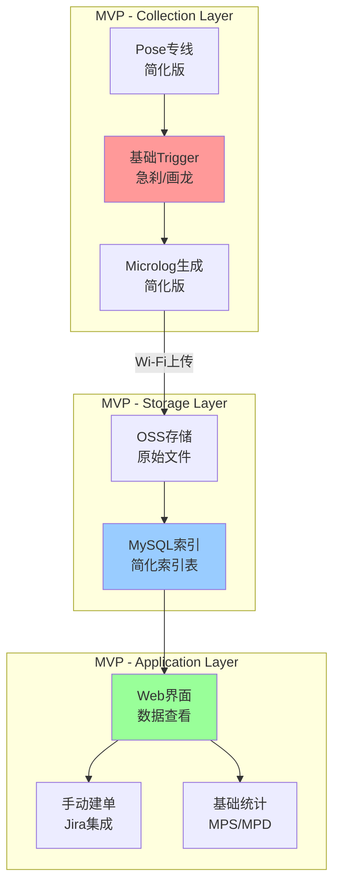

### 12.4 MVP技术栈

#### MVP技术选型（简化版）

| 组件 | MVP技术栈 | 完整技术栈 | 说明 |
|------|----------|-----------|------|
| **车端数据采集** | C++/Python | C++/Rust | 使用Python简化开发 |
| **数据传输** | HTTP/HTTPS | 4G/5G/Wi-Fi分级 | 统一使用HTTP上传 |
| **数据存储** | OSS + MySQL | OSS + ODPS + ADB | MySQL做简单索引 |
| **数据检索** | MySQL查询 | FastDM + ADB | 直接SQL查询 |
| **Web界面** | Flask/Django | 自研前端 | 快速搭建Web界面 |
| **问题管理** | Jira API | 自动建单系统 | 手动创建Jira Issue |

### 12.5 MVP数据模型

#### MVP简化数据模型

```sql
-- 车辆表
CREATE TABLE vehicles (
    car_id VARCHAR(64) PRIMARY KEY,
    car_type VARCHAR(32),
    created_at TIMESTAMP
);

-- Case表（简化版）
CREATE TABLE cases (
    case_id VARCHAR(64) PRIMARY KEY,
    car_id VARCHAR(64),
    trigger_type VARCHAR(32),
    start_ts BIGINT,
    end_ts BIGINT,
    file_path VARCHAR(512),
    status VARCHAR(16),  -- pending/analyzing/resolved
    created_at TIMESTAMP,
    FOREIGN KEY (car_id) REFERENCES vehicles(car_id)
);

-- 指标统计表（简化版）
CREATE TABLE metrics_daily (
    date DATE,
    car_id VARCHAR(64),
    trigger_type VARCHAR(32),
    count INT,
    PRIMARY KEY (date, car_id, trigger_type)
);
```

### 12.6 MVP实施步骤

#### Phase 1: MVP基础功能（Week 1-2）

**目标**：实现数据采集和上传

**任务清单**：
- [ ] 实现Pose专线（简化版，只记录关键字段）
- [ ] 实现基础Trigger（急刹检测、画龙检测）
- [ ] 实现Microlog生成（简化版）
- [ ] 实现Wi-Fi上传功能
- [ ] 实现OSS存储

**验收标准**：
- Pose数据能正常采集
- Trigger能检测到急刹和画龙事件
- Microlog能正常生成并上传到OSS
- 数据能在OSS中查看

#### Phase 2: MVP数据管理（Week 3-4）

**目标**：实现数据索引和查看

**任务清单**：
- [ ] 设计MySQL索引表结构
- [ ] 实现数据上传后自动写入索引
- [ ] 实现Web界面（数据列表、详情查看）
- [ ] 实现按时间/车辆/Trigger类型查询

**验收标准**：
- 上传的数据能自动建立索引
- Web界面能查看数据列表
- 能按条件查询数据
- 能查看Microlog详情

#### Phase 3: MVP问题管理（Week 5-6）

**目标**：实现基础问题管理

**任务清单**：
- [ ] 实现手动建单功能（Jira集成）
- [ ] 实现Case状态管理
- [ ] 实现基础分类（感知/规控/硬件等）
- [ ] 实现问题统计报表

**验收标准**：
- 能在Web界面手动创建Jira Issue
- 能查看Case列表和状态
- 能按类型统计问题数量
- 能生成基础报表

#### Phase 4: MVP指标统计（Week 7-8）

**目标**：实现基础指标统计

**任务清单**：
- [ ] 实现MPS/MPD基础统计
- [ ] 实现按车辆/时间维度统计
- [ ] 实现基础Dashboard
- [ ] 实现数据导出功能

**验收标准**：
- 能统计每万公里急刹/画龙次数
- 能按车辆查看指标趋势
- Dashboard能显示关键指标
- 能导出统计数据

### 12.7 MVP代码示例

#### MVP Pose专线（简化版）

```python
# mvp_pose_stream.py
import time
import json
from collections import deque

class MVPPoseStream:
    def __init__(self, buffer_size=300):  # 30秒数据（10Hz）
        self.buffer = deque(maxlen=buffer_size)
        self.frequency = 0.1  # 100ms
    
    def write_pose(self, pose_data):
        """写入Pose数据（简化版）"""
        record = {
            'timestamp': time.time(),
            'car_id': pose_data.get('car_id'),
            'latitude': pose_data.get('latitude'),
            'longitude': pose_data.get('longitude'),
            'speed': pose_data.get('speed'),
            'acceleration': pose_data.get('acceleration'),
            'heading': pose_data.get('heading')
        }
        self.buffer.append(record)
    
    def get_recent_data(self, seconds=30):
        """获取最近N秒的数据"""
        cutoff_time = time.time() - seconds
        return [r for r in self.buffer if r['timestamp'] > cutoff_time]
```

#### MVP Trigger引擎（简化版）

```python
# mvp_trigger_engine.py
class MVPTriggerEngine:
    def __init__(self):
        self.triggers = [
            self.hard_brake_trigger,
            self.lane_weaving_trigger
        ]
    
    def hard_brake_trigger(self, pose_data):
        """急刹检测（简化版）"""
        acceleration = pose_data.get('acceleration', 0)
        return acceleration < -0.5  # m/s²
    
    def lane_weaving_trigger(self, pose_data_list):
        """画龙检测（简化版）"""
        if len(pose_data_list) < 10:
            return False
        
        # 计算最近10秒的航向角变化
        headings = [p.get('heading', 0) for p in pose_data_list[-10:]]
        heading_changes = [abs(headings[i] - headings[i-1]) 
                          for i in range(1, len(headings))]
        
        # 如果变化频繁且幅度大，认为是画龙
        avg_change = sum(heading_changes) / len(heading_changes)
        return avg_change > 0.1  # 阈值可调
    
    def check_triggers(self, pose_stream):
        """检查所有Trigger"""
        recent_data = pose_stream.get_recent_data(30)
        if not recent_data:
            return []
        
        triggered = []
        for trigger_func in self.triggers:
            if trigger_func == self.hard_brake_trigger:
                # 检查最后一条数据
                if trigger_func(recent_data[-1]):
                    triggered.append({
                        'type': 'hard_brake',
                        'timestamp': recent_data[-1]['timestamp']
                    })
            elif trigger_func == self.lane_weaving_trigger:
                if trigger_func(recent_data):
                    triggered.append({
                        'type': 'lane_weaving',
                        'timestamp': recent_data[-1]['timestamp']
                    })
        
        return triggered
```

#### MVP上传管理器（简化版）

```python
# mvp_upload_manager.py
import requests
import json
from datetime import datetime

class MVPUploadManager:
    def __init__(self, oss_endpoint, access_key, secret_key):
        self.oss_endpoint = oss_endpoint
        self.access_key = access_key
        self.secret_key = secret_key
        self.upload_queue = []
    
    def generate_microlog(self, pose_data_list, trigger_info):
        """生成Microlog（简化版）"""
        microlog = {
            'case_id': f"case_{datetime.now().strftime('%Y%m%d%H%M%S')}",
            'car_id': pose_data_list[0]['car_id'],
            'trigger_type': trigger_info['type'],
            'start_ts': pose_data_list[0]['timestamp'],
            'end_ts': pose_data_list[-1]['timestamp'],
            'pose_frames': pose_data_list
        }
        return microlog
    
    def upload_to_oss(self, microlog):
        """上传到OSS（简化版）"""
        # 简化版：直接HTTP POST上传
        file_name = f"{microlog['case_id']}.json"
        url = f"{self.oss_endpoint}/upload"
        
        response = requests.post(
            url,
            files={'file': (file_name, json.dumps(microlog))},
            auth=(self.access_key, self.secret_key)
        )
        
        if response.status_code == 200:
            return {
                'success': True,
                'file_path': response.json().get('file_path'),
                'case_id': microlog['case_id']
            }
        else:
            return {'success': False, 'error': response.text}
    
    def save_index(self, case_info):
        """保存索引到MySQL"""
        # 简化版：直接SQL插入
        sql = """
        INSERT INTO cases (case_id, car_id, trigger_type, start_ts, end_ts, file_path, status)
        VALUES (%s, %s, %s, %s, %s, %s, 'pending')
        """
        # 执行SQL（需要数据库连接）
        # db.execute(sql, ...)
        pass
```

#### MVP Web界面（简化版）

```python
# mvp_web_app.py
from flask import Flask, render_template, request, jsonify
import mysql.connector

app = Flask(__name__)

@app.route('/')
def index():
    """首页：显示Case列表"""
    # 查询Case列表
    cases = query_cases(
        car_id=request.args.get('car_id'),
        trigger_type=request.args.get('trigger_type'),
        start_date=request.args.get('start_date'),
        end_date=request.args.get('end_date')
    )
    return render_template('cases.html', cases=cases)

@app.route('/case/<case_id>')
def case_detail(case_id):
    """Case详情页"""
    case = get_case_by_id(case_id)
    return render_template('case_detail.html', case=case)

@app.route('/metrics')
def metrics():
    """指标统计页"""
    metrics_data = calculate_metrics(
        start_date=request.args.get('start_date'),
        end_date=request.args.get('end_date')
    )
    return render_template('metrics.html', metrics=metrics_data)

@app.route('/api/create_jira_issue', methods=['POST'])
def create_jira_issue():
    """创建Jira Issue（简化版）"""
    case_id = request.json.get('case_id')
    case = get_case_by_id(case_id)
    
    # 调用Jira API创建Issue
    jira_issue = jira_client.create_issue({
        'summary': f"{case['trigger_type']} - {case['car_id']}",
        'description': f"Case ID: {case_id}\nTime: {case['start_ts']}",
        'project': 'AUTO'
    })
    
    # 更新Case状态
    update_case_status(case_id, 'analyzing')
    
    return jsonify({'success': True, 'issue_key': jira_issue.key})
```

### 12.8 MVP到完整系统的演进路径

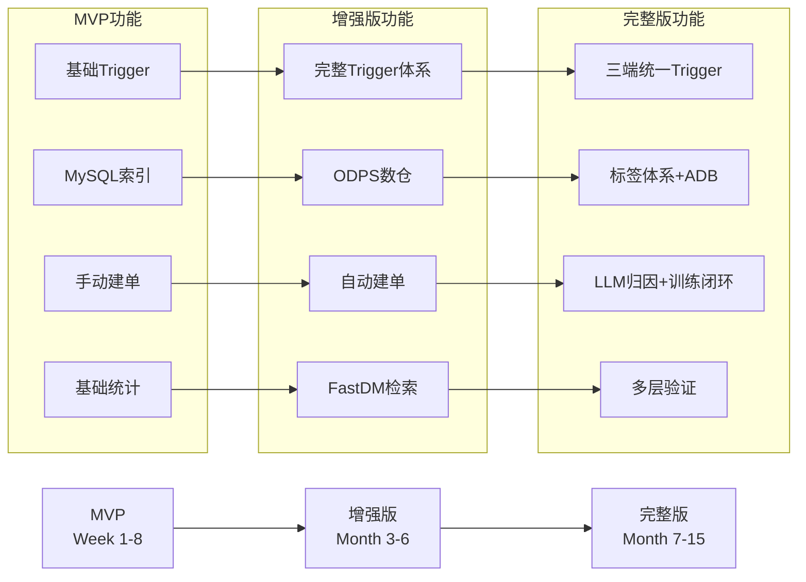

### 12.9 MVP演进计划

#### MVP → 增强版（Month 3-6）

**升级内容**：
1. **Trigger体系**：从基础Trigger扩展到完整Trigger体系
2. **数据存储**：从MySQL迁移到ODPS数仓
3. **数据检索**：从SQL查询升级到FastDM
4. **问题管理**：从手动建单升级到自动建单

**关键里程碑**：
- [ ] 完成ODPS数仓迁移
- [ ] 实现FastDM检索
- [ ] 实现自动建单功能

#### 增强版 → 完整版（Month 7-15）

**升级内容**：
1. **三端统一**：实现Trigger在车端/云端/仿真端统一
2. **标签体系**：建立秒级标签体系和ADB加速
3. **智能化**：引入LLM归因分析和问题聚类
4. **训练闭环**：实现从问题到模型训练的完整闭环

**关键里程碑**：
- [ ] 完成三端统一Trigger
- [ ] 建立标签体系
- [ ] 实现训练闭环

### 12.10 MVP资源需求

#### MVP资源估算

| 资源类型 | MVP需求 | 完整系统需求 | 说明 |
|---------|---------|------------|------|
| **开发人力** | 2-3人 | 10-15人 | MVP可小团队快速迭代 |
| **开发时间** | 8周 | 15个月 | MVP快速验证 |
| **服务器** | 2台（4核8G） | 集群 | MVP单机即可 |
| **存储** | 100GB | PB级 | MVP小规模数据 |
| **数据库** | MySQL | ODPS+ADB | MVP简单数据库即可 |

#### MVP成本估算

- **开发成本**：2-3人 × 8周 ≈ 16-24人周
- **服务器成本**：2台 × $50/月 × 2月 ≈ $200
- **存储成本**：100GB × $0.02/GB/月 × 2月 ≈ $4
- **总计**：约 $204 + 人力成本

### 12.11 MVP验收标准

#### MVP功能验收

- [ ] **数据采集**：能采集Pose数据，Trigger能检测到急刹和画龙
- [ ] **数据上传**：数据能成功上传到OSS
- [ ] **数据查看**：Web界面能查看数据列表和详情
- [ ] **问题管理**：能手动创建Jira Issue
- [ ] **指标统计**：能统计MPS/MPD基础指标

#### MVP性能验收

- [ ] **数据采集延迟**：< 100ms
- [ ] **上传成功率**：> 95%
- [ ] **查询响应时间**：< 2秒
- [ ] **系统可用性**：> 95%

#### MVP质量验收

- [ ] **数据完整性**：上传数据不丢失
- [ ] **数据准确性**：Trigger检测准确率 > 80%
- [ ] **系统稳定性**：连续运行7天无故障

---

## 十三、参考资源

### 12.1 相关文档

- [L4_DATA_LOOP_COMPLETE_SOLUTION.md](./L4_DATA_LOOP_COMPLETE_SOLUTION.md)：完整解决方案文档
- [L4_4C_ARCHITECTURE.md](./L4_4C_ARCHITECTURE.md)：4C架构详细设计
- [HARD_DRIVE_TRIGGER_DESIGN.md](./HARD_DRIVE_TRIGGER_DESIGN.md)：硬盘触发设计

### 12.2 技术参考

- **ODPS (MaxCompute)**：阿里云大数据计算服务
- **ADB (AnalyticDB)**：阿里云分析型数据库
- **SLS**：阿里云日志服务
- **OSS**：阿里云对象存储服务

### 12.3 最佳实践

- **数据分层**：ODS/DWD/DWS/ADS数仓分层
- **标签体系**：秒级标签 + 标签宽表
- **三端统一**：Trigger逻辑在车端/云端/仿真端统一
- **自动化闭环**：从问题发现到模型训练全流程自动化

---

*文档版本：v1.0*  
*最后更新：2025年*  
*文档状态：已完成*

