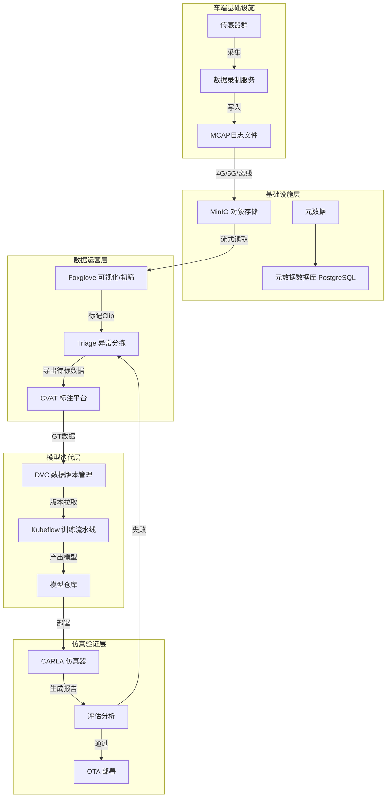

# 开源自动驾驶数据闭环架构设计指南

本文档基于行业最佳实践，详细阐述如何利用主流开源工具（Apollo/ROS2, MCAP, MinIO, Foxglove, CVAT, DVC, Kubeflow, CARLA）构建一套完整的自动驾驶数据闭环（Data Loop）系统。

## 1. 架构总览

本架构旨在解决自动驾驶研发中的核心痛点：**如何高效地将车端海量数据转化为模型能力的迭代**。

### 数据流向图

---

## 2. 核心组件详解

### 2.1 车端采集 (Ingestion)
*   **工具选型**: **Apollo** 或 **ROS 2** + **MCAP**
*   **核心功能**: 负责传感器数据的采集、序列化和落盘。
*   **为何选择 MCAP**:
    *   **性能**: 相比传统 rosbag，MCAP 写入性能更优，专为高带宽传感器（Lidar/4K相机）设计。
    *   **索引**: 自带索引，支持“仅读取第10-20秒的数据”，无需下载整个GB级文件，这对云端可视化至关重要。
    *   **生态**: Foxglove 原生支持，通用性强。
*   **实施重点**: 需要开发车端 Trigger 逻辑（如急刹车、接管），只上传高价值片段（Clip）或打点信息。

### 2.2 数据存储 (Storage)
*   **工具选型**: **MinIO**
*   **核心功能**: 兼容 Amazon S3 协议的高性能对象存储。
*   **方案优势**:
    *   **私有化部署**: 适合拥有大量敏感数据的自动驾驶公司，可部署在自建机房。
    *   **高性能**: 也是为大文件吞吐优化的，支持纠删码保护。
*   **架构设计**: 建议按冷热数据分层。热数据（近期路测）存 MinIO，冷数据归档。

### 2.3 初筛与挖掘 (Triage & Exploration)
*   **工具选型**: **Foxglove**
*   **核心功能**: 基于 Web 的数据回放与可视化工具。
*   **工作流**:
    1.  数据入库 MinIO 后，生成签名 URL。
    2.  数据运营人员打开 Foxglove 网页，通过 URL 直接流式播放远程 MCAP 文件（无需下载）。
    3.  结合布局（Layout）查看 Camera、Lidar、Radar 融合效果。
    4.  **关键动作**: 实现自定义插件（Foxglove Extension），在界面上增加“一键标记”按钮，将当前时间戳和问题描述发送给后端数据库。

### 2.4 数据标注 (Labeling)
*   **工具选型**: **CVAT (Computer Vision Annotation Tool)**
*   **核心功能**: 生产 2D/3D 真值（Ground Truth）。
*   **集成方案**:
    *   编写脚本将初筛后的 MCAP 特定帧提取为 PCAP/PCD (点云) 或 JPG (图像)。
    *   通过 CVAT API 创建标注任务（Task）。
    *   标注员在 CVAT Web 端进行 3D 框选或 2D 分割。
    *   标注完成后，通过 API 导出数据集（如 COCO, KITTI, NuScenes 格式）。

### 2.5 数据与模型版本管理 (Versioning)
*   **工具选型**: **DVC (Data Version Control)**
*   **核心功能**: 解决“模型复现难”的问题。
*   **工作机制**:
    *   不直接将 TB 级数据存入 Git。
    *   DVC 在 Git 中存储 `.dvc` 索引文件（类似指针）。
    *   实际数据存储在 MinIO 后端。
    *   **价值**: 此时可以执行 `git checkout experiment-v1`，DVC 会自动将本地数据切换到当时训练用的版本。

### 2.6 模型训练编排 (Orchestration)
*   **工具选型**: **Kubeflow**
*   **核心功能**: 云原生 ML 流水线。
*   **典型 Pipeline**:
    *   **Data Prep**: 从 MinIO 拉取 DVC 指定版本的数据。
    *   **Train**: 启动 PyTorch/TensorFlow 分布式训练 Job。
    *   **Eval**: 在验证集上跑评测指标。
    *   **Export**: 转换模型格式（如 ONNX, TensorRT）。

### 2.7 仿真验证 (Validation)
*   **工具选型**: **CARLA**
*   **核心功能**: 闭环的最后一公里，合成场景验证。
*   **应用场景**:
    *   **场景重构**: 将 Foxglove 中发现的 Corner Case（如“鬼探头”），在 CARLA 编辑器中重建。
    *   **回归测试**: 新模型发布前，必须在 CARLA 的 1000+ 个标准场景库中跑通，确保没有发生退化。

---

## 3. 下一步研究与实施路线图 (Roadmap)

建议按照以下顺序进行技术预研和原型搭建 (PoC)：

### 第一阶段：数据底座搭建 (基础)
1.  **部署 MinIO**: 在服务器上搭建单节点或集群版 MinIO。
2.  **MCAP 转换测试**: 写一个 Python 脚本，将手头的 rosbag 转换为 mcap 格式，并测试其压缩率和读取速度。
3.  **Foxglove 对接**: 尝试配置 Foxglove 连接本地 MinIO，实现“点击 URL 即播放”的效果。

### 第二阶段：标注闭环打通 (核心)
1.  **部署 CVAT**: 使用 Docker Compose 快速部署 CVAT。
2.  **格式转换器**: 编写中间件代码（Python），连接 Foxglove 和 CVAT：
    *   输入：MCAP 文件路径 + 时间戳。
    *   输出：CVAT 任务（自动上传图片/点云）。

### 第三阶段：MLOps 自动化 (进阶)
1.  **DVC 实践**: 在一个小数据集上尝试 DVC 的 init, add, push, pull 流程，理解其与 Git 的配合。
2.  **Kubeflow Pipeline**: 编写一个简单的 Pipeline，串联“拉取数据”和“打印数据统计”两个步骤，跑通流程。

### 第四阶段：仿真集成 (高阶)
1.  **CARLA 场景同步**: 研究 OpenSCENARIO 标准，看如何将通过数据挖掘出的场景参数化，转换为 CARLA 可读的配置文件。
